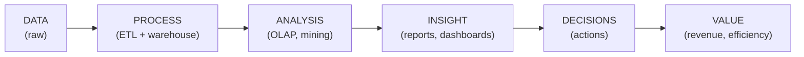
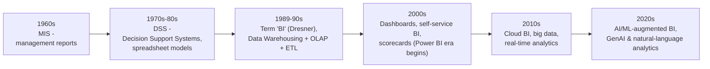
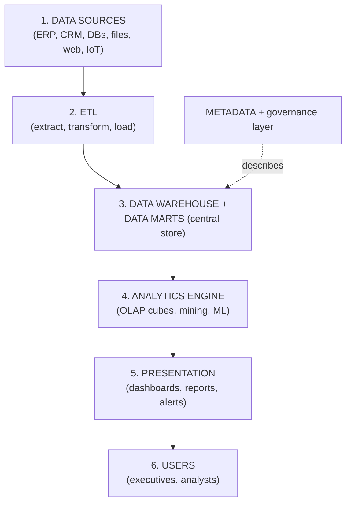
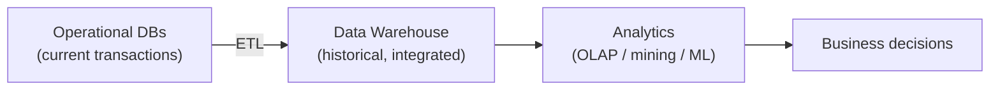
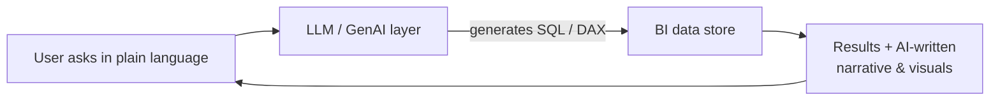

# BI — Unit 1 (Introduction to Business Intelligence)

> Exam-prep notes: short definitions, key points, and diagrams.

**Contents**
1. [What is Business Intelligence?](#1-what-is-business-intelligence)
2. [Evolution of BI & Decision Support Systems](#2-evolution-of-bi--decision-support-systems)
3. [Data-Driven Decision Making & BI Architecture](#3-data-driven-decision-making--bi-architecture)
4. [Databases, Data Warehouses & Analytics in BI](#4-databases-data-warehouses--analytics-in-bi)
5. [Applications, Benefits & Challenges](#5-applications-benefits--challenges)
6. [Generative AI & LLMs in BI](#6-generative-ai--llms-in-bi)
7. [Quick Revision](#7-quick-revision)

---

## 1. What is Business Intelligence?

- **Business Intelligence (BI)** = the set of **technologies, processes and tools** that transform **raw data into meaningful, actionable insights** for better **business decisions**.
- Coined by **Gartner analyst Howard Dresner (1989)**. BI = Data (+ warehouse) + **Analytics** + **Reporting/Visualization**.
- Core purpose: right information → right person → right time → **right decision**.

## 2. Evolution of BI & Decision Support Systems

| Era | System | Focus |
|---|---|---|
| 1960s | **MIS** | Periodic fixed management reports |
| 1970s–80s | **DSS** | Interactive models supporting semi-structured decisions |
| 1989–90s | **BI + DW + OLAP** | Integrated historical data, multidimensional analysis |
| 2000s | **Dashboards / EPM** | Visual KPIs, scorecards, self-service |
| 2010s–20s | **Cloud + AI BI** | Real-time, predictive, **natural-language & GenAI-driven** |

- **DSS** = computer-based system that helps managers take **semi-structured/unstructured decisions** using data + models + user interface.

## 3. Data-Driven Decision Making & BI Architecture

### 3.1 Data-Driven Decision Making (DDDM)

- Making decisions on **facts, metrics and data analysis** instead of intuition/observation.
- Cycle: **Collect → Measure → Analyse → Decide → Act → Learn** (repeat). Culture change: "gut feeling" is replaced (or verified) by evidence; decisions become measurable & accountable.

### 3.2 Components of BI Architecture

| Component | Role |
|---|---|
| Data sources | Operational systems producing raw data |
| **ETL** | Moves & cleans data into the warehouse |
| **Data warehouse/marts** | Subject-oriented historical storage |
| **Analytics** | OLAP, data mining, statistics, ML |
| **Presentation** | Dashboards, KPIs, self-service reports |
| **Metadata & governance** | Definitions, lineage, security, quality |

## 4. Databases, Data Warehouses & Analytics in BI

| Layer | Role in BI |
|---|---|
| **Operational databases** | Capture day-to-day transactions; the **source** of BI data (current, detailed, normalized) |
| **Data warehouse** | **Backbone of BI** — integrates + stores historical, cleaned, subject-oriented data optimized for queries |
| **Analytics** | The "intelligence" — OLAP slicing, statistical analysis, data mining, **predictive ML** that turns storage into insight |

## 5. Applications, Benefits & Challenges

### 5.1 Applications by Domain

| Domain | BI use cases |
|---|---|
| **Finance** | Risk analysis, fraud detection, budgeting vs actuals, profitability dashboards |
| **Healthcare** | Patient-outcome analytics, resource/hospital-bed planning, disease trend tracking, cost control |
| **Retail** | Sales & basket analysis, demand forecasting, customer segmentation, loyalty & pricing optimization |
| **Education** | Student performance tracking, dropout prediction, course demand planning, accreditation reporting |
| (Others) | Telecom churn, manufacturing quality, HR attrition analytics |

### 5.2 Benefits vs Challenges

| Benefits ✔ | Challenges ✘ |
|---|---|
| Faster, fact-based decisions | High implementation **cost** (tools + infrastructure) |
| Single source of truth (integrated data) | **Data quality** issues (garbage in → garbage out) |
| Improved efficiency & reduced waste | User **adoption** & training resistance |
| Customer insight & competitiveness | Data **silos** and integration complexity |
| Fraud/risk detection, compliance reporting | **Security & privacy** of consolidated data |
| New revenue/market opportunities | Skilled staff shortage; scope creep |

## 6. Generative AI & LLMs in BI

- **Generative AI** = models that **create content** (text, code, charts); **LLMs (Large Language Models)** = transformer models (GPT-class) trained on massive text that understand & generate natural language.
- **Roles in BI:**
  - **Natural-language querying:** ask *"Why did Q3 sales drop?"* in plain English → LLM generates the SQL/analysis (chat-with-your-data)
  - **Automated report writing:** LLM narrates dashboard insights in plain language
  - **Data prep help:** generate cleaning/ETL scripts, suggest data models
  - **Dashboard generation:** describe a dashboard → auto-built (Copilot in Power BI, Tableau Pulse/Einstein)
  - **Anomaly narration & forecasting:** AI explains *why* a KPI moved
- **Caution:** hallucinations (wrong facts), data-privacy leakage, bias, need human verification.

## 7. Quick Revision

| Item | One-liner |
|---|---|
| BI | Data → insight → decision tools & processes (term by Dresner, Gartner) |
| Evolution | MIS (60s) → DSS (70-80s) → BI/DW/OLAP (90s) → dashboards (2000s) → cloud/AI (now) |
| DSS | Interactive system for semi-structured decisions |
| DDDM | Decide on facts & metrics, not gut feeling |
| BI architecture | Sources → ETL → DW → Analytics → Dashboards (+ metadata) |
| DB vs DW vs Analytics | Current transactions vs historical store vs insight engine |
| Applications | Finance (risk), Healthcare (outcomes), Retail (sales), Education (performance) |
| Main benefits | Faster decisions, single truth |
| Main challenges | Cost, data quality, adoption, security |
| GenAI/LLM in BI | NL querying, auto-reports, dashboard generation (Copilot/Tableau Pulse) |
