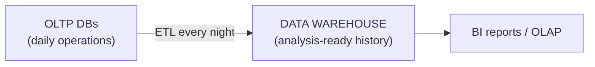
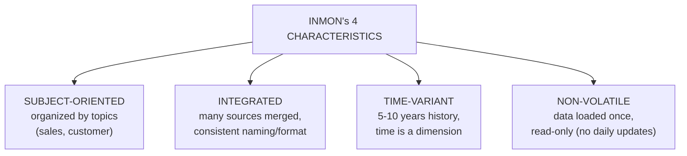
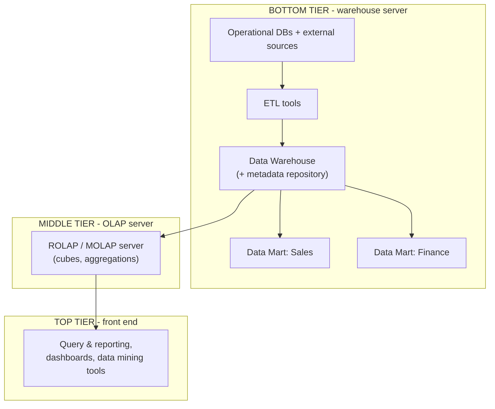
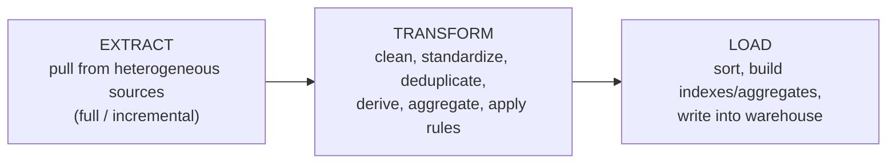
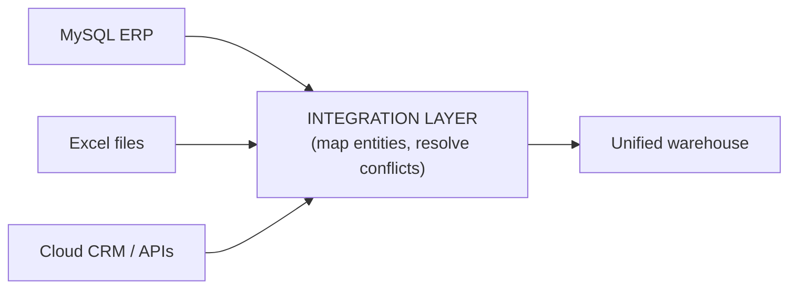
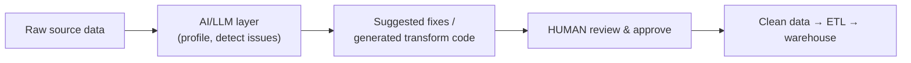

# BI — Unit 2 (Data Warehousing and Data Preparation)

> Exam-prep notes: short definitions, key points, and diagrams.

**Contents**
1. [Operational Databases vs Data Warehouses](#1-operational-databases-vs-data-warehouses)
2. [Characteristics of Data Warehouses](#2-characteristics-of-data-warehouses)
3. [Three-Tier Architecture & ETL](#3-three-tier-architecture--etl)
4. [Data Cleaning Techniques](#4-data-cleaning-techniques)
5. [Data Integration from Heterogeneous Sources](#5-data-integration-from-heterogeneous-sources)
6. [Metadata, Data Quality & AI/LLMs in Preparation](#6-metadata-data-quality--ai-llms-in-preparation)
7. [Quick Revision](#7-quick-revision)

---

## 1. Operational Databases vs Data Warehouses

| Aspect | **Operational Database (OLTP)** | **Data Warehouse (OLAP)** |
|---|---|---|
| Purpose | Run daily **transactions** (insert/update) | **Analysis & reporting** (read-heavy) |
| Data | Current, detailed, volatile | **Historical**, summarized, stable |
| Design | Normalized (3NF, ER model) | Denormalized (**star/snowflake**) |
| Users | Clerks, applications | Analysts, managers, BI tools |
| Operations | Many short read/write ops | Few long complex queries |
| Data size per query | Few records | Millions of records |
| Example | ATM withdrawal, order entry | "Yearly sales trend by region" |

## 2. Characteristics of Data Warehouses

- Extra features: holds **aggregated/summarized** data, supports **drill-down/roll-up**, separates analytics load from operational systems.

## 3. Three-Tier Architecture & ETL

### 3.1 Data Warehouse Architecture (Three-Tier)

- **Data mart** = department-sized subset of the warehouse (sales, HR, finance).

### 3.2 ETL Process

| Step | Key activities |
|---|---|
| **Extraction** | Read from DBs/files/APIs; full extract or incremental (changed-data capture) |
| **Transformation** | Cleaning (fix nulls/errors), standardization (units, formats), integration (matching keys), derivation (age from DOB), aggregation (daily → monthly) |
| **Loading** | Order data, create indexes/summaries, load into fact/dimension tables; schedule refreshes |

## 4. Data Cleaning Techniques

- **Goal:** fix **incomplete, noisy, inconsistent** data before loading (garbage in → garbage out).

| Problem | Technique |
|---|---|
| **Missing values** | Drop tuple (if few) · fill with mean/median/mode · predict via regression · mark "unknown" |
| **Noisy data** | **Binning** (by mean/median/boundaries) · **regression** smoothing · **outlier detection** (IQR, clustering) |
| **Inconsistent data** | Standardize formats/units, resolve conflicts using metadata, remove **duplicates** |
| **Wrong format/typos** | Parsing, pattern rules, spell-check dictionaries |

- *Binning example:* 4, 8, 15 | 21, 21, 24 → smooth by bin mean → 9, 9, 9 | 22, 22, 22.

## 5. Data Integration from Heterogeneous Sources

- Combining data from **different DBs, files, formats, vendors** into one consistent store.
- Challenges & solutions:

| Challenge | Solution |
|---|---|
| **Entity identification** — `cust_id` vs `c_no` | Metadata mapping (same real-world entity) |
| **Schema conflicts** — different structures | Schema integration before loading |
| **Redundant/derived attributes** | Correlation analysis (χ²) → drop duplicates |
| **Value conflicts** — ₹ vs $, cm vs inch, date formats | Unit conversion & standardization rules |
| Different update frequencies | Incremental ETL with CDC |

## 6. Metadata, Data Quality & AI/LLMs in Preparation

### 6.1 Metadata — Types & Importance

- **Metadata** = "**data about data**" — the warehouse's **directory/map** (data dictionary, lineage, rules).

| Type | Contents | Example |
|---|---|---|
| **Technical** | Schema, tables, ETL mappings, indexes, data types | "sales_amount is DECIMAL(10,2), loaded nightly from ERP" |
| **Business** | Definitions in business terms, owners, rules | "Revenue = gross sales − returns; owner: Sales VP" |
| **Operational** | Lineage, freshness, load times, audit, usage stats | "Last load 02:00 AM, 12 min, 1.2M rows" |

- **Importance:** helps developers find & understand data fast; enables **impact analysis** (what breaks if source changes); ensures consistent definitions across reports; basis of **data governance & lineage**; speeds ETL design & troubleshooting.

### 6.2 Data Quality — Concepts & Challenges

| Dimension | Meaning |
|---|---|
| **Accuracy** | Values match reality |
| **Completeness** | No missing records/fields |
| **Consistency** | Same value everywhere (no conflicts) |
| **Timeliness** | Data is up to date |
| **Uniqueness** | No duplicates |
| **Validity** | Conforms to format/range rules |

- **Challenges:** multiple entry points & manual entry errors, legacy/siloed systems, no common standards, merging sources creates conflicts, constant change (schema drift), cost of cleansing at scale.

### 6.3 Role of AI/LLMs in Data Preparation & Automated ETL

- **AI-assisted cleaning:** auto-detect anomalies/outliers/duplicates (clustering, fuzzy matching), suggest fixes
- **LLM powers:**
  - Generate **ETL/cleaning code** from natural language ("standardize these date columns")
  - Infer **schema mappings** between heterogeneous sources; suggest joins
  - Auto-classify sensitive data (PII tagging) & produce documentation/metadata
  - Modern tools: **Power Query AI, Tableau Prep, dbt Copilot, Trifacta/Paxata ML suggestions**
- **Benefits:** faster prep (the 60–70% bottleneck), fewer human errors, self-service for non-coders. **Caution:** verify AI-generated logic — silent wrong transformations are dangerous.

## 7. Quick Revision

| Item | One-liner |
|---|---|
| OLTP vs OLAP | Run the business (current, normalized) vs analyse it (historical, star) |
| 4 characteristics | Subject-oriented, Integrated, Time-variant, Non-volatile |
| 3 tiers | Sources+ETL → OLAP server → Front-end tools |
| ETL | Extract → Transform → Load |
| Cleaning | Missing (fill), noisy (binning/regression/outliers), inconsistent (standardize) |
| Integration | Entity identification, schema conflicts, redundancy, value conflicts |
| Metadata types | Technical · Business · Operational |
| Metadata value | Definitions, lineage, impact analysis, governance |
| 6 quality dimensions | Accuracy, Completeness, Consistency, Timeliness, Uniqueness, Validity |
| AI/LLM in prep | Anomaly detection, generated ETL code, schema mapping, docs — always human-verified |
