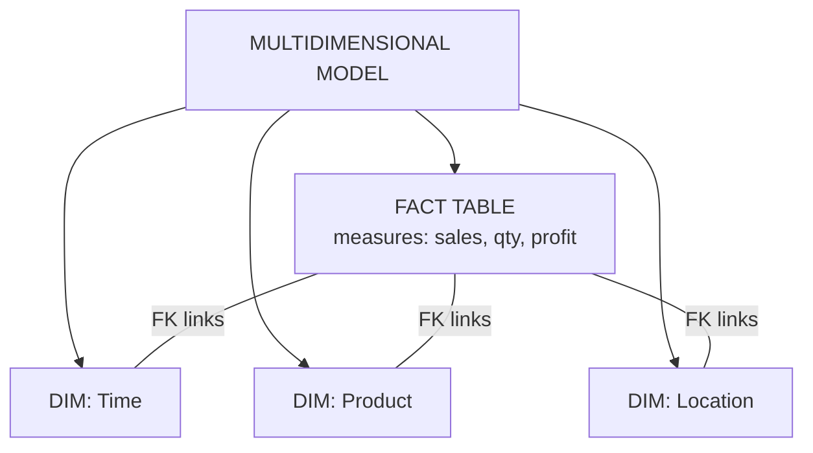
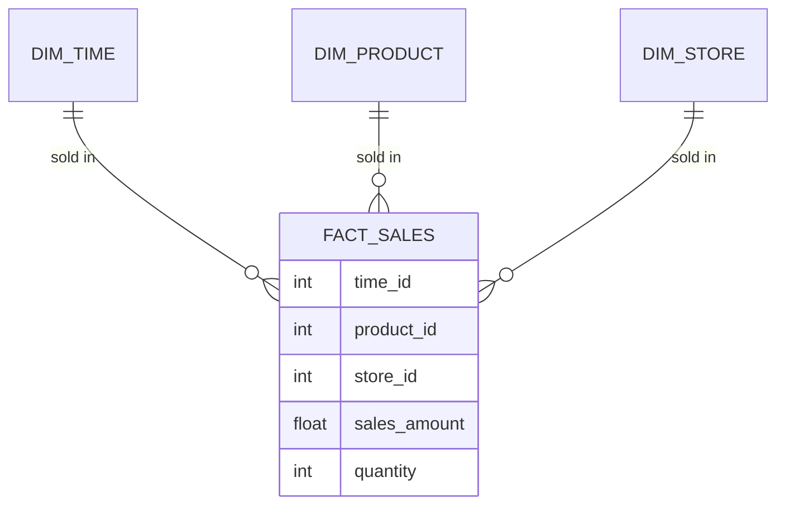
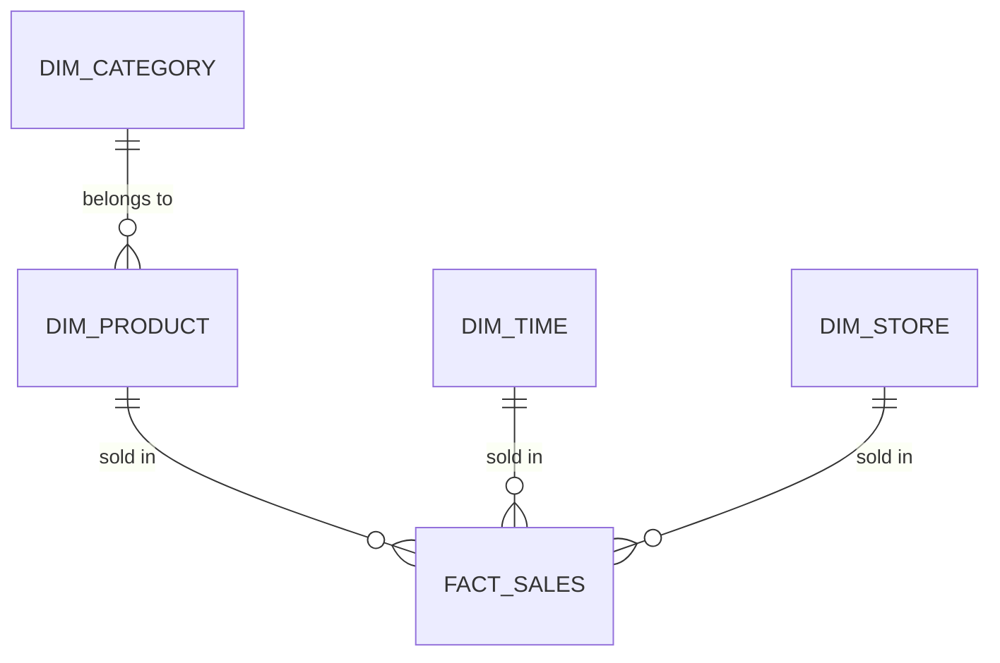
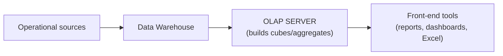
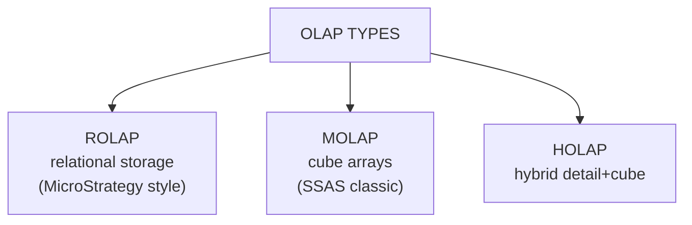
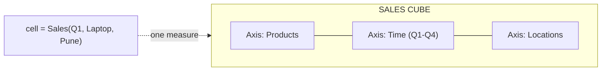
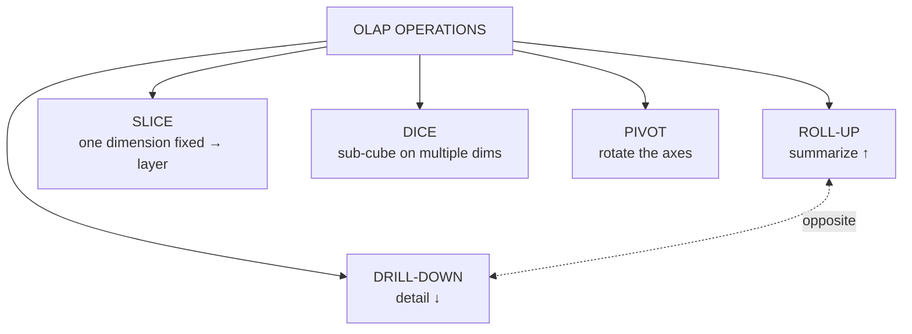

# BI — Unit 3 (Multidimensional Data Modeling and OLAP)

> Exam-prep notes: short definitions, key points, and diagrams.

**Contents**
1. [Multidimensional Data Model](#1-multidimensional-data-model)
2. [Star, Snowflake & Schema Comparison](#2-star-snowflake--schema-comparison)
3. [OLAP: Architecture & Types](#3-olap-architecture--types)
4. [OLAP Cube & Operations](#4-olap-cube--operations)
5. [OLAP vs OLTP & Applications](#5-olap-vs-oltp--applications)
6. [Quick Revision](#6-quick-revision)

---

## 1. Multidimensional Data Model

- **Multidimensional model** = viewing data as a **data cube**: **measures** (numbers) organized along **dimensions** (perspectives like time, product, location).
- **Fact table** = numeric **measures** (sales, quantity, profit) + foreign keys to dimensions; huge (millions of rows).
- **Dimension table** = descriptive context — *who, what, where, when* (product, store, date); small, textual.
- **Measures** = the analyzed numbers; **Dimensions** = the "axes" used to slice them.

## 2. Star, Snowflake & Schema Comparison

### 2.1 Star Schema

- One central **fact table** with **denormalized** dimensions directly around it → looks like a star. Simple, fastest queries (few joins).

### 2.2 Snowflake Schema

- Star schema with **normalized** dimensions — each dimension splits into sub-tables (product → category → department). Less redundancy, more joins → slower queries.

### 2.3 Star vs Snowflake

| Feature | **Star** | **Snowflake** |
|---|---|---|
| Dimension design | Denormalized (single table) | Normalized (split tables) |
| Redundancy | More | Less |
| Query speed | **Fast** (fewer joins) | Slower (more joins) |
| Design complexity | Simple | Complex |
| Storage | More | Less |
| Best when | Query performance matters (most BI) | Storage/consistency matters |

## 3. OLAP: Architecture & Types

- **OLAP (Online Analytical Processing)** = technology for fast **multidimensional analysis** of warehouse data (slice, dice, drill…).

### 3.1 OLAP Architecture

### 3.2 Types of OLAP Systems

| Type | How data is stored | Pros | Cons |
|---|---|---|---|
| **ROLAP** | Relational tables (star/snowflake) + SQL | Handles **huge/volatile** data; no cube size limit | Slower queries |
| **MOLAP** | Pre-computed **multidimensional cube arrays** | **Fastest** queries (pre-aggregated) | Cube build time; size limits; sparse data |
| **HOLAP** | Detail in relational + summaries in cube | Balance: scalable **and** fast for summaries | More complex to manage |

## 4. OLAP Cube & Operations

### 4.1 OLAP Cube Concept

- A **cube** = multidimensional array of measures; each **cell** = one fact value at a specific combination of dimension members (e.g., Sales of *Product A* in *Pune store* in *Q1*).
- Dimensions > 3 are still called "cubes" (hyper-cubes).

### 4.2 OLAP Operations

| Operation | Meaning | Example |
|---|---|---|
| **Roll-up** (drill-up) | **Aggregate up** a hierarchy — summarize | City → Country; Q1..Q4 → Year |
| **Drill-down** | Opposite — break into finer detail | Year → Quarter → Month → Day |
| **Slice** | **Fix one dimension** → take a 2-D layer out of the cube | Only `Time = Q1` (all products, all cities) |
| **Dice** | **Select a sub-cube** on 2+ dimensions | `Q1-Q2` × `Laptops-Phones` × `Pune-Mumbai` |
| **Pivot (rotate)** | **Rotate axes** to view from another angle | Swap rows/columns: products vs time |

## 5. OLAP vs OLTP & Applications

### 5.1 OLAP vs OLTP

| Feature | **OLTP** | **OLAP** |
|---|---|---|
| Purpose | Transaction processing (run business) | Analysis & decision support |
| Data | Current, detailed | Historical, summarized |
| Operations | Read + write (INSERT/UPDATE/DELETE) | Mostly complex **reads** |
| Design | Normalized ER | Denormalized star / cube |
| Query | Short, touches few rows | Long, scans millions of rows |
| Users | Clerks, apps | Analysts, managers |
| Metric | Transactions/second | Query response time |

### 5.2 Applications of OLAP in Business Analysis

- **Sales & marketing:** trend and seasonality analysis, campaign effectiveness, regional comparisons
- **Finance:** budgeting, profitability by product/branch, variance (actual vs plan) analysis
- **Retail:** basket & category performance, store vs store benchmarking
- **Inventory/supply chain:** stock movement, demand patterns
- **HR/Telecom/Banking:** attrition analysis, call-centre metrics, credit-portfolio slicing

## 6. Quick Revision

| Item | One-liner |
|---|---|
| Multidimensional model | Measures along dimensions = data cube |
| Fact vs dimension | Numbers/measurements vs descriptive context |
| Star | Denormalized dims, fast, simple |
| Snowflake | Normalized dims, compact, slower |
| ROLAP / MOLAP / HOLAP | Relational (scalable) / cube (fast) / hybrid |
| Cube cell | One measure at one combination of dimension members |
| Roll-up vs drill-down | Summarize ↑ vs detail ↓ |
| Slice vs dice | One dim fixed (layer) vs multi-dim sub-cube |
| Pivot | Rotate axes for a new view |
| OLTP vs OLAP | Transactions/normalized vs analysis/star+cube |
| Uses | Sales trends, finance variance, retail benchmarking |
