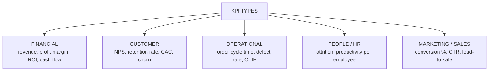
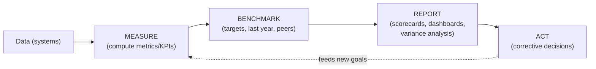
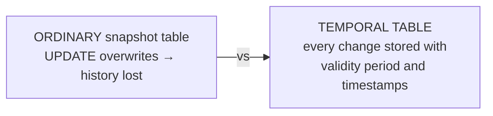
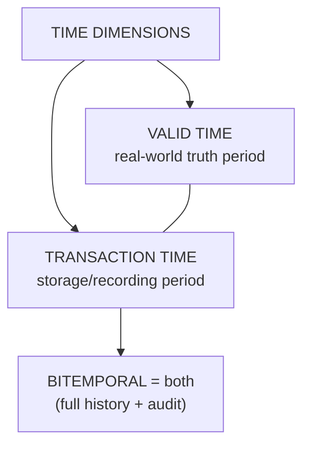
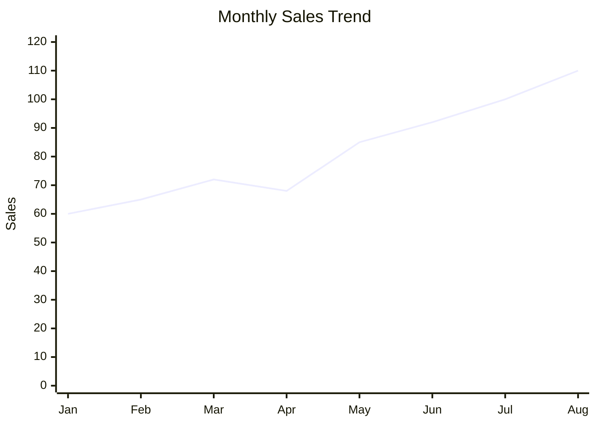
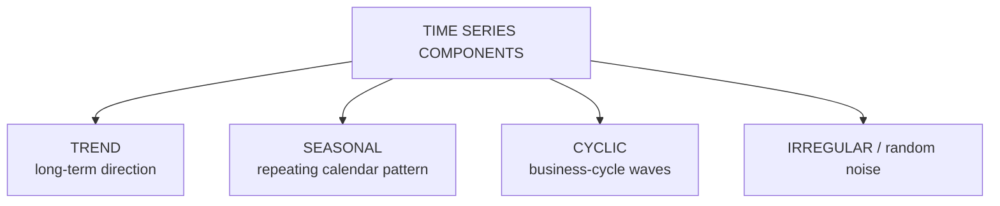
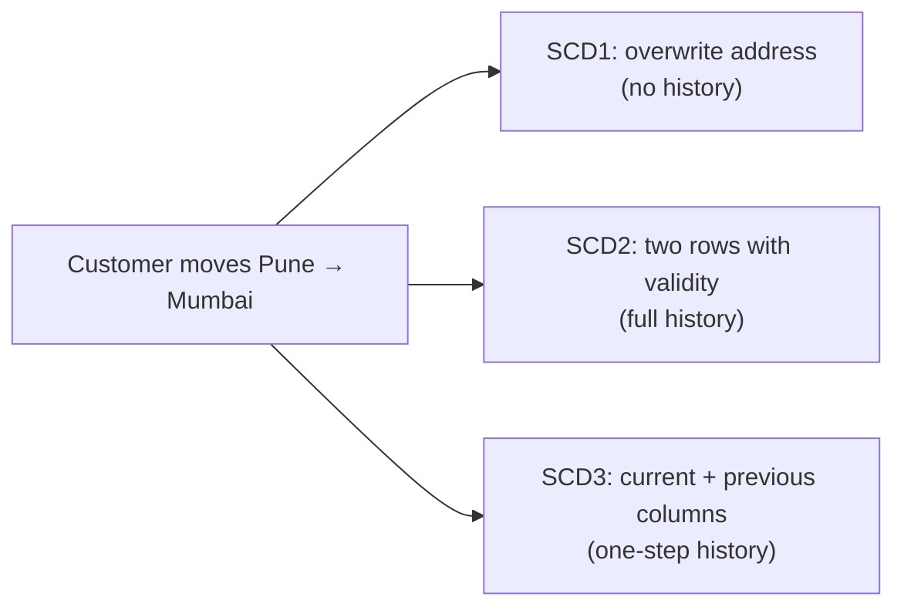

# BI — Unit 4 (Business Analytics and Temporal Data)

> Exam-prep notes: short definitions, key points, and diagrams.

**Contents**
1. [Business Metrics & KPIs](#1-business-metrics--kpis)
2. [Importance of KPIs & Performance Measurement](#2-importance-of-kpis--performance-measurement)
3. [Introduction to Temporal Data](#3-introduction-to-temporal-data)
4. [Valid Time, Transaction Time & Timestamps](#4-valid-time-transaction-time--timestamps)
5. [Time-Based Analysis, Trends & Historical Tracking](#5-time-based-analysis-trends--historical-tracking)
6. [Quick Revision](#6-quick-revision)

---

## 1. Business Metrics & KPIs

### 1.1 Definitions

- **Business metric** = any **quantifiable measure** that tracks a business process (e.g., number of orders, page views, total cost).
- **KPI (Key Performance Indicator)** = a **selected, critical metric** directly tied to **strategic goals** — tells whether the organization is *winning or losing* on what matters most.

| Metric vs KPI | Metric | KPI |
|---|---|---|
| Scope | Any measurement | The **key** few tied to objectives |
| Example | Daily website visits | Conversion rate (goal: grow sales) |
| Action | Inform | Drive decisions & targets |

### 1.2 Types of KPIs & Examples

- **Good KPIs are SMART:** **S**pecific, **M**easurable, **A**chievable, **R**elevant, **T**ime-bound. Each KPI needs: owner, target, frequency, data source.

## 2. Importance of KPIs & Performance Measurement

### 2.1 Why KPIs matter in decision making

1. **Focus** attention on strategic goals (not vanity numbers)
2. **Objective** performance evidence — removes guesswork
3. **Early warning** — trends spotted before targets are missed
4. **Alignment** — teams see how their work maps to company goals
5. **Accountability & motivation** — clear targets, clear owners
6. Enable **comparison** (period vs period, vs competitors, vs targets)

### 2.2 Performance Measurement & Analytical Reporting

| Report type | Question | Frequency |
|---|---|---|
| **Operational reports** | "What is happening now?" | Real-time/daily |
| **Tactical reports** | "How are we doing this month vs plan?" | Weekly/monthly |
| **Strategic scorecards** | "Are we achieving long-term goals?" | Monthly/quarterly (e.g., **Balanced Scorecard:** financial, customer, process, learning) |
| **Ad-hoc/analytical** | "Why did it happen?" (drill-down) | On demand |

## 3. Introduction to Temporal Data

- **Temporal data** = data whose **validity depends on time** — values change over time and history must be preserved (prices, salary, address, product status).
- Ordinary databases **overwrite** old values (you lose history); **temporal data handling** keeps *what was true, when*.
- Used for: price/salary history, audit trails, point-in-time reporting ("what was the policy rate on 1 Jan?"), forecasting.

## 4. Valid Time, Transaction Time & Timestamps

### 4.1 Two Dimensions of Time

| Time | Meaning | Question answered | Known by |
|---|---|---|---|
| **Valid time** | Period during which a fact is **true in the real world** | "When was the price actually ₹100?" | Business/application |
| **Transaction time** | Period when the fact was **stored in the database** | "When did the system record it?" | DBMS automatically |

- **Bitemporal data** = tracks **both** — supports corrections ("we recorded salary X on 1 Apr, but it was actually valid from 1 Jan") — ideal for finance/audit.
- **Timestamps** = markers (`valid_from`, `valid_to`, `recorded_at`) attached to rows/attributes; period stored as `[from, to)` intervals.
- Temporal attributes example:

| salary | valid_from | valid_to |
|---|---|---|
| 30,000 | 2023-01-01 | 2024-06-30 |
| **35,000** | 2024-07-01 | 9999-12-31 (current) |

- SQL support: **system-versioned temporal tables** (`FOR SYSTEM_TIME`) in SQL Server/MySQL 8+ maintain transaction-time history automatically.

## 5. Time-Based Analysis, Trends & Historical Tracking

### 5.1 Time-Based Data Analysis

- Techniques over time-stamped data: **time-series analysis**, period comparisons (YoY, QoQ, MoM), **moving averages** (smooth noise), seasonality detection, cohort analysis (group by signup period), cumulative totals & growth rates.

### 5.2 Trend Analysis

- **Trend analysis** = examining historical data to **identify direction/pattern** (upward, downward, seasonal, cyclical) and **project future values**.
- Components of a time series:

- Methods: moving average, exponential smoothing, linear regression on time, BI forecast features (Power BI/Tableau auto-forecast).

### 5.3 Historical Data Tracking in BI Systems

- How BI keeps history: **fact tables with date dimensions**, **slowly changing dimensions (SCD):**
  - **SCD Type 1:** overwrite — keep only latest (history lost)
  - **SCD Type 2:** **new row per change** with `valid_from/valid_to` (full history — most used)
  - **SCD Type 3:** extra "previous value" column (limited history)
- Enables: point-in-time restatements, audit & compliance, accurate year-on-year comparisons, forecasting input.

## 6. Quick Revision

| Item | One-liner |
|---|---|
| Metric vs KPI | Any measure vs key measure tied to a strategic goal |
| SMART KPI | Specific, Measurable, Achievable, Relevant, Time-bound |
| KPI examples | Revenue growth, churn %, NPS, defect rate, conversion % |
| Why KPIs | Focus, objectivity, early warning, alignment, accountability |
| Reporting types | Operational (now) · Tactical (month) · Strategic scorecard (quarter) |
| Temporal data | Values with time-dependent validity; history preserved |
| Valid time | When fact true in real world |
| Transaction time | When stored in DB |
| Bitemporal | Both dimensions (audit-grade) |
| Trend components | Trend + Seasonal + Cyclic + Irregular |
| SCD types | 1 overwrite · 2 new row + validity (full history) · 3 previous column |
| Analysis tools | YoY/MoM, moving average, seasonality, forecasting |
