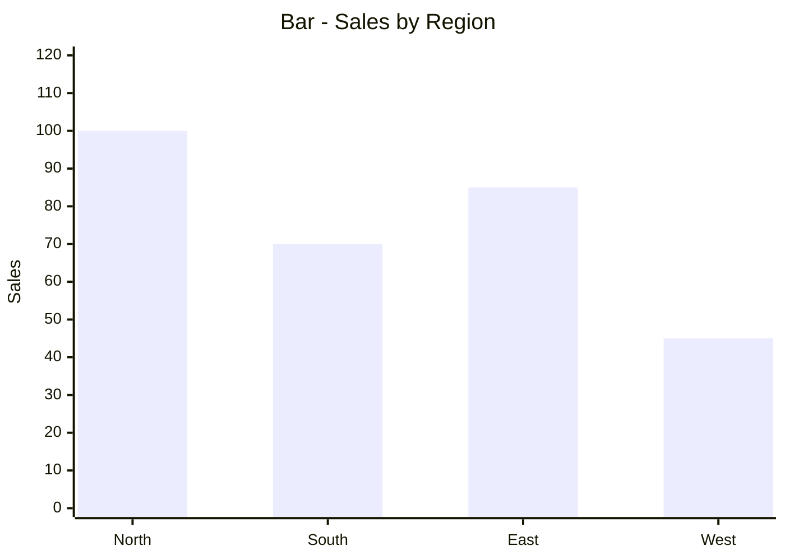
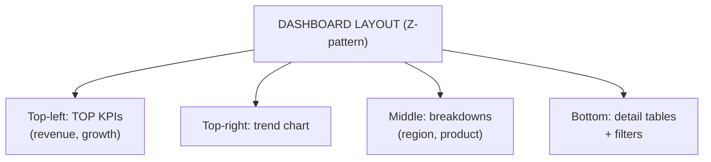
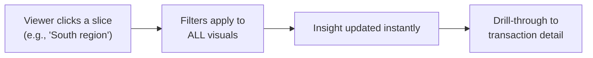
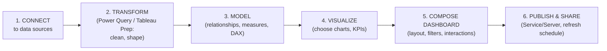
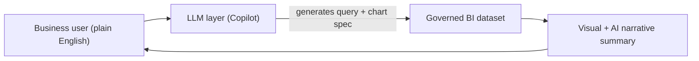

# BI — Unit 5 (Data Visualization and BI Tools)

> Exam-prep notes: short definitions, key points, and diagrams.

**Contents**
1. [Introduction & Principles of Data Visualization](#1-introduction--principles-of-data-visualization)
2. [Types of Charts](#2-types-of-charts)
3. [Dashboard Design Principles](#3-dashboard-design-principles)
4. [Interactive Reporting & Visual Analytics](#4-interactive-reporting--visual-analytics)
5. [BI Tools: Power BI & Tableau](#5-bi-tools-power-bi--tableau)
6. [AI-Assisted Visualization & LLM Reporting](#6-ai-assisted-visualization--llm-reporting)
7. [Quick Revision](#7-quick-revision)

---

## 1. Introduction & Principles of Data Visualization

- **Data visualization** = graphical representation of data (charts, maps, dashboards) so patterns, trends & outliers are understood **at a glance**.
- **Why:** humans process visuals ~60,000× faster than text; decisions improve when insight is instant; supports storytelling with data.

### Principles of Effective Visualization

1. **Know your audience & message** first — one clear takeaway per visual
2. **Choose the right chart** for the data relationship
3. **Maximize data-ink ratio** (Tufte) — remove clutter/chartjunk
4. **Honest scales** — start bar axes at zero; no truncated/misleading axes
5. **Colour with meaning** — highlight what matters, consistent semantics, colour-blind safe
6. **Label everything** — titles, axis labels, units, data values
7. **Keep it simple** — 5-second comprehension rule


## 2. Types of Charts

| Chart | Best for | Example |
|---|---|---|
| **Bar chart** | Compare categories | Sales by region |
| **Stacked bar** | Total + composition per category | Revenue by region per product |
| **Line chart** | Trends over time | Monthly sales |
| **Area chart** | Trend + cumulative volume | Traffic over time |
| **Pie / Doughnut** | Part-of-whole (≤5 slices) | Market share |
| **Scatter plot** | Relationship/correlation of 2 numbers | Ad spend vs revenue |
| **Histogram** | Distribution of one variable | Marks distribution |
| **Box plot** | Spread, median, outliers | Salary by department |
| **Heatmap** | Magnitude across 2 dimensions (colour) | Sales by day × hour |
| **Treemap** | Hierarchical part-to-whole (area) | Portfolio by sector |
| **Waterfall** | Cumulative step changes | Profit bridge |
| **KPI cards / Gauges** | Single key numbers vs target | Revenue vs goal |
| **Map (filled)** | Geographic data | State-wise sales |



```mermaid
xychart-beta
    title "Line - Monthly Trend"
    x-axis ["Jan", "Feb", "Mar", "Apr", "May", "Jun"]
    y-axis "Sales" 0 --> 100
    line [40, 55, 50, 70, 85, 95]
```

- **Choosing rule:** compare → bar · change over time → line · part-of-whole → pie/doughnut/treemap · relationship → scatter · distribution → histogram/box · density in 2-D → heatmap.

## 3. Dashboard Design Principles

- **Dashboard** = single-screen visual display of the most important **KPIs & metrics** for at-a-glance monitoring & decisions (types: **operational / strategic / analytical**).
- **Design principles:**
  1. **Purpose & audience first** (CEO scorecard ≠ operations wallboard)
  2. **5-second rule** — key message instantly visible
  3. **Visual hierarchy** — most important KPI top-left; size = importance
  4. **Less is more** — 5–9 key visuals, no chartjunk
  5. **Right chart per KPI**; consistent colours (red = bad, green = good)
  6. **Context** — targets, comparisons vs last period, sparklines
  7. **Interactivity** — filters, drill-down, time range
  8. **Layout grid** — aligned, grouped, responsive



## 4. Interactive Reporting & Visual Analytics

- **Interactive reporting** = users **explore** data instead of reading static pages: click to filter, drill down/up, cross-highlight, hover tooltips, export.
- **Visual analytics** = thinking with visuals — instant **drag-and-drop analysis** combining charts, filters, and calculations to answer "why" questions on the fly.
- Techniques: **cross-filtering** (click a region → all charts update), drill-through to detail rows, bookmarks/scenarios, parameter what-ifs, real-time refresh.



## 5. BI Tools: Power BI & Tableau

### 5.1 Power BI vs Tableau

| Feature | **Power BI** | **Tableau** |
|---|---|---|
| Vendor | Microsoft | Salesforce |
| Learning curve | Easy (Excel-like) | Moderate |
| Modeling / language | DAX, Power Query (M) | VizQL (drag-drop), LOD expressions |
| Data sources | Microsoft stack + common connectors | Very wide connector library |
| Performance | Good (VertiPaq in-memory) | Excellent on large data (Hyper) |
| Cost | Cheaper; free Desktop | Costlier |
| Sharing | Power BI Service, Teams, SharePoint | Tableau Server/Cloud |
| Best for | Business reporting in MS ecosystems | Advanced, data-rich visual analytics |

### 5.2 Creating Dashboards & Visual Reports (typical workflow)



- **Power BI pieces:** Desktop (build) → Service (share) → Mobile (view). **Tableau pieces:** Desktop/Public (build) → Server/Cloud (share).
- Best practice: model measures once (central definitions), use consistent colour themes, refresh scheduling + row-level security (RLS) before sharing.

## 6. AI-Assisted Visualization & LLM Reporting

- **AI-assisted data visualization:** tools suggest chart types, auto-detect anomalies/trends, auto-explain KPI changes, recommend visuals while you drag fields.
  - Examples: **Power BI Copilot + Q&A**, **Tableau Pulse / Einstein Copilot**, "Explain the increase" features.
- **LLMs for automated dashboards & natural-language reporting:**
  - **NL → query:** "Show top 5 products by profit in Q3" → generated SQL/DAX → chart (chat-with-data)
  - **Chart → narrative:** LLM writes the executive summary ("Revenue rose 12% led by South region…")
  - **NL → dashboard:** describe the dashboard you want → auto-generated draft visuals
  - Auto-generated titles, insights, alt-text and scheduled plain-language email digests
- **Benefits:** self-service for non-technical users, minutes instead of days, democratized analytics. **Risks:** hallucinated numbers, data privacy, bias → always verify against governed data.



## 7. Quick Revision

| Item | One-liner |
|---|---|
| Data viz | Graphics for instant understanding of data |
| Principles | Right chart, honest axes, less clutter, meaningful colour, labels |
| Chart picks | Compare→bar · Trend→line · Whole→pie · Relation→scatter · Distribution→histogram/box · 2-D density→heatmap |
| Treemap | Hierarchy by area |
| Dashboard | One-screen KPI display (operational/strategic/analytical) |
| Dashboard design | Audience, 5-second rule, hierarchy, ≤9 visuals, context, interactivity |
| Interactive reporting | Filter, drill, cross-highlight instead of static pages |
| Power BI vs Tableau | Cheaper+MS stack vs stronger visual analytics |
| BI workflow | Connect → Transform → Model → Visualize → Publish |
| AI in viz | Chart suggestions, anomaly explanations (Copilot, Pulse) |
| LLM reporting | NL→SQL query, chart→narrative, NL→dashboard — verify outputs |
