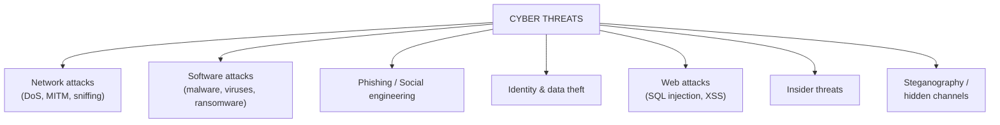
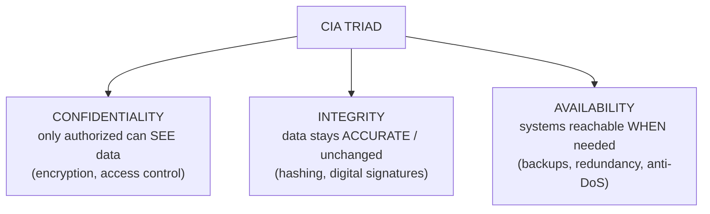
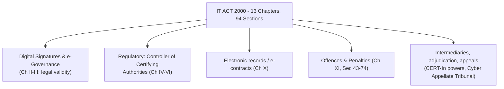

# CS — Unit 1 (Introduction to Cyber Security)

> Exam-prep notes: short definitions, key points, and diagrams.

**Contents**
1. [Cyber Security: Meaning, Need, Importance, Challenges](#1-cyber-security-meaning-need-importance-challenges)
2. [Cyberspace, Threats, Warfare, CIA Triad, Terrorism](#2-cyberspace-threats-warfare-cia-triad-terrorism)
3. [Critical Infrastructure & Organizational Implications](#3-critical-infrastructure--organizational-implications)
4. [Policy, Governance, Nodal Authority & International Convention](#4-policy-governance-nodal-authority--international-convention)
5. [Cyber Laws & IT Act 2000](#5-cyber-laws--it-act-2000)
6. [Quick Revision](#6-quick-revision)

---

## 1. Cyber Security: Meaning, Need, Importance, Challenges

### 1.1 Introduction

- **Cyber Security** = the body of technologies, processes and practices designed to protect **systems, networks, programs and data** from digital attacks, damage, or unauthorized access.
- It spans: **network security, application security, information security, endpoint security, identity management, disaster recovery, end-user education.**

### 1.2 Need & Importance

- Everything is digital: banking, government services, healthcare, power grids, communication → a breach can cost **money, data, safety and even lives**.
- Drivers of importance:
  - Explosive growth of data + IoT/cloud devices → huge attack surface
  - Rising **cybercrime economy** (ransomware-as-a-service, dark web)
  - National security: elections, defence, infrastructure are networked
  - Legal compliance: IT Act, GDPR — penalties for poor protection
  - Trust: customers only use digital services they trust

### 1.3 Challenges

| Challenge | Explanation |
|---|---|
| **Evolving threats** | Attackers constantly invent new techniques (zero-days, AI attacks) |
| **Huge attack surface** | Cloud, mobile, IoT, remote work multiply entry points |
| **Skilled-manpower shortage** | Fewer trained defenders than attackers |
| **Sophisticated attacks** | APTs, ransomware, social engineering bypass technology |
| **Legacy systems** | Old unpatched software still in critical use |
| **Anonymity & borders** | Attackers hide; laws differ per country → hard to trace/punish |
| **User negligence** | Weak passwords, phishing clicks — the weakest link is human |
| **Cost & awareness** | SMEs under-invest in security; incidents under-reported |

---

## 2. Cyberspace, Threats, Warfare, CIA Triad, Terrorism

### 2.1 Cyberspace

- The **virtual environment of the Internet**: websites, networks, computers, phones, applications and the people using them — "the fifth domain" (after land, sea, air, space).

### 2.2 Cyber Threats

- Any potential danger to data/systems. Broad categories:

### 2.3 Cyber-warfare

- Nation/state-sponsored use of technology to **attack another country's computers/networks** — espionage, sabotage, or disruption.
- Examples: **Stuxnet** (damaged Iranian nuclear centrifuges), **Estonia 2007** (network shutdown), power-grid attacks.
- Characteristics: attribution is hard, low cost vs huge impact, can precede physical war ("fifth battlefield").

### 2.4 CIA Triad (core of security)

| Property | Breach example | Protection |
|---|---|---|
| Confidentiality | Data leaked/stolen | Encryption, ACLs |
| Integrity | Record tampered | Hashes, signatures, audit logs |
| Availability | Site down (DDoS) | Redundancy, firewalls, backups |

- **(+ extra properties sometimes added:** authentication, authorization, non-repudiation**).**

### 2.5 Cyber Terrorism

- **Politically/socially motivated** use of cyberspace to create fear, violence, or damage — attacking critical systems or spreading terror (defacing govt sites, threatening infrastructure).
- Difference from ordinary cybercrime: **motive** (ideological vs money) and **impact** (fear/coercion vs theft).

---

## 3. Critical Infrastructure & Organizational Implications

### 3.1 Cyber Security of Critical Infrastructure

- **Critical infrastructure** = assets vital for a nation: **power grids, water, banking, telecom, transport, hospitals, defence, oil & gas**.
- Mostly run by **SCADA/ICS (industrial control systems)** — old tech now networked → easy targets (Stuxnet proved it).
- Protection steps: network segmentation (IT ≠ OT), continuous monitoring, incident-response plans, regular audits, government CERT coordination (India: **NCIIPC** protects critical infra).

### 3.2 Organizational Implications

- Every organization must treat security as a **business function**, not just IT:
  - **Board-level accountability** & risk management
  - Budget for tools + skilled staff + training
  - Policies: acceptable use, access control, BYOD, incident response
  - Business continuity & disaster recovery planning
  - Legal liability: breach → fines, lawsuits, reputation loss

---

## 4. Policy, Governance, Nodal Authority & International Convention

### 4.1 Need for a Comprehensive Cyber Security Policy & Governance

- A **national cyber policy** gives a unified vision: rules for protecting infrastructure, incident reporting, standards, and penalties — otherwise each organization decides its own (inconsistent) level of protection.
- **Governance** = framework of who is responsible for what, how risks are assessed, monitored and escalated (leadership, policies, compliance audits). India's example: **National Cyber Security Policy 2013**, CERT-In as national incident-response agency.

### 4.2 Need for a Nodal Authority

- Cyber incidents cross departments (banking + telecom + police). A **single nodal agency** (e.g., **CERT-In / NCIIPC** in India) is needed to:
  - receive & coordinate **incident reports**, issue alerts/advisories
  - standardize response across government & private sector
  - interface internationally with other CERTs (no fragmentation)

### 4.3 Need for an International Convention on Cyberspace

- The Internet is **borderless** — an attacker in country A hits a bank in country B through servers in country C. National laws stop at borders → need for **global treaties**:
  - common definitions of cybercrimes
  - **extradition & evidence-sharing** procedures
  - minimum security standards & mutual assistance
  - model: **Budapest Convention (2001)** on Cybercrime; UN GGE norms for state behaviour.

---

## 5. Cyber Laws & IT Act 2000

### 5.1 Introduction to Cyber Laws & Key Principles

- **Cyber law** = the legal rules governing **cyberspace**: crimes, contracts, privacy, IP, and evidence in digital form.
- Key principles: **legality** (clear offences & penalties), **jurisdiction** (which court/country), **recognition of electronic records & signatures**, **privacy & data protection**, **liability of intermediaries**, **admissibility of electronic evidence**.

### 5.2 Information Technology Act 2000 — Overview

- India's primary cyber law: legal recognition for **e-records & digital signatures**, defines **cyber offences & penalties**, based on UNCITRAL model law on e-commerce. Came into force **17 Oct 2000**; applies to whole India (and offences by/against Indians abroad).

### 5.3 Important Provisions (Offences & Penalties)

| Section | Offence | Penalty |
|---|---|---|
| **43** | Unauthorized access / damage to computer (hacking, virus, data theft) | Compensation up to ₹1 crore (damages) |
| **65** | Tampering with computer source documents | 3 years prison +/or ₹2 lakh |
| **66** | Computer-related offences (dishonest hacking) | 3 years +/or ₹5 lakh |
| **66B** | Dishonestly receiving stolen computer resource | 3 years +/or ₹1 lakh |
| **66C** | Identity theft (fraudulent use of password/signature) | 3 years + ₹1 lakh |
| **66D** | Cheating by personation (online fraud/phishing) | 3 years + ₹1 lakh |
| **66E** | Privacy violation (publishing private images) | 3 years + ₹2 lakh |
| **66F** | **Cyber terrorism** | **Life imprisonment** |
| **67** | Publishing obscene material electronically | 3 yrs (first) + ₹5 lakh |
| **67B** | Child pornography | 5 years + ₹10 lakh |

### 5.4 Amendments (IT Amendment Act 2008)

- Passed **2008** (effective 2009) — the major update:

| Area | Change |
|---|---|
| **Electronic signature** | "Digital signature" broadened to technology-neutral "electronic signature" |
| **New offences** | Identity theft (66C), cheating by personation (66D), privacy violation (66E), **cyber terrorism (66F)** added |
| **Obscenity** | Sec 67/67B refined (child porn explicitly) |
| **Corporate responsibility** | Sec 43A: compensation for negligent handling of **sensitive personal data** |
| **Intermediaries** | Sec 79 exemption tightened (must act on complaints — "due diligence") |
| **Authority powers** | Sec 69: govt may intercept/monitor for security; 69B: monitor traffic; CERT-In empowered |
| **Cyber Appellate Tribunal** | Powers enhanced; police powers for arrest/inspection of cybercafés |
| **Data protection** | SPDI Rules 2011 flowed from Sec 43A |

---

## 6. Quick Revision

| Item | One-liner |
|---|---|
| Cyber security | Protect systems/networks/data from digital attacks |
| Challenges | Evolving threats, IoT attack surface, skill shortage, human error, borders |
| Cyberspace | Virtual world of networks, devices, users (5th domain) |
| Cyber-warfare | Nation-state attacks: espionage/sabotage (Stuxnet) |
| CIA triad | Confidentiality (see) · Integrity (tamper-proof) · Availability (up) |
| Cyber terrorism | Ideological attack creating fear; Sec 66F → life imprisonment |
| Critical infra | Power, banking, telecom — protected by NCIIPC |
| Policy/governance | Uniform rules + accountability (NSP 2013, CERT-In) |
| Nodal authority | Single coordinating incident-response agency |
| International law | Budapest Convention — because the Internet is borderless |
| IT Act 2000 | Legal e-records/signatures + cyber offences (Sec 43–74) |
| ITAA 2008 | e-signature, 66C/66D/66E/66F, 43A data protection, Sec 69 powers |
