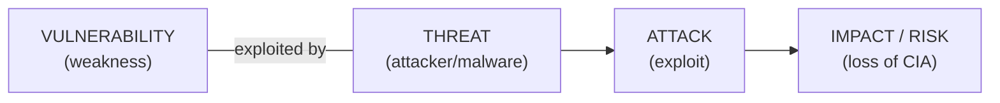
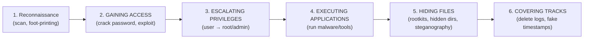
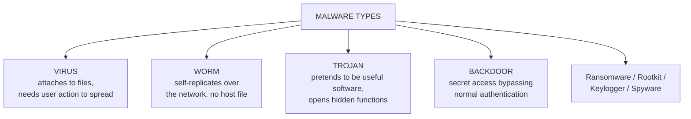
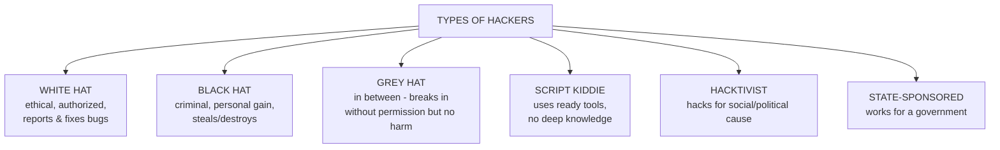

# CS — Unit 2 (Cybercrimes and Hacking)

> Exam-prep notes: short definitions, key points, and diagrams.

**Contents**
1. [Cyber-Attacks and Vulnerabilities](#1-cyber-attacks-and-vulnerabilities)
2. [Types of Threats](#2-types-of-threats)
3. [Malware: Viruses, Worms, Trojans, Backdoors](#3-malware-viruses-worms-trojans-backdoors)
4. [Types of Cyber Crime](#4-types-of-cyber-crime)
5. [Hacking: Types of Hackers, Cracking, Ethical Issues](#5-hacking-types-of-hackers-cracking-ethical-issues)
6. [Quick Revision](#6-quick-revision)

---

## 1. Cyber-Attacks and Vulnerabilities

- **Vulnerability** = weakness in a system (unpatched software, weak password, misconfiguration, human gullibility).
- **Threat** = potential actor/event that can exploit it (hacker, virus, flood).
- **Attack** = the actual exploitation causing damage. **Risk** = Threat × Vulnerability × Impact.

- Attack classes: **passive** (eavesdrop, sniff — no change) vs **active** (alter, disrupt: DoS, injection, MITM).

---

## 2. Types of Threats

### 2.1 Malware & Spyware

- **Malware** = malicious software designed to damage/spy (see §3).
- **Spyware** = secretly collects user info (keystrokes, browsing, passwords) and sends it to the attacker (keyloggers, adware trackers).

### 2.2 Sniffing

- Capturing **data packets travelling on a network** (passwords, emails) using tools like **Wireshark/tcpdump** — especially dangerous on unswitched/unencrypted (HTTP, open Wi-Fi) traffic. Countermeasure: encryption (HTTPS/VPN).

### 2.3 Hacking Attack Stages (systematic threat sequence)

| Stage | Meaning |
|---|---|
| **Gaining Access** | Breaking in via exploits, password cracking, social engineering |
| **Escalating Privileges** | Moving from normal user to admin/root to control the machine |
| **Executing Applications** | Running malicious programs (bots, backdoors, ransomware) |
| **Hiding Files** | Concealing tools using hidden attributes, alternate data streams, rootkits |
| **Covering Tracks** | Clearing/altering audit logs so investigation finds nothing |

---

## 3. Malware: Viruses, Worms, Trojans, Backdoors

| Malware | Key trait | Example |
|---|---|---|
| **Virus** | Attaches to host file/program; spreads when run/shared; corrupts data | Cascade, ILOVEYOU (email-borne) |
| **Worm** | **Self-replicating**, spreads alone via network vulnerabilities; consumes bandwidth/resources | Blaster, WannaCry (worm+ransomware) |
| **Trojan** | Disguised as legitimate software ("gift horse"); creates access, steals data | Zeus banking trojan, RATs |
| **Backdoor** | Hidden login/method left by attacker (or bad programmer) to re-enter anytime | Back Orifice |
| Logic bomb | Code that detonates on a trigger (date/event) | see §4 |
| Rootkit | Hides deep in OS to keep stealthy persistence | Sony BMG rootkit |

---

## 4. Types of Cyber Crime

| Cyber Crime | What it is |
|---|---|
| **Cyber stalking** | Repeatedly harassing/following a person online — threatening emails, tracking, fake profiles |
| **Software piracy** | Illegal copying/distribution/sale of copyrighted software (cracks, keygens) |
| **Cyber terrorism** | Ideological attacks on critical systems to create terror (life imprisonment — Sec 66F) |
| **Phishing** | Fake emails/sites impersonating banks to steal credentials ("fishing" for users) — see Unit 5 |
| **Computer hacking** | Unauthorized access to systems to steal/alter data |
| **Spamming** | Mass unsolicited emails (ads, scams) — floods inboxes, spreads malware |
| **Cross-site scripting (XSS)** | Injecting malicious **scripts into trusted websites** that run in visitors' browsers to steal cookies/sessions |
| **Online auction fraud** | Fake listings / never delivering paid items / fake bids on eBay-style sites |
| **Logic bombs** | Malicious code **triggered by an event/date** (e.g., disgruntled employee's code fires on his name removal) |
| **Web jacking** | Hacker takes control of a **website** (changes its content or redirects) and demands ransom |
| **Internet time theft** | Stealing someone's **Internet usage time/account** credentials to browse free |
| **DoS attack** | Flooding a server with traffic so **legitimate users can't use it**; **DDoS** = many bots at once |
| **Salami attack** | Stealing **tiny amounts** from many transactions ("slicing salami") — round-off money in bank accounts adds up |
| **Data diddling** | **Altering raw data** before/during entry into the computer (fake sales entries, changed grades) |
| **Email spoofing** | Forging the **From address** so an email looks like it came from someone trusted |

**DoS vs DDoS:** DoS = one machine floods target; DDoS = botnet (thousands of compromised machines) floods → harder to block.

**XSS example:** attacker posts `` as a comment — every viewer's cookie is stolen.

---

## 5. Hacking: Types of Hackers, Cracking, Ethical Issues

### 5.1 Types of Hackers

### 5.2 Hacking vs Cracking

| | **Hacking** | **Cracking** |
|---|---|---|
| Attitude | Curiosity, learning, improving security | Breaking for gain/damage |
| Legality | Ethical hacking is legal (with permission) | Illegal |
| Person | White-hat hacker | Cracker / black-hat |
| Activity | Find & report vulnerabilities responsibly | Bypass passwords/licences, deface, steal |

### 5.3 Hacking: Ethical Issues & Ethical Hacking

- Ethical issues: **privacy** violation, informed consent, harm to innocent users, disclosure of vulnerabilities (responsible disclosure?), misuse of tools — legality ends where permission ends.
- **Ethical Hacking (penetration testing)** = an authorized attempt to break into systems with the **owner's written permission**, using the attacker's techniques, to find and fix weaknesses **before** criminals do.
- **Ethical hacking phases:** Reconnaissance → Scanning → Gaining access → Maintaining access → **Reporting + clearing tracks** (documents everything, signs NDA).
- Skills: networking, OS internals, programming, tools (Nmap, Metasploit, Wireshark, Burp Suite); certifications: CEH, OSCP.

---

## 6. Quick Revision

| Item | One-liner |
|---|---|
| Risk formula | Threat × Vulnerability → Impact |
| Sniffing | Capture network packets (Wireshark); fix = encryption |
| 5 attack stages | Recon → Gaining access → Escalating privileges → Executing apps → Hide & cover tracks |
| Virus vs Worm | Needs host file vs self-replicates alone |
| Trojan | Malware disguised as useful software |
| Backdoor | Hidden bypass of authentication |
| Phishing | Fake bank/mail pages to steal credentials |
| Salami attack | Steal tiny slices from many transactions |
| Data diddling | Tamper data before entry |
| Email spoofing | Forged From address |
| XSS | Inject script that runs in other users' browsers |
| DoS/DDoS | Flood service; DDoS uses botnets |
| Web jacking | Hijack control of a website |
| Logic bomb | Code that fires on a trigger event |
| Hacker colours | White (ethical) / Black (criminal) / Grey (in-between) |
| Ethical hacking | Authorized pentest to fix weaknesses — permission is the key |
