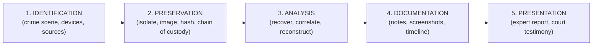
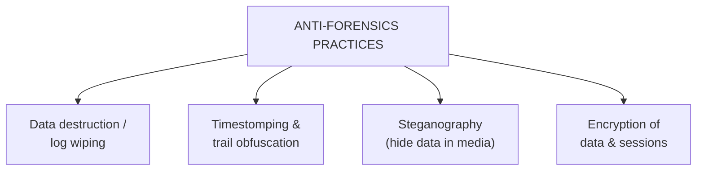
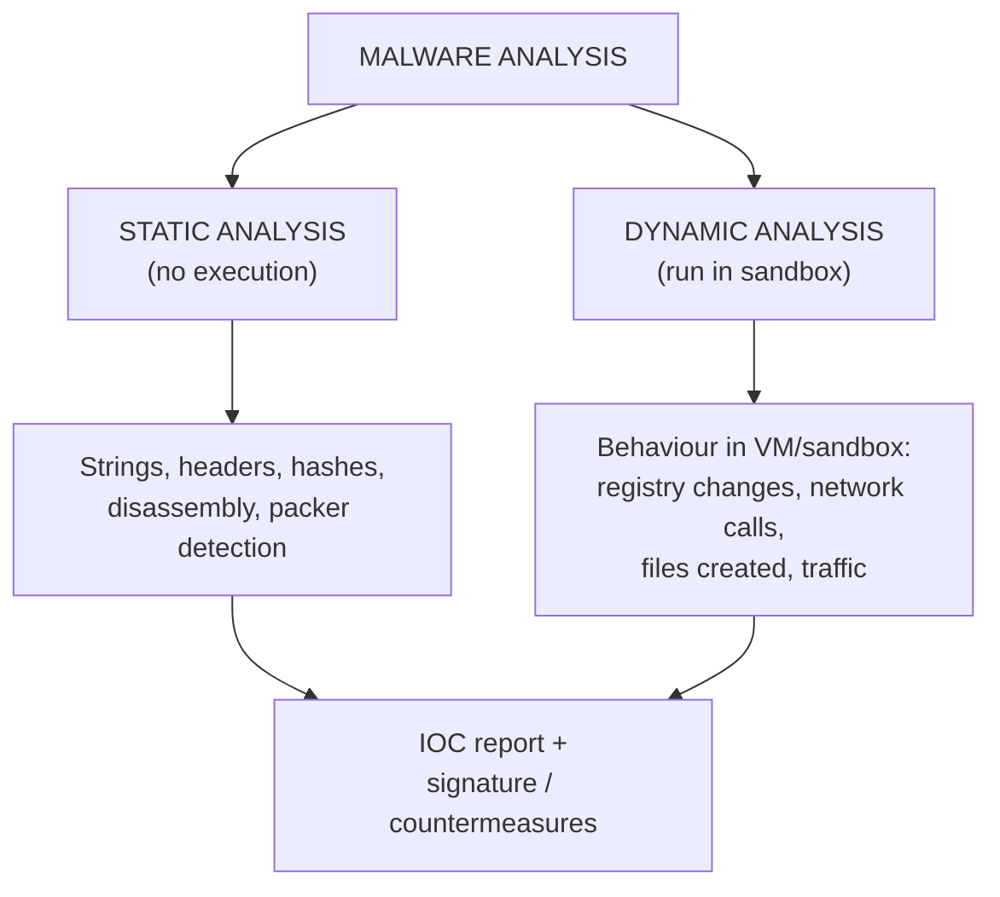
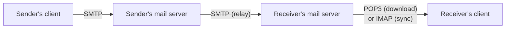
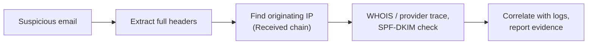

# CS — Unit 3 (Cyber Forensics)

> Exam-prep notes: short definitions, key points, and diagrams.

**Contents**
1. [Introduction to Cyber Forensics](#1-introduction-to-cyber-forensics)
2. [Investigation Process & Digital Evidence](#2-investigation-process--digital-evidence)
3. [Web Attack Forensics](#3-web-attack-forensics)
4. [Anti-Forensics](#4-anti-forensics)
5. [Network Forensics Analysis Tools](#5-network-forensics-analysis-tools)
6. [Malware Forensics](#6-malware-forensics)
7. [Email Forensics](#7-email-forensics)
8. [Quick Revision](#8-quick-revision)

---

## 1. Introduction to Cyber Forensics

- **Cyber (computer) forensics** = application of investigation and analysis techniques to **collect, preserve, examine and present digital evidence** in a manner **admissible in a court of law**.
- Goals: identify the culprit & method · recover deleted/hidden data · prove what happened (who, what, when, how) · support prosecution & improve security.
- Golden rules: **never alter original evidence**, document every step, maintain **chain of custody**, follow legal procedures.

## 2. Investigation Process & Digital Evidence

### 2.1 Cyber Forensics Investigation Process

### 2.2 Digital Evidence

- **Digital evidence** = information of probative value stored/transmitted digitally: hard disks, logs, emails, chat records, browsing history, GPS, cloud data, mobile data.
- **Properties:** **fragile/easily altered**, **copyable without loss** (work on copies), **timestampable**, **metadata-rich**, must be **authenticated** (hashes) to be admissible (Indian Evidence Act Sec 65B certificate for electronic records).

### 2.3 Challenges in Cyber Forensics

1. **Volume** of data (TBs to analyse within deadlines)
2. **Encryption** of data/devices
3. **Anti-forensics** (log wiping, steganography — §4)
4. **Cloud & cross-border** data (jurisdiction, provider cooperation)
5. Rapidly changing devices/formats (IoT, encrypted phones)
6. Attribution — attackers hide via proxies/VPN/Tor
7. Evidence volatility — RAM/network data disappears on shutdown

---

## 3. Web Attack Forensics

| Branch | Focus | What is examined |
|---|---|---|
| **Intrusion forensics** | *How did the attacker get in & what did they do?* | Web-server access/error logs, firewall & IDS logs, modified files, injected scripts, shell history |
| **Database forensics** | *What data was touched in the DB?* | DB transaction logs, audit trails, temp tables, SQL injection traces, schema changes |
| **Preventive forensics** | *Prepare evidence-ready systems in advance* | Extended logging, audit trails, honeypots, file-integrity monitoring (build forensics-readiness) |

- **Typical web-attack investigation:** correlate **access logs** (suspicious URLs — `../`, `' OR 1=1`, long queries) → identify source IP/session → find compromised files (integrity check) → inspect DB logs for injected queries → build timeline.

---

## 4. Anti-Forensics

- **Anti-forensics** = techniques used to **frustrate, mislead or erase** forensic investigation.
- **Practices:** deleting/wiping logs & files securely (multi-pass overwrite), **timestomping** (fake timestamps), steganography (hiding data in images), encryption, file-signature spoofing, trail obfuscation (false IPs), physically destroying media, "defence-in-depth against the investigator".

- **Detection techniques:** compare **file hashes** against known databases · check **timestamp inconsistencies** (MFT vs logs) · scan for **steganography** tools/signatures · look for wipe-tool artefacts & anomalous gaps in logs · cross-correlate multiple log sources (one source deleted ≠ all deleted).

## 5. Network Forensics Analysis Tools

- **Network forensics** = capturing, recording and analysing **network traffic** to reconstruct attacks (works even when endpoint is wiped).
- Tools:

| Tool | Use |
|---|---|
| **Wireshark** | Deep packet capture & protocol analysis |
| **tcpdump** | Command-line capture |
| **NetworkMiner** | Network forensic analysis (files, sessions, credentials) |
| **Snort / Suricata** | IDS — alert + capture suspicious traffic |
| **Zeek (Bro)** | Behavioural network logging |
| **NetFlow analysis** | Traffic statistics & anomaly detection |

---

## 6. Malware Forensics

### 6.1 Malware Types (recap)

Virus · Worm · Trojan · Ransomware · Rootkit · Keylogger · Spyware · Botnet · Fileless malware (see Unit 2 §3).

### 6.2 Malware Analysis (2 levels)

### 6.3 Tools for Analysis

| Tool | Purpose |
|---|---|
| **VirusTotal** | Multi-engine scan / hash lookup |
| **IDA Pro / Ghidra** | Disassembly & reverse engineering |
| **PEiD / Detect It Easy** | Packer & file-type detection |
| **strings / PEview** | Extract readable strings & PE structure |
| **Process Monitor / Process Explorer** | Live behaviour monitoring |
| **Wireshark / INetSim / Cuckoo Sandbox** | Network behaviour & automated detonation |
| **RegShot / FakeNet** | Registry diff / fake internet for sandbox |

---

## 7. Email Forensics

### 7.1 E-mail Protocols

| Protocol | Port | Role |
|---|---|---|
| **SMTP** | 25/587 | **Sending** & relaying mail between servers |
| **POP3** | 110/995 | Download mail to one device (usually deletes server copy) |
| **IMAP** | 143/993 | Keep mail on server, sync across devices |
| **MIME** | — | Standard that allows attachments, HTML, non-ASCII content |

### 7.2 E-mail Crimes & Investigation

- **Crimes:** email **spoofing** (forged From), **phishing**, spamming, email bombing (flooding), threatening/defamatory mails, business email compromise (BEC).
- **Forensic examination of headers:**
  - `Received:` chain — trace real path (bottom-most = original)
  - `Message-ID`, `X-Mailer`, `Return-Path`, `DKIM/SPF/DMARC` results
  - `Reply-To` mismatch, originating **IP** → WHOIS/geo-lookup
- Tools: eMailTrackerPro, MailXaminer, header analysers; preserve with full headers + `.eml`/`.msg` export (hash it).

---

## 8. Quick Revision

| Item | One-liner |
|---|---|
| Cyber forensics | Scientifically collect & present digital evidence for court |
| 5 investigation steps | Identify → Preserve → Analyse → Document → Present |
| Chain of custody | Documented handling trail of evidence |
| Digital evidence | Fragile, copyable, needs hash authentication (Sec 65B) |
| Intrusion forensics | Trace how attacker entered (logs, files) |
| Database forensics | Examine DB transaction/audit logs |
| Preventive forensics | Log & audit-trail design so future evidence exists |
| Anti-forensics | Log wiping, timestomping, steganography, encryption |
| Detection | Hash comparison, timestamp cross-checks, gap analysis |
| NFAT | Wireshark, NetworkMiner, Zeek, Snort |
| Static vs dynamic analysis | Inspect code without running vs run in sandbox |
| Analysis tools | VirusTotal, Ghidra/IDA, Cuckoo, Process Monitor |
| Email protocols | SMTP sends · POP3 downloads · IMAP syncs · MIME attachments |
| Email header clues | Received chain, Message-ID, SPF/DKIM, originating IP |
