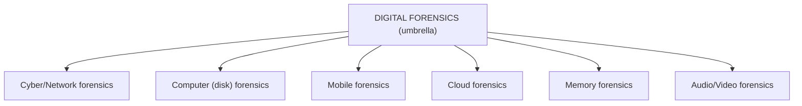
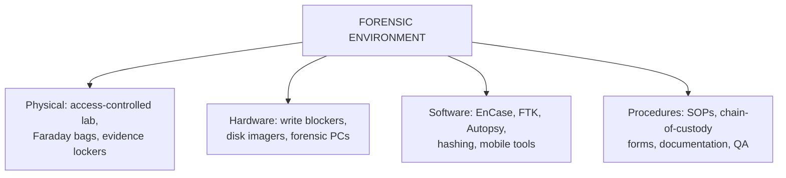
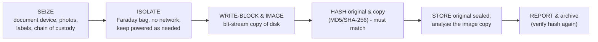
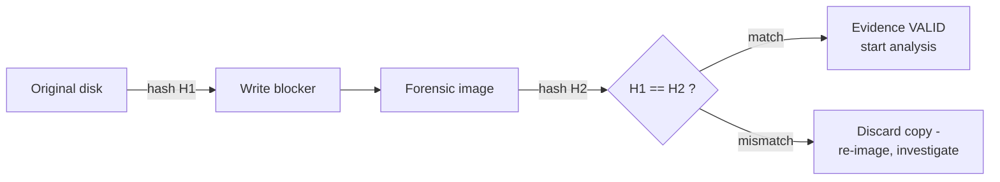

# CS — Unit 4 (Digital Forensics)

> Exam-prep notes: short definitions, key points, and diagrams.

**Contents**
1. [Introduction & Cyber vs Digital Forensics](#1-introduction--cyber-vs-digital-forensics)
2. [Role of Digital Forensics & Its Environment](#2-role-of-digital-forensics--its-environment)
3. [Forensic Software and Hardware](#3-forensic-software-and-hardware)
4. [Digital Evidence: Properties, Recovery, Preservation](#4-digital-evidence-properties-recovery-preservation)
5. [Selecting, Analyzing & Validating Evidence](#5-selecting-analyzing--validating-evidence)
6. [Forensic Technology and Practices](#6-forensic-technology-and-practices)
7. [Quick Revision](#7-quick-revision)

---

## 1. Introduction & Cyber vs Digital Forensics

- **Digital forensics** = the scientific process of **identifying, preserving, analysing and presenting evidence from ANY digital device/media** (computers, phones, IoT, cloud, storage) for legal purposes.

| Aspect | **Cyber Forensics** | **Digital Forensics** |
|---|---|---|
| Scope | Crimes **committed on/over networks & cyberspace** (hacking, intrusion, phishing) | **Any digital device/media** — even offline evidence (a seized phone, CCTV DVR, USB) |
| Focus | Network-centric investigation | Broader umbrella — includes cyber forensics as a branch |
| Branches | Network, web, email, malware forensics | Computer, mobile, cloud, memory, disk forensics |
| Example question | "Who intruded the server?" | "What's inside this recovered phone?" |

## 2. Role of Digital Forensics & Its Environment

- **Roles:** reconstruct crimes from digital traces · support prosecution/defence · corporate incident response & HR cases · data recovery · prove/disprove alibis · strengthen security by learning attack paths.
- **Environment (setup)** = a proper **forensic lab**:

## 3. Forensic Software and Hardware

| Category | Tools | Purpose |
|---|---|---|
| **Imaging** | FTK Imager, dd/dc3dd, Cellebrite UFED | Bit-by-bit copies of media |
| **Write blockers** | Tableau, WiebeTech | Physically prevent writes to evidence disk |
| **Full suites** | EnCase, FTK (Forensic Toolkit), X-Ways | Index, search, recover, report |
| **Open source** | Autopsy/Sleuth Kit, Volatility (RAM), Wireshark | Free analysis frameworks |
| **Mobile** | Cellebrite, Oxygen Forensics, MOBILedit | Phone extraction & decoding |
| **Hardware** | Faraday bags, forensic bridges, chip-off rigs, ROM duplicators | Isolate & copy devices |

- Key rule: work only on **forensic images**, never on originals — a **write blocker + hash-verified image** is the industry-standard safeguard.

## 4. Digital Evidence: Properties, Recovery, Preservation

### 4.1 Properties of Digital Evidence

1. **Fragile/volatile** — one keystroke can change it (RAM first to die)
2. **Easily duplicated** — copies are analysed, original sealed
3. **Latent/invisible** — exists beyond user view: deleted files, slack space, metadata, logs
4. **Timestamped** — file-system times, logs (but forgeable)
5. **Requires authentication** — hash (MD5/SHA-256) + chain of custody + Sec 65B certificate
6. **Format-independent** — content survives storage moves

### 4.2 Recovering & Preserving Digital Evidence

- **Recovery** techniques: recover deleted files (parse file system: $MFT, inodes), carve files from unallocated space (**file carving** — headers/footers), extract from slack space & unallocated clusters, decrypt/password-crack, mount encrypted volumes (with keys/court orders).
- **Preservation:** proper bagging/tagging, temperature control, batteries maintained, hash verification, hash-verified re-checks, strict access logs to evidence vault.

## 5. Selecting, Analyzing & Validating Evidence

### 5.1 Selecting & Analyzing

- From mountains of data, select by **relevance**: keywords (case terms), date/time windows, file types, owner/user accounts, email & chat threads, registry/browser artifacts.
- **Analysis artifacts:**

| Artifact | What it proves |
|---|---|
| Browser history/cache/cookies | What the user viewed and when |
| Registry (Windows) | USB devices used, programs run, user activity |
| Event/security logs | Logins, errors, intrusions |
| Email metadata | Communication & intent |
| File metadata (EXIF) | Camera, GPS, timestamps of photos |
| RAM dump | Running malware, keys, unsaved data |

### 5.2 Validating the Evidence

- **Hash validation:** MD5/SHA hash of original == hash of image ⇒ copy is exact (integrity proof).
- **Dual-hash** practice (MD5 + SHA-256) avoids collision objections.
- Other validation: **cross-validation** with second tool, reproducing findings, **known-file filtering** (NSRL), audit logs of the tool's own actions, peer/expert review before court submission.

## 6. Forensic Technology and Practices

- **Advanced forensic tools** (in practice): **Volatility** (memory forensics — recover malware/keys from RAM), **Plaso/log2timeline** (super-timelines), **Cellebrite UFED** (mobile physical extraction), **Magnet AXIOM** (multi-source), **Hashcat** (password recovery), **X-Ways**, cloud forensic APIs (Google Takeout/M365).
- **Practices / standard methodology:** follow **ISO/IEC 27037** (evidence handling) & NIST SP 800-86 process; maintain **case notes + chain-of-custody forms**; peer review; lab accreditation; keep tool skills current; **documentation culture** — if it isn't written down, it didn't happen.

---

## 7. Quick Revision

| Item | One-liner |
|---|---|
| Digital forensics | Evidence science for ALL digital devices (umbrella) |
| Cyber vs digital | Network/cyberspace crimes vs any digital media (broader) |
| Lab environment | Controlled lab + write blockers + imaging + SOPs |
| Key tools | EnCase, FTK, Autopsy, Cellebrite, Volatility |
| Evidence properties | Fragile, copyable, latent, timestamped, needs authentication |
| Golden rule | Never touch original — write-block, image, hash |
| Recovery | Deleted-file parsing, file carving, slack space, decryption |
| Validation | MD5/SHA-256 hash match (+ dual hash, cross-tool check) |
| Artifacts | Browser history, registry, logs, metadata, RAM |
| Standards | ISO 27037, NIST 800-86, chain of custody always |
