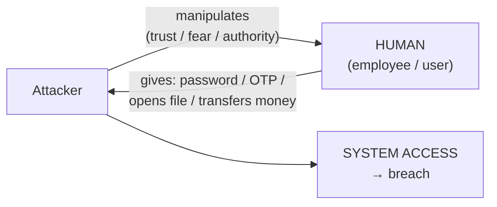
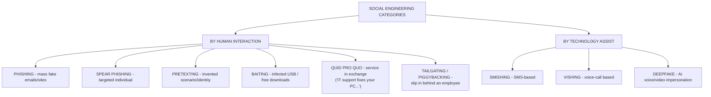
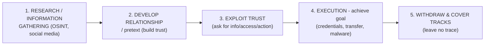
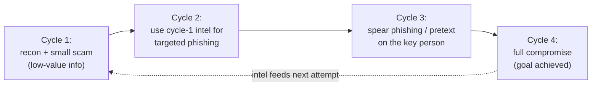
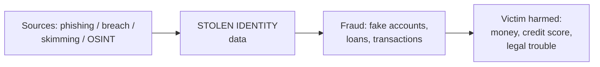
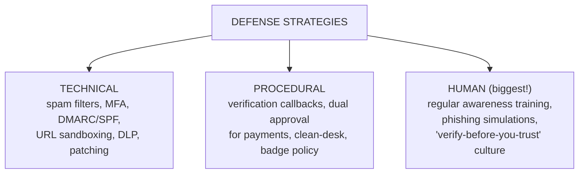

# CS — Unit 5 (Social Engineering)

> Exam-prep notes: short definitions, key points, and diagrams.

**Contents**
1. [Social Engineering & Cyber Security](#1-social-engineering--cyber-security)
2. [Conceptual Evolution & Categories](#2-conceptual-evolution--categories)
3. [Phases of a Social Engineering Attack](#3-phases-of-a-social-engineering-attack)
4. [Attack Spiral Model & Attack Vectors](#4-attack-spiral-model--attack-vectors)
5. [Advanced Attacks: Phishing, Insider, Identity Theft](#5-advanced-attacks-phishing-insider-identity-theft)
6. [Preventing Insider Threats](#6-preventing-insider-threats)
7. [Targets and Defense Strategies](#7-targets-and-defense-strategies)
8. [Quick Revision](#8-quick-revision)

---

## 1. Social Engineering & Cyber Security

- **Social engineering** = psychological manipulation of people into performing actions or revealing **confidential information** — **hacking the human**, not the machine.
- Why it works: **trust, authority, fear, greed, urgency, helpfulness** — humans are the weakest link; firewalls can't patch people.
- In cyber security, most major breaches begin with a social-engineering step (a phishing email, a call posing as IT support).

## 2. Conceptual Evolution & Categories

### 2.1 Conceptual Evolution

- **Pre-digital era:** con artists, pyramid salesmen, impersonation at offices (classic fraud always relied on persuasion).
- **Phone era:** cold-calling scams, pretexting (fake bank/bureau calls).
- **Internet era:** phishing emails, fake websites, instant-message scams at massive, near-zero cost.
- **Modern/AI era:** spear phishing with OSINT from social media, business email compromise, **deepfake voice/video**, smishing & vishing at scale.

### 2.2 Defining Social Engineering — Categories

## 3. Phases of a Social Engineering Attack

| Phase | What attacker does |
|---|---|
| 1. Research | Collect target info (LinkedIn, company site, dumps, small talk) |
| 2. Relationship/Pretext | Pose as IT staff, auditor, colleague; build credibility |
| 3. Exploit | Ask for the password/OTP/access card/money transfer |
| 4. Execution | Use obtained access; plant malware; loot data |
| 5. Withdraw | Delete traces, exit quietly |

## 4. Attack Spiral Model & Attack Vectors

### 4.1 Attack Spiral Model

- SE attacks are **not one-shot** — each success gives data/tools to launch a **bigger, better-informed attack**, spiralling inward toward the high-value goal:

### 4.2 Attack Vectors — Social vs Socio-technical Approach

| | **Social approach** | **Socio-technical approach** |
|---|---|---|
| Means | Pure psychology: talk, impersonate, charm | Psychology **+ technology** (links, attachments, malware) |
| Examples | Pretexting call, tailgating into server room, dumpster diving | Phishing mail with malicious link, Baiting USB with RAT, vishing + remote-access tool |
| Target | People directly | People as the door into systems |

## 5. Advanced Attacks: Phishing, Insider, Identity Theft

### 5.1 Phishing Attack (and variants)

| Variant | Channel | Example |
|---|---|---|
| **Phishing** | Mass email | Fake bank login page |
| **Spear phishing** | Targeted email (uses victim's name/role) | CFO receives fake invoice from "CEO" |
| **Whaling** | Targets executives | Fraudulent wire transfer |
| **Vishing / Smishing** | Voice call / SMS | "Your KYC expired — share OTP" |
| **Pharming** | DNS poison / hosts file | Correct URL opens fake site |
| **Clone phishing** | Resend a real mail with swapped attachment | Replaces legit PDF with infected one |

### 5.2 Insider Attack & Identity Theft

- **Insider attack** = a current/former **employee, contractor or partner** misusing legitimate access (steal data, sabotage, plant logic bombs). Motives: revenge, money, ideology, coercion — or accidental negligence.
- **Identity theft** = stealing someone's **personal identifiers** (name, Aadhaar/PAN, card details, passwords, biometrics) to **impersonate** them — opening accounts, taking loans, committing crimes in the victim's name.
- Gained via phishing, data breaches, dumpster diving, skimmers, malware keyloggers, social-media oversharing.

## 6. Preventing Insider Threats

1. **Least privilege & need-to-know** — minimal access rights; revoke immediately on role change/exit
2. **Access monitoring & UEBA** — log and flag abnormal data downloads/logins
3. **Segregation of duties** — no single person controls a full sensitive process
4. **Strong onboarding/offboarding** — NDAs, exit checklists (disable accounts, collect devices)
5. **Data loss prevention (DLP)** — block bulk uploads/USB copies
6. **Security awareness & reporting culture** — make it safe to report suspicious colleagues
7. **Background checks** + watch for disgruntlement indicators

## 7. Targets and Defense Strategies

### 7.1 Who is Targeted?

- **Helpdesk/reception** (trusted, compliant) · **executives** (whaling — approve payments) · **HR & finance** (PAN/bank data, payroll) · **new employees** (don't know processes yet) · **IT admins** (high privileges) · **customers of banks** (mass phishing).

### 7.2 Defense Strategies

| Rule for employees | Meaning |
|---|---|
| Slow down on urgency | Urgency/threat = classic SE signature |
| Verify out-of-band | Call the "bank/CEO" on the known number before acting |
| Never share OTP/passwords | No genuine party ever asks |
| Check URLs & sender domains | `paypa1.com` ≠ `paypal.com` |
| Report immediately | Early report = contained damage |

---

## 8. Quick Revision

| Item | One-liner |
|---|---|
| Social engineering | Hacking humans via trust, fear, authority — weakest link |
| Categories | Phishing, spear phishing, pretexting, baiting, quid pro quo, tailgating, vishing/smishing, deepfakes |
| 5 phases | Research → Relationship/pretext → Exploit → Execute → Withdraw |
| Attack spiral | Each success powers a bigger, better-informed next attack |
| Social vs socio-technical | Pure talk vs talk + malware/links |
| Whaling | Phishing aimed at top executives |
| Pharming | Redirected traffic to fake site without user error |
| Insider attack | Misuse of legitimate access by employee/contractor |
| Identity theft | Impersonation using stolen identifiers (Aadhaar, cards) |
| Insider prevention | Least privilege, monitoring, segregation of duties, DLP, exits |
| Best defense | Trained, sceptical humans + MFA + verification procedures |
