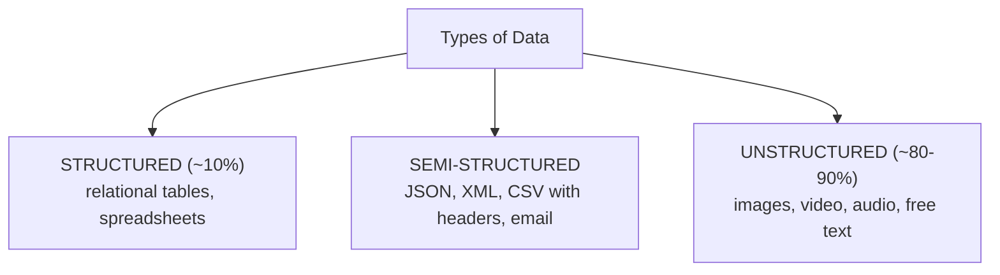
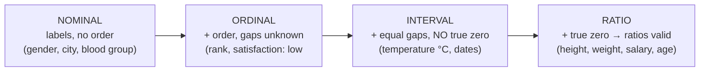
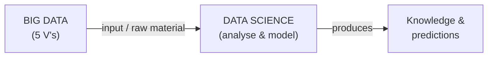
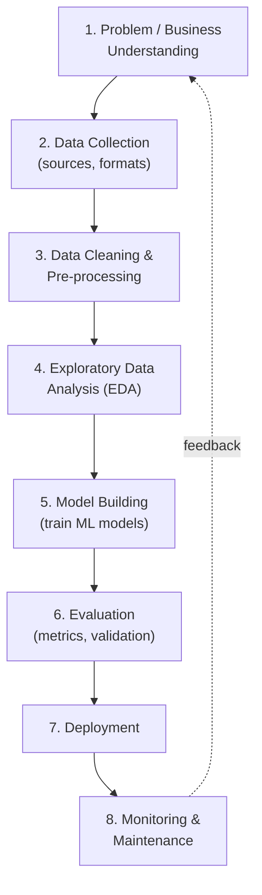
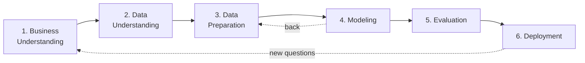
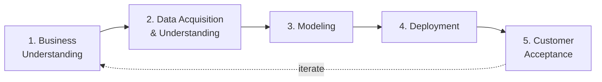
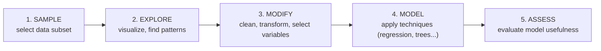
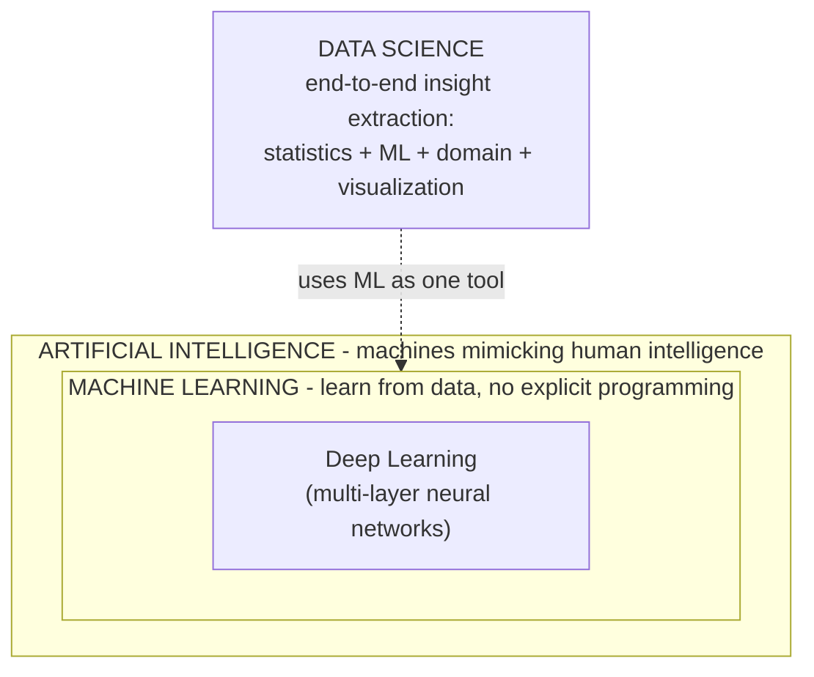
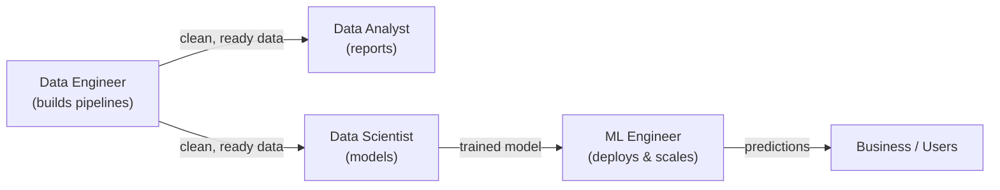

# DS — Unit 1 (Fundamentals of Data Science)

> Exam-prep notes: short definitions, key points, and diagrams.

**Contents**
1. [Importance of Data Science & Types of Data](#1-importance-of-data-science--types-of-data)
2. [Scales of Measurement & Data Formats](#2-scales-of-measurement--data-formats)
3. [Big Data vs Data Science & The Life Cycle](#3-big-data-vs-data-science--the-life-cycle)
4. [Process Models: CRISP-DM, TDSP, SEMMA](#4-process-models-crisp-dm-tdsp-semma)
5. [Applications, DS vs ML vs AI, Roles](#5-applications-ds-vs-ml-vs-ai-roles)
6. [Importance of Mathematical Statistics](#6-importance-of-mathematical-statistics)
7. [Quick Revision](#7-quick-revision)

---

## 1. Importance of Data Science & Types of Data

### 1.1 Importance of Data Science

- **Data Science** = interdisciplinary field that extracts **knowledge and insights** from data using statistics, ML, and domain knowledge.
- Why it matters today: massive data generation (2.5+ quintillion bytes/day) + cheap storage/compute + better algorithms → **data-driven decisions** beat intuition.
- Value: better decisions, prediction of trends, personalization, fraud detection, cost reduction, new products/services.

### 1.2 Types of Data (by structure)

| Type | Meaning | Examples |
|---|---|---|
| **Structured** | Fixed schema, rows & columns; easy to store/query | SQL tables, Excel sheets |
| **Semi-structured** | No rigid schema but has **tags/markers** | JSON, XML, HTML, emails, logs |
| **Unstructured** | No predefined format | Images, videos, audio, PDFs, social media text |

- Also classified by **nature:** Quantitative (numerical: discrete/continuous) vs **Qualitative** (categorical: nominal/ordinal).

---

## 2. Scales of Measurement & Data Formats

### 2.1 Scales of Measurement (NOIR)

| Scale | Order? | Equal intervals? | True zero? | Example | Allowed ops |
|---|---|---|---|---|---|
| **N**ominal | ✘ | ✘ | ✘ | Gender | Count, mode |
| **O**rdinal | ✔ | ✘ | ✘ | Class rank | + median |
| **I**nterval | ✔ | ✔ | ✘ | °C temperature | + mean, std (no ratios: 20°C ≠ 2×10°C) |
| **R**atio | ✔ | ✔ | ✔ | Weight, income | + ratios (80 kg = 2×40 kg) |

*Memory trick: **NOIR** — each level adds one more property.*

### 2.2 Data Formats

| Format | Nature | Example |
|---|---|---|
| **CSV** | Comma-Separated Values — plain text table, 1 row per line | `id,name,age` `1,Amit,21` |
| **JSON** | JavaScript Object Notation — key-value pairs, arrays; lightweight, web APIs | `{"name": "Amit", "age": 21, "skills": ["Python","SQL"]}` |
| **XML** | eXtensible Markup Language — nested **tags**, schema (XSD), verbose | `<person><name>Amit</name><age>21</age></person>` |
| **SQL tables** | Structured relations in RDBMS — rows/columns, types, keys, SQL queries | `SELECT name FROM student WHERE age > 20;` |

- **JSON vs XML:** both semi-structured & human-readable; JSON is lighter & maps to objects directly; XML supports schemas/namespaces.

---

## 3. Big Data vs Data Science & The Life Cycle

### 3.1 Big Data vs Data Science

| Aspect | **Big Data** | **Data Science** |
|---|---|---|
| What | Huge **datasets** (too big for traditional tools) | The **field/methodology** to extract insights from data |
| Focus | Storage, processing, management | Analysis, modelling, prediction |
| Characterized by | **5 V's — Volume, Velocity, Variety, Veracity, Value** | Statistics + ML + domain expertise |
| Tools | Hadoop, Spark, NoSQL, Kafka | Python/R, SQL, ML libraries, visualization |
| Relation | Big Data is the **raw material** | Data Science is the **process** that refines it |

### 3.2 Data Science Life Cycle (generic)

---

## 4. Process Models: CRISP-DM, TDSP, SEMMA

### 4.1 CRISP-DM (Cross-Industry Standard Process for Data Mining)

The most widely used, **cyclic** model with 6 phases:

- Key ideas: starts & ends with **business understanding**; data preparation is the most time-consuming phase (~60–70% effort); iterative, not one-way.
- **Why "cyclic"?** Deployment gives new insights → next iteration of the project.

### 4.2 TDSP (Team Data Science Process — Microsoft)

- An **agile, team-based** framework (extends CRISP-DM) with defined **roles** (manager, data scientist, engineer) and tools/infrastructure for collaboration.
- 5 lifecycle stages:

### 4.3 SEMMA (Sample, Explore, Modify, Model, Assess — SAS)

| Model | Origin | Focus |
|---|---|---|
| CRISP-DM | Industry consortium | Business-goal driven, cyclic, most popular |
| TDSP | Microsoft | **Team collaboration**, agile, standardized tooling |
| SEMMA | SAS Institute | Data-mining **steps** in SAS EM tool (ignores business phase) |

---

## 5. Applications, DS vs ML vs AI, Roles

### 5.1 Applications of Data Science

- **Healthcare:** disease prediction, medical image analysis, drug discovery
- **Finance:** fraud detection, credit scoring, algorithmic trading
- **E-commerce / Retail:** recommendation systems, demand forecasting, price optimization
- **Transport:** route optimization, self-driving cars
- **Entertainment:** content recommendations (Netflix/Spotify)
- **Others:** spam filtering, weather forecasting, agriculture (crop prediction), sentiment analysis

### 5.2 Data Science vs Machine Learning vs AI

| | AI | ML | Data Science |
|---|---|---|---|
| Goal | Make machines **behave intelligently** | Machines **learn patterns** from data | Extract **insights/knowledge** from data |
| Scope | Broadest | Subset of AI | Interdisciplinary (stats + ML + business) |
| Output | Intelligent agents/systems | Trained models | Reports, predictions, decisions |
| Example | Chatbot, self-driving car | Spam classifier | Analysing sales data for strategy |

### 5.3 Roles in Data Science

| Role | Focus | Typical tasks & tools |
|---|---|---|
| **Data Analyst** | Descriptive: *what happened?* | Dashboards, reports, SQL, Excel, Power BI/Tableau |
| **Data Scientist** | Predictive: *what will happen & why?* | Modelling, statistics, experiments; Python/R, ML libraries |
| **Data Engineer** | Data **pipeline & infrastructure** | ETL, data lakes/warehouses, Spark, Airflow, SQL/NoSQL |
| **ML Engineer** | **Production-izing** models | Model deployment, monitoring, MLOps, Docker, APIs |

---

## 6. Importance of Mathematical Statistics

- Statistics is the **foundation** of every DS phase — models are statistical in nature, and stats tells us whether a result is real or coincidence.
- Key contributions:

| Area | Use in Data Science |
|---|---|
| **Descriptive statistics** (mean, median, mode, variance, std) | Summarize & understand data (EDA) |
| **Probability & distributions** (Normal, Binomial, Poisson) | Basis of models & assumptions; uncertainty quantification |
| **Inferential statistics** — hypothesis testing, confidence intervals, p-values | Decide if a pattern is statistically significant (A/B testing) |
| **Sampling theory** | Draw valid conclusions from samples of big data |
| **Correlation & regression** | Relationships & prediction between variables |
| **Bayesian statistics** | Update beliefs with evidence (Naive Bayes, spam filters) |

- Without statistics a data scientist risks: wrong sampling → biased models; no significance testing → false discoveries; misinterpreting correlation as causation.

---

## 7. Quick Revision

| Item | One-liner |
|---|---|
| Data science | Extract insights from data (stats + ML + domain) |
| Data types | Structured (tables) · Semi-structured (JSON/XML) · Unstructured (media) |
| NOIR scales | Nominal → Ordinal → Interval → Ratio (each adds a property) |
| Interval vs Ratio | Interval: no true zero (°C); Ratio: true zero (weight) |
| Big Data 5 V's | Volume, Velocity, Variety, Veracity, Value |
| CRISP-DM | BU → DU → Prep → Model → Eval → Deploy (cyclic) |
| TDSP | Microsoft team-based agile version |
| SEMMA | Sample → Explore → Modify → Model → Assess |
| AI ⊃ ML ⊃ DL | DS overlaps and uses ML |
| Roles | Analyst (reports) · Scientist (models) · Engineer (pipelines) · MLE (deployment) |
| Why statistics | Sampling, significance, uncertainty — foundation of valid insights |
