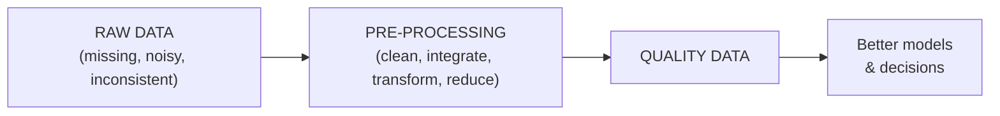
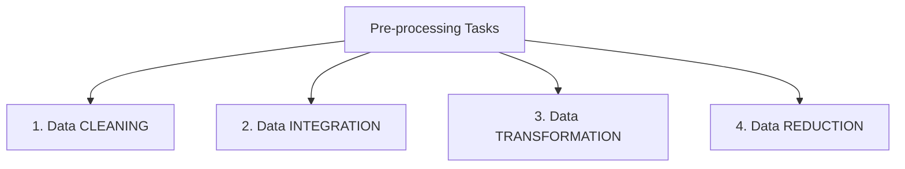
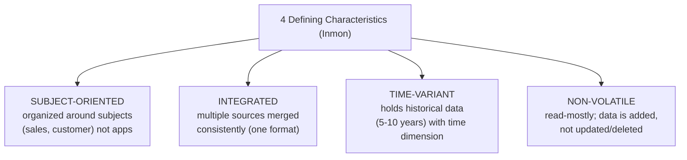
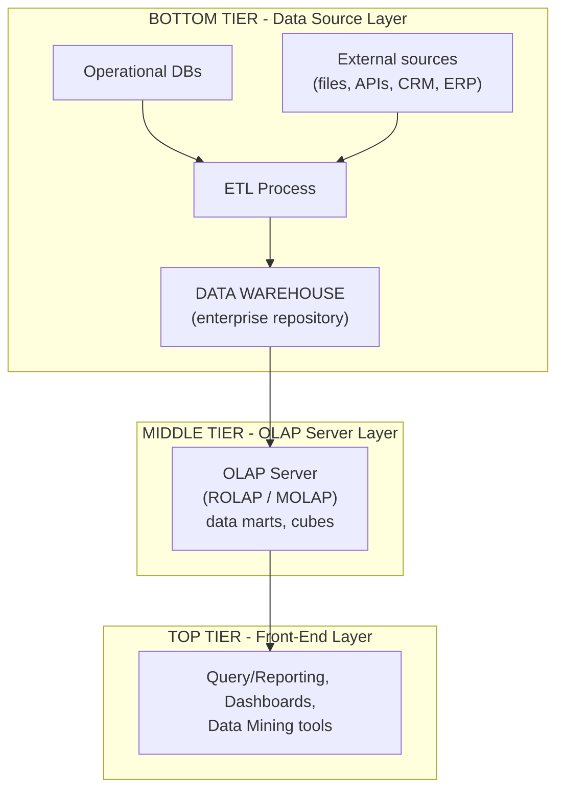
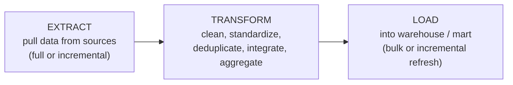
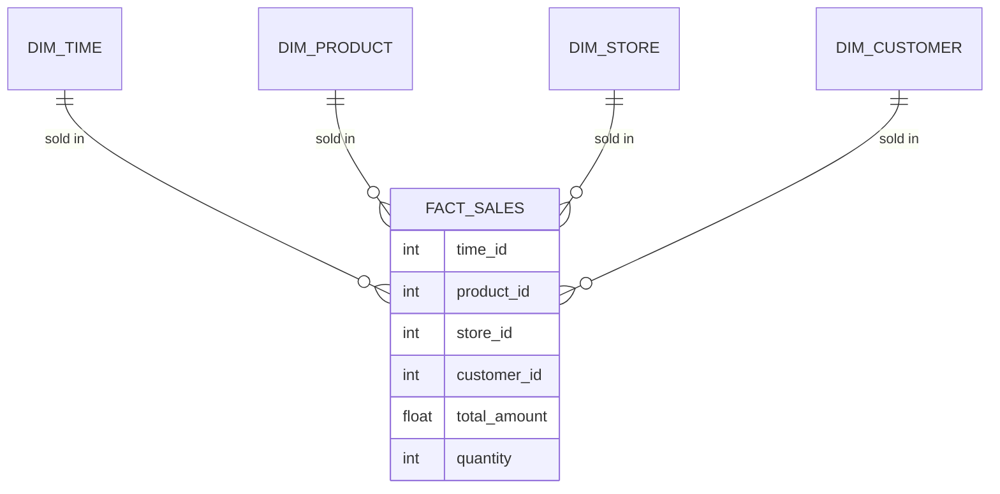
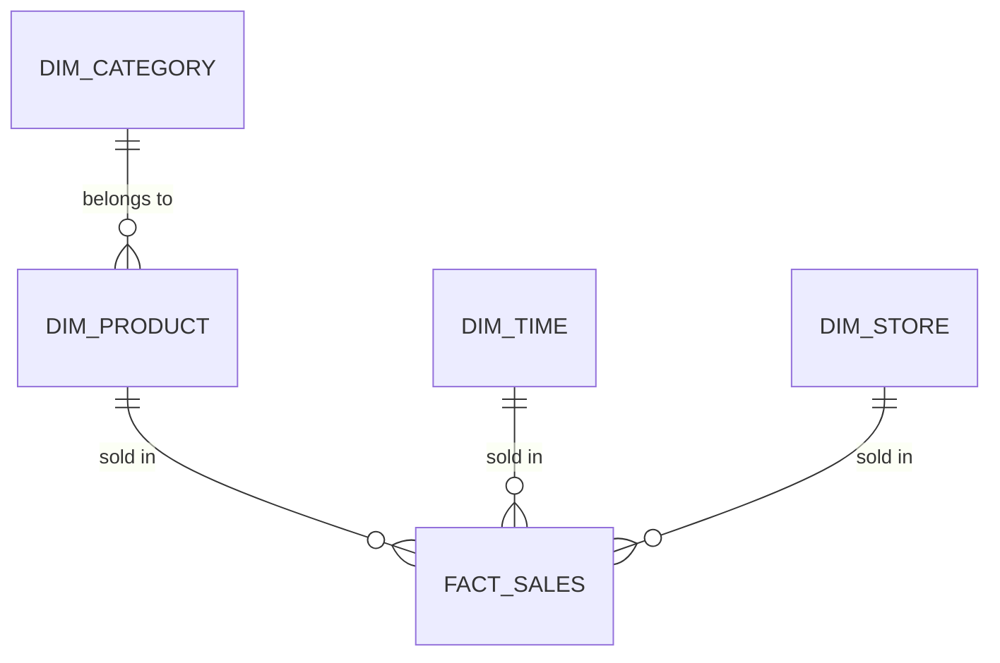

# DS — Unit 2 (Data Pre-processing and Data Warehouse)

> Exam-prep notes: short definitions, key points, and diagrams.

**Contents**
1. [Data Pre-processing](#1-data-pre-processing)
2. [Data Warehouse](#2-data-warehouse)
3. [Data Warehouse Modeling](#3-data-warehouse-modeling)
4. [OLAP vs OLTP](#4-olap-vs-oltp)
5. [Quick Revision](#5-quick-revision)

---

## 1. Data Pre-processing

### 1.1 What & Why (Need)

- **Data pre-processing** = transforming **raw, messy data into clean, consistent, analysis-ready data** before applying any model/warehouse.
- **Why needed:** real-world data is **dirty** —

| Problem | Meaning | Example |
|---|---|---|
| **Incomplete** | Missing values, empty fields | Age = NULL in some records |
| **Noisy** | Errors & outliers | Salary = −5000; Age = 250 |
| **Inconsistent** | Conflicts in codes/formats | "M"/"Male"/"1" for same gender; dd/mm vs mm/dd |

- Rule of thumb: *"Garbage In → Garbage Out"* — a model is only as good as its data; pre-processing takes **60–70% of a project's time**.

### 1.2 Major Tasks

### 1.3 Data Cleaning

- **Missing values — how to handle:**
  - Ignore/drop the tuple (only if few) · fill with **mean / median / mode** · predict with regression/classification · treat as special category
- **Noisy data — smoothing techniques:**
  - **Binning:** sort values into bins; smooth by bin **mean / median / boundaries**
  - **Regression:** fit a function to smooth data
  - **Outlier detection:** clustering / IQR — inspect & remove values far outside the norm
- Also: fix inconsistencies, remove duplicates, standardize formats.

*Example (binning by mean):* data 4, 8, 15, 21, 21, 24 → bins of 3: [4, 8, 15]→[9, 9, 9]; [21, 21, 24]→[22, 22, 22].

### 1.4 Data Integration

- Combining data from **multiple sources** (databases, files, APIs) into one coherent store.
- Challenges & solutions:
  - **Entity identification:** `cust_id` (DB1) = `c_no` (DB2) → metadata mapping
  - **Redundancy:** attribute derived from another → remove (detect via **correlation** χ² test)
  - **Value conflicts:** units differ (₹ vs $, cm vs inches) → normalize
- Done via **schema integration** + careful handling of data conflicts (see ETL, §2.3).

### 1.5 Data Transformation

| Technique | Meaning | Example |
|---|---|---|
| **Normalization — Min-Max** | `v' = (v − min)/(max − min)` → [0,1] | Age 20–60 → 40 ⇒ (40−20)/40 = 0.5 |
| **Normalization — Z-score** | `v' = (v − μ)/σ` | Mean 30, σ 5 → 40 ⇒ +2 |
| **Decimal scaling** | `v' = v / 10^j` | 350 → 0.35 (j=3) |
| **Attribute construction** | New features from old | `BMI = weight/height²` |
| **Aggregation** | Summarize | daily sales → monthly sales |
| **Smoothing / Generalization** | Noise removal / roll-up | 22, 23 → "young"; city → state |
| **Discretization** | Numbers → intervals/labels | Age → (child, adult, senior) |

### 1.6 Data Reduction

- Get a **reduced volume** representation with (almost) the same analytical power:
  - **Dimensionality reduction:** keep only useful attributes (attribute subset selection), **PCA** (principal component analysis) — combine correlated attributes into fewer components
  - **Numerosity reduction:** regression/clustering models, **histograms**, **sampling**
  - **Data compression:** encoding (lossless/lossy), wavelets
  - **Aggregation/cube:** pre-compute summaries

---

## 2. Data Warehouse

### 2.1 Definition & Characteristics

- **Inmon:** *"A data warehouse is a subject-oriented, integrated, time-variant, and non-volatile collection of data in support of management's decision-making process."*

### 2.2 Data Warehouse Architecture (3-Tier)

- **Data mart** = smaller, department-specific subset of the warehouse (sales mart, HR mart).

### 2.3 ETL Process

| Step | What happens |
|---|---|
| **Extract** | Read from heterogeneous sources (DBs, files, APIs); capture changed data |
| **Transform** | Clean errors, convert formats/units, apply business rules, integrate schemas, aggregate |
| **Load** | Sort, consolidate, build indexes/aggregates, write into the warehouse tables |

---

## 3. Data Warehouse Modeling

### 3.1 Fact and Dimension Tables

- **Fact table:** *numeric, measurable* business events (sales amount, quantity) + **foreign keys** to dimensions; large (millions of rows). Facts are **additive** (can be summed).
- **Dimension table:** *descriptive context* — who, what, where, when (product, customer, store, date); small, textual attributes.

### 3.2 Star Schema

- One **fact table** in the middle, **denormalized dimensions** directly around it — looks like a star. Simplest & most common; fast joins.

### 3.3 Snowflake Schema

- Star schema but with **normalized dimensions** — each dimension splits into sub-dimensions (e.g., product → category → department). Less redundancy, more storage-efficient, but **more joins → slower queries**.

| Feature | **Star schema** | **Snowflake schema** |
|---|---|---|
| Dimensions | Denormalized (one table) | Normalized (split tables) |
| Redundancy | More | Less |
| Query speed | **Fast** (fewer joins) | Slower (more joins) |
| Design | Simple | Complex |
| Storage | More | Less |

### 3.4 (Bonus) Fact Constellation / Galaxy

- Multiple fact tables **share** dimension tables (e.g., FACT_SALES & FACT_SHIPMENT share DIM_TIME, DIM_PRODUCT) — used at enterprise level.

---

## 4. OLAP vs OLTP

| Feature | **OLTP** (Online Transaction Processing) | **OLAP** (Online Analytical Processing) |
|---|---|---|
| Purpose | Day-to-day **transactions** (run the business) | **Analysis & decision support** (understand the business) |
| Users | Clerks, cashiers, apps | Managers, analysts, data scientists |
| Data | **Current**, detailed | **Historical**, summarized/aggregated |
| Operations | Read + write: INSERT/UPDATE/DELETE | Mostly **read**: complex queries, aggregations |
| Design | ER model, **normalized** (3NF) | **Star/snowflake**, denormalized |
| Size per query | Short, simple (few records) | Long, complex (millions of records) |
| Example | ATM withdrawal, order booking | "Quarterly sales by region vs last year" |
| DB | MySQL, PostgreSQL | Warehouse + OLAP cubes |

- **OLAP operations:** **Roll-up** (summarize, city→country), **Drill-down** (opposite), **Slice** (fix one dimension), **Dice** (select a sub-cube), **Pivot** (rotate axes).

---

## 5. Quick Revision

| Item | One-liner |
|---|---|
| Need for pre-processing | Real data is incomplete, noisy, inconsistent → GIGO |
| 4 pre-processing tasks | Cleaning, Integration, Transformation, Reduction |
| Missing values | Drop / mean-median-mode fill / predict |
| Noise removal | Binning, regression, outlier detection |
| Min-max normalization | (v − min)/(max − min) → [0,1] |
| Data reduction | PCA, sampling, histograms, aggregation |
| Warehouse (Inmon) | Subject-oriented, Integrated, Time-variant, Non-volatile |
| 3-tier architecture | Sources+ETL → OLAP server → Front-end tools |
| ETL | Extract → Transform → Load |
| Fact vs dimension | Measures/numbers vs descriptive context |
| Star vs snowflake | Denormalized & fast vs normalized & compact |
| OLTP vs OLAP | Transactions/normalized/current vs analysis/star/historical |
| OLAP ops | Roll-up, Drill-down, Slice, Dice, Pivot |
