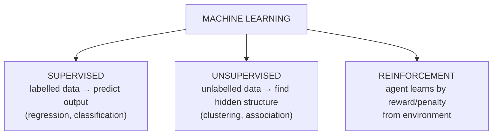
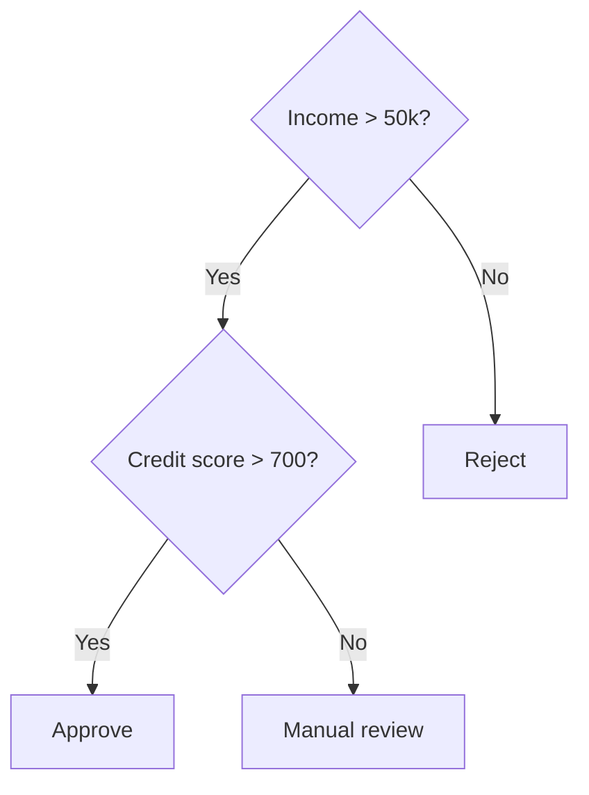
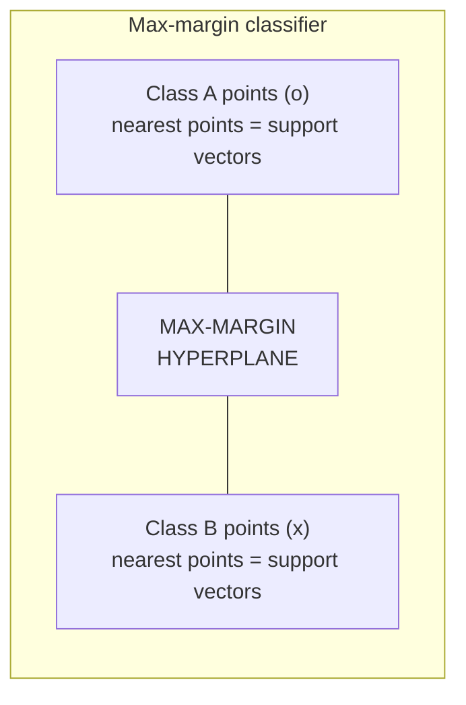
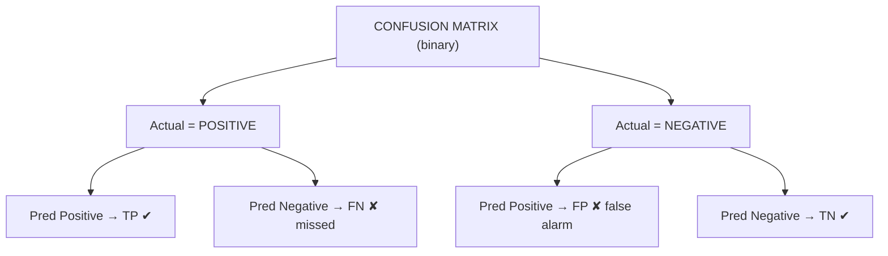

# DS — Unit 3 (Classification)

> Exam-prep notes: short definitions, key points, and diagrams.

**Contents**
1. [Machine Learning Types & Classification Applications](#1-machine-learning-types--classification-applications)
2. [Supervised Algorithms](#2-supervised-algorithms)
3. [Metrics for Model Evaluation](#3-metrics-for-model-evaluation)
4. [Quick Revision](#4-quick-revision)

---

## 1. Machine Learning Types & Classification Applications

### 1.1 Machine Learning — Types

- **Machine Learning:** algorithms that **learn patterns from data** and improve with experience, without being explicitly programmed.



| Type | Data | Goal | Examples |
|---|---|---|---|
| **Supervised** | Labelled (X → y) | Predict output for new input | Spam filter, price prediction |
| **Unsupervised** | Unlabelled | Discover groups/patterns | Customer segmentation, market basket |
| **Reinforcement** | Interaction + rewards | Learn optimal actions | Game AI, robotics, self-driving |

### 1.2 Applications of Classification

- Classification = supervised learning where output is a **category/class** (vs regression = numeric value).
- Uses: **spam email detection**, **disease diagnosis** (tumour benign/malignant), **credit approval** (loan defaulter or not), sentiment analysis (positive/negative review), fraud detection, handwriting/face recognition, churn prediction.

---

## 2. Supervised Algorithms

### 2.1 Linear Regression

- Fits a **straight line** to predict a **numeric** value: `y = a + b·x` (simple) or `y = w₀ + w₁x₁ + … + wₙxₙ` (multiple).
- Best line minimizes **sum of squared errors** (least squares). Used for price/salary/sales prediction.

```mermaid
xychart-beta
    title "Linear Regression - y vs x"
    x-axis [1, 2, 3, 4, 5, 6]
    y-axis "y" 0 --> 12
    line [1.5, 3.2, 4.4, 6.5, 8.1, 9.2]
```

### 2.2 Logistic Regression

- **Classification** algorithm (despite the name!) — models the **probability** of a class using the **sigmoid** function:

  **σ(z) = 1 / (1 + e^−z)**, where z = w₀ + w₁x₁ + … ; output ∈ (0, 1)
- If probability > 0.5 → class 1 (e.g., "will buy"), else class 0. Used for yes/no problems: churn, pass/fail, disease risk.

```mermaid
xychart-beta
    title "Sigmoid curve"
    x-axis [-6, -4, -2, 0, 2, 4, 6]
    y-axis "p" 0 --> 1
    line [0.0, 0.02, 0.12, 0.5, 0.88, 0.98, 1.0]
```

### 2.3 Naive Bayes Classifier

- Probabilistic classifier based on **Bayes' theorem**:

  **P(C | X) = P(X | C) · P(C) / P(X)**
- **"Naive"** assumption: all features are **independent** given the class → `P(X|C) = P(x₁|C)·P(x₂|C)…`
- Compute posterior for each class → **predict the class with highest P(C|X)**.
- Fast, works well with small data & **text** (spam filtering, sentiment). Weakness: independence assumption rarely true; zero-frequency (fix with Laplace smoothing).

### 2.4 K-Nearest Neighbor (KNN)

- **Lazy learner** (no training phase — stores data; all work at prediction).
- To classify a new point: compute distance to all training points → take **K nearest** → predict the **majority class** among them.


- K small → sensitive to noise; K large → over-smoothed. Use odd K to avoid ties; **scale features** first.

### 2.5 Decision Trees

- Tree of **if-then rules**: internal nodes = attribute tests, branches = outcomes, leaves = class labels.
- Attribute selection: **Information Gain (entropy)** for ID3, **Gini index** for CART.
  - Entropy `H = −Σ pᵢ log₂ pᵢ`; Gain = H(parent) − weighted H(children). Pick the attribute with max gain/Gini reduction.
- Pros: interpretable, no scaling needed. Cons: **overfitting** (prune / limit depth).



### 2.6 Support Vector Machine (SVM)

- Finds the **best hyperplane** separating classes with the **maximum margin** (distance to nearest points).
- **Support vectors** = closest data points that define the margin. Larger margin ⇒ better generalization.
- **Kernel trick** maps non-linear data to higher dimensions where it becomes separable (Linear, Polynomial, RBF kernels).



### 2.7 Algorithm Cheat-Table

| Algorithm | Output type | Key idea | Watch out |
|---|---|---|---|
| Linear Regression | Numeric | Best-fit line, least squares | Only linear relations |
| Logistic Regression | Class probability | Sigmoid of linear function | Linear decision boundary |
| Naive Bayes | Class (prob.) | Bayes + independence | Zero-frequency problem |
| KNN | Class | Majority vote of K neighbours | Slow at predict; needs scaling |
| Decision Tree | Class | Greedy splits by gain/Gini | Overfits — prune |
| SVM | Class | Max-margin hyperplane + kernels | Costly on huge data; tune C, γ |

---

## 3. Metrics for Model Evaluation

### 3.1 Confusion Matrix



|  | Predicted Positive | Predicted Negative |
|---|---|---|
| **Actual Positive** | TP (correct) | FN (type II) |
| **Actual Negative** | FP (type I) | TN (correct) |

**Worked example:** TP=80, FP=10, FN=20, TN=90 (total 200)

| Metric | Formula | Example | Meaning |
|---|---|---|---|
| **Accuracy** | (TP+TN)/Total | (80+90)/200 = **85%** | Overall correctness |
| **Precision** | TP/(TP+FP) | 80/90 ≈ **0.89** | Of predicted positives, how many are right |
| **Recall (Sensitivity, TPR)** | TP/(TP+FN) | 80/100 = **0.80** | Of actual positives, how many caught |
| **F1 Score** | 2·(P·R)/(P+R) | 2·.89·.80/(1.69) ≈ **0.84** | Harmonic mean — balance P & R |
| **Specificity (TNR)** | TN/(TN+FP) | 90/100 = 0.90 | Of actual negatives, how many correct |

- **Precision vs Recall:** high precision = few false alarms; high recall = few misses. Which matters more depends on cost (cancer → recall; spam → precision).
- **ROC-AUC:** ROC curve = **TPR vs FPR** at all thresholds; **AUC** = area under it (1.0 = perfect, 0.5 = random guessing). Summarizes performance across all thresholds.

### 3.2 Regression Metrics

| Metric | Formula | Notes |
|---|---|---|
| **MAE** | (1/n) Σ \|yᵢ − ŷᵢ\| | Mean absolute error — robust, easy to read |
| **MSE** | (1/n) Σ (yᵢ − ŷᵢ)² | Punishes big errors (squared) |
| **RMSE** | √MSE | Same units as y — most reported |
| **R² (coefficient of determination)** | 1 − SS_res/SS_tot | 1 = perfect, 0 = no better than mean; can go negative |

- Smaller MAE/MSE/RMSE = better model; higher R² = better fit.

---

## 4. Quick Revision

| Item | One-liner |
|---|---|
| ML types | Supervised (labels) · Unsupervised (no labels) · Reinforcement (rewards) |
| Classification vs Regression | Category vs numeric output |
| Linear regression | y = a + bx, least squares |
| Logistic regression | σ(z) = 1/(1+e^−z); >0.5 ⇒ class 1 |
| Naive Bayes | P(C|X) ∝ P(C)·∏P(xᵢ|C); features independent |
| KNN | Majority class of K nearest points; lazy learner |
| Decision tree | Greedy splits by information gain / Gini; overfits |
| SVM | Max-margin hyperplane; kernels for non-linear |
| Accuracy | (TP+TN)/all — misleading on imbalanced data |
| Precision | TP/(TP+FP) — purity of positive predictions |
| Recall | TP/(TP+FN) — coverage of actual positives |
| F1 | 2PR/(P+R) — harmonic balance |
| ROC-AUC | TPR vs FPR curve; AUC 1.0 perfect, 0.5 random |
| MAE/MSE/RMSE | Error sizes; RMSE in y-units, punishes outliers |
| R² | 1 − SS_res/SS_tot; closer to 1 = better |
