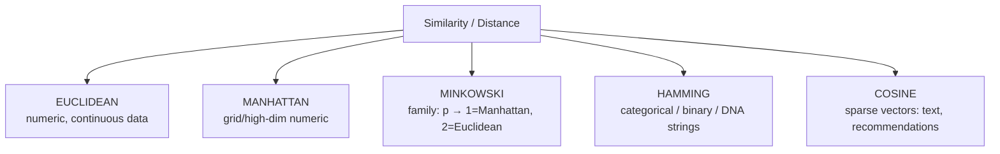
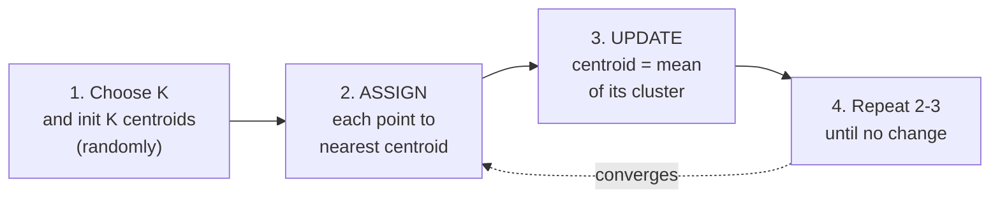
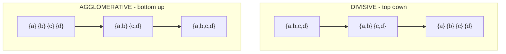
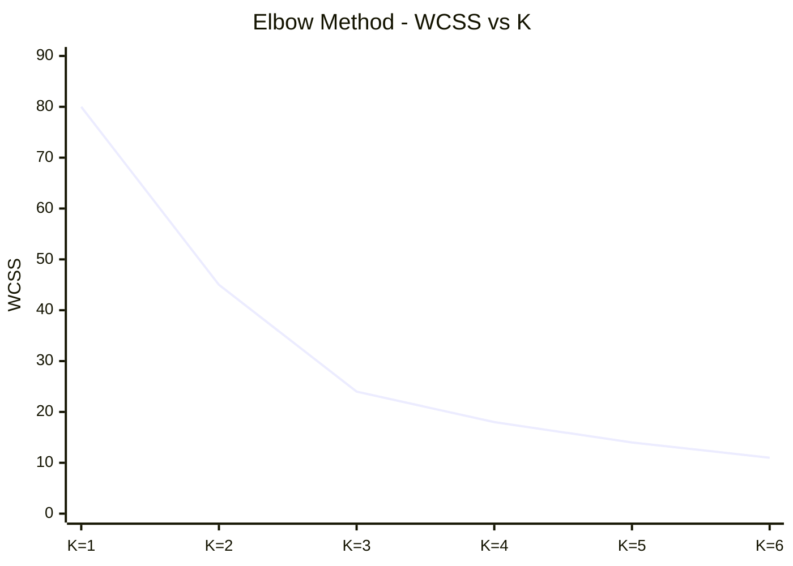
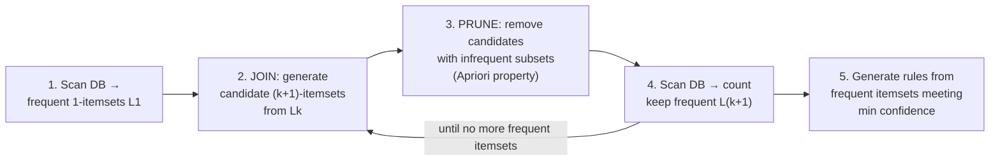

# DS — Unit 4 (Clustering and Association Rule Mining)

> Exam-prep notes: short definitions, key points, and diagrams.

**Contents**
1. [Distance-Based Models](#1-distance-based-models)
2. [Clustering Algorithms](#2-clustering-algorithms)
3. [Association Rule Mining](#3-association-rule-mining)
4. [Quick Revision](#4-quick-revision)

---

## 1. Distance-Based Models

- Distances/similarities measure **how alike two data points** are — the engine behind KNN, K-means, hierarchical clustering.

| Measure | Formula | Type | Example (A=(1,2), B=(4,6)) |
|---|---|---|---|
| **Euclidean** | √Σ(xᵢ−yᵢ)² | Straight-line distance | √(9+16) = **5** |
| **Manhattan** | Σ\|xᵢ−yᵢ\| | City-block (grid) distance | 3+4 = **7** |
| **Minkowski** | (Σ\|xᵢ−yᵢ\|ᵖ)^(1/p) | Generalization | p=1 → Manhattan; p=2 → Euclidean |
| **Hamming** | # of differing positions | Categorical / strings / binary | "karolin" vs "kathrin" → **2** |
| **Cosine similarity** | (A·B)/(‖A‖·‖B‖) | Angle between vectors (1 = same direction) | text/document similarity |

- **Cosine example:** A=(1,2,3), B=(2,4,6) → cos θ = 28/(√14·√56) = **1.0** (same direction, different magnitude).

---

## 2. Clustering Algorithms

- **Clustering** = unsupervised grouping of similar objects into **clusters** — high intra-cluster similarity, low inter-cluster similarity. Uses: customer segmentation, image grouping, anomaly detection.

### 2.1 K-Means

- Objective: minimize **WCSS** (within-cluster sum of squared distances) = Σ Σ ‖x − cᵢ‖².
- **Pros:** simple, fast, scalable. **Cons:** must set K, sensitive to initial centroids & **outliers** (mean gets dragged), only spherical/similar-size clusters, needs numeric data.

### 2.2 K-Medoids (PAM)

- Like K-means but cluster centre = **actual data point (medoid)** — the object with minimal total distance to others in the cluster.
- Update step: swap medoid with a non-medoid if total cost drops; uses distance (not squared mean).
- **More robust to outliers** than K-means, works with any distance metric — but **costlier (O(k(n−k)²) per iteration)**.

| | K-Means | K-Medoids |
|---|---|---|
| Centre | Mean (may be a virtual point) | Real data point (medoid) |
| Outliers | Sensitive | **Robust** |
| Cost | Cheap, O(n) per iter | Expensive |
| Metric | Euclidean (numeric) | Any dissimilarity |

### 2.3 Hierarchical Clustering

Builds a **tree of clusters (dendrogram)** — no need to pre-set K; cut the tree at any level to get clusters.

| | **AGGLOMERATIVE** (AGNES) | **DIVISIVE** (DIANA) |
|---|---|---|
| Direction | **Bottom-up** — merge | **Top-down** — split |
| Start | Every point = its own cluster | All points in one cluster |
| Step | Merge the two **closest** clusters repeatedly | Split the "most heterogeneous" cluster repeatedly |
| End | One big cluster | Each point separate |

- **Linkage rules** (distance between clusters): **single** (min pair distance), **complete** (max), **average**, **centroid**.
- Dendrogram: leaves = points; height of a join = distance at which clusters merged — cut high → few clusters, low → many.

### 2.4 Evaluation: Elbow Method (choosing K)

- Run K-means for K = 1, 2, 3, … plot **WCSS vs K**; pick the **"elbow"** — the K where adding another cluster stops helping much.

*Elbow at K = 3 → choose K = 3. (Complementary metric: **Silhouette score**, higher = better-separated clusters.)*

---

## 3. Association Rule Mining

### 3.1 Market Basket Analysis

- Finds **products that are bought together** → rules like **{bread} → {butter}**: customers buying bread tend to buy butter.
- Uses: shelf placement, cross-selling, combo offers, recommendations.
- Terms: **Itemset** (set of items), **k-itemset** (k items), **frequent itemset** (support ≥ threshold), rule in the form **A → B** where A = antecedent, B = consequent.

### 3.2 Performance Measures: Support & Confidence

For a rule **A → B**:

- **Support** = P(A ∪ B) = **(transactions containing both A and B) / (total transactions)** → how *frequent* the combination is.
- **Confidence** = P(B | A) = **support(A→B) / support(A)** → how *reliable* the rule is.
- **Lift** (bonus) = confidence / P(B) → >1 means A really boosts B; =1 independent.

**Worked example (100 transactions):** {milk} in 40, {bread} in 50, {milk, bread} in 20.
- support(milk→bread) = 20/100 = **20%**
- confidence(milk→bread) = 20/40 = **50%**
- lift = 0.5 / 0.5 = **1** → independent.

### 3.3 Apriori Algorithm

- **Apriori property:** *every subset of a frequent itemset must also be frequent* (and contrapositive: any superset of an infrequent itemset is infrequent → prune!).

- **Limitation:** multiple database scans + huge candidate generation (level-wise) → slow on large data.

### 3.4 FP-Growth (Frequent Pattern Growth)

- Mining **without candidate generation** — only **2 DB scans**:
  1. Scan 1: find frequent items (support order)
  2. Scan 2: compress DB into an **FP-tree** (prefix tree of frequent items)
  3. Mine the FP-tree recursively via **conditional pattern bases** (divide & conquer)
- **Much faster than Apriori** on large data (no candidate sets, fewer scans), but tree can be memory-hungry.

| | Apriori | FP-Growth |
|---|---|---|
| Candidates | Generates & tests huge candidate sets | **None** |
| DB scans | Many (one per level) | **2** |
| Speed | Slow for large/sparse data | Fast |
| Idea | Level-wise search + prune | FP-tree + conditional mining |

---

## 4. Quick Revision

| Item | One-liner |
|---|---|
| Euclidean | √Σ(x−y)² — straight line |
| Manhattan | Σ\|x−y\| — city block |
| Minkowski | (Σ\|x−y\|^p)^(1/p); p=1 Manhattan, p=2 Euclidean |
| Hamming | Count differing positions (strings/binary) |
| Cosine similarity | A·B / (‖A‖‖B‖) — angle, used for text |
| K-means | Assign → update means → repeat; minimize WCSS |
| K-medoid | Centre = real object; outlier-robust but slow |
| Agglomerative vs Divisive | Bottom-up merge vs top-down split |
| Dendrogram | Tree showing cluster merges; cut to choose clusters |
| Elbow method | WCSS vs K — pick the bend point |
| Support | P(A∪B) — frequency of A&B together |
| Confidence | P(B\|A) = supp(A→B)/supp(A) — rule reliability |
| Apriori property | Subsets of frequent sets are frequent (prune supersets of infrequent) |
| FP-Growth | FP-tree, no candidates, only 2 scans — faster than Apriori |
