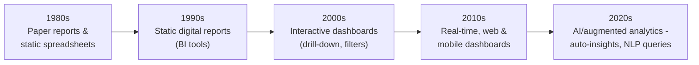
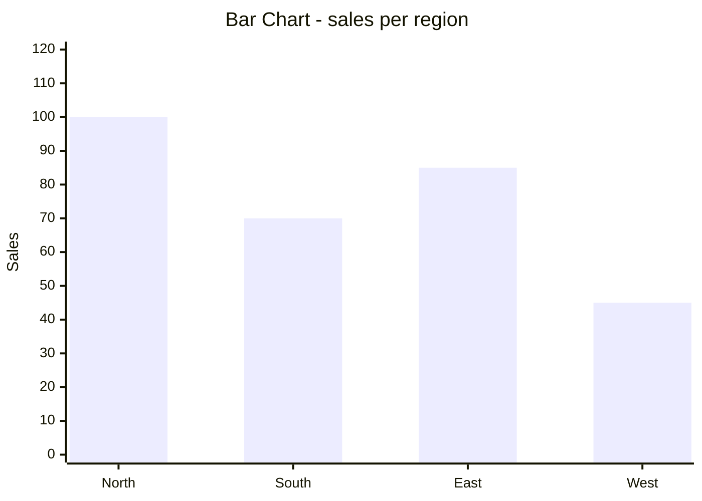
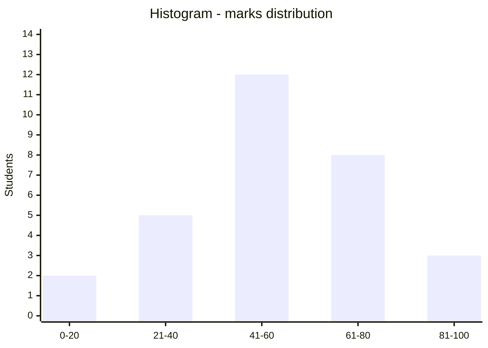
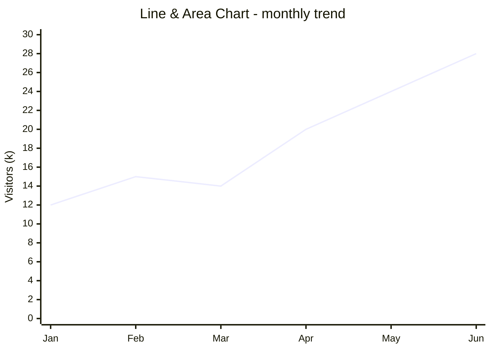
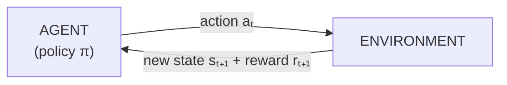
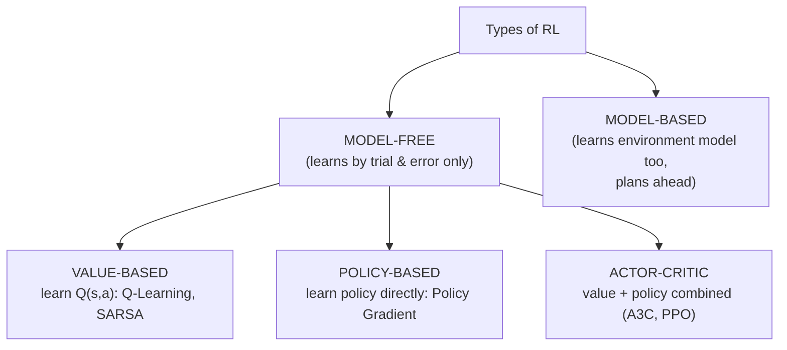
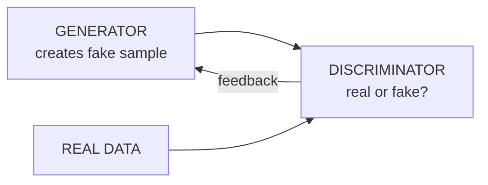
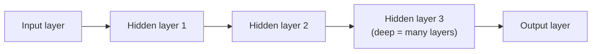
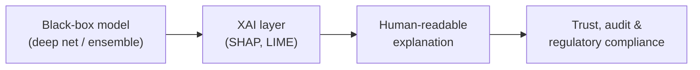

# DS — Unit 5 (Data Visualization and Emerging Trends)

> Exam-prep notes: short definitions, key points, and diagrams.

**Contents**
1. [Data Visualization & Dashboards](#1-data-visualization--dashboards)
2. [Types of Graphs](#2-types-of-graphs)
3. [Visualization Tools: Tableau & Power BI](#3-visualization-tools-tableau--power-bi)
4. [Emerging Trends: RL, Generative Learning, Deep Learning, XAI](#4-emerging-trends-rl-generative-learning-deep-learning-xai)
5. [Quick Revision](#5-quick-revision)

---

## 1. Data Visualization & Dashboards

### 1.1 Introduction to Data Visualization

- **Data visualization** = graphical representation of data (charts, maps, graphs) to make patterns, trends & outliers **easy to see and understand** quickly.
- Why: humans process images **far faster** than tables; enables quick decisions, storytelling with data, spotting anomalies, communicating insights.

### 1.2 Challenges of Data Visualization

1. **Too much data** (volume) → cluttered, unreadable charts
2. **Choosing the right chart** for the data/message
3. **Misleading visuals** — truncated axes, wrong scales, cherry-picked ranges
4. **Colour misuse** — bad palettes, colour-blindness, too many colours
5. **Data quality issues** — missing/dirty data produce false patterns
6. **Performance** — rendering huge live datasets
7. **Audience diversity** — executives vs analysts need different depth
8. **Over-decoration** (chartjunk) hides the message

### 1.3 Dashboard — Definition & Types

- **Dashboard** = a **single-screen, visual display of the most important KPIs and metrics**, updated as needed, for monitoring and decision-making at a glance.

| Type | Purpose | Audience | Refresh |
|---|---|---|---|
| **Operational** | Monitor live operations, act now | Operations teams | Real-time/hourly (e.g., server uptime) |
| **Strategic / Executive** | Track long-term KPIs vs goals | Senior management | Daily/monthly |
| **Analytical** | Deep-dive, explore trends & causes | Analysts | On demand |
| **Tactical** | Track projects/processes mid-level | Team leads | Weekly |

### 1.4 Evolution of Dashboards

### 1.5 Dashboard Design & Principles

- **Know your audience & purpose** first; 5-second rule (key info understood in 5 s).
- **Less is more:** few KPIs, no clutter/chartjunk; group related items.
- **Visual hierarchy:** most important metric top-left; size/position = importance.
- **Right chart for each metric** (trend → line; comparison → bar; part-of-whole → pie/doughnut).
- **Consistent colours** (traffic-light semantics: red = bad) — accessible palettes.
- **Interactivity:** filters, drill-down, time-range selectors.
- **Context:** targets, comparisons vs last period, clear titles/labels.

### 1.6 Display Media for Dashboards

- **Large screens / TV walls** — operations centres (NOC, trading floor)
- **Desktop browsers** — standard office BI use
- **Tablets & mobile** — responsive layouts, alerts on the go
- **Embedded dashboards** — inside portals/products (iframe, embedded analytics)
- **Projectors / video walls** — meeting rooms, control rooms
- (Old: printed wallboards — now replaced by live displays)

---

## 2. Types of Graphs

| Chart | Best for | Example use |
|---|---|---|
| **Bar graph** | Compare categories | Sales per region |
| **Stacked bar** | Category totals **+ composition** | Revenue by region split by product |
| **Pie chart** | Part-of-whole (few slices, ≤5–6) | Market share |
| **Doughnut chart** | Part-of-whole + KPI in the middle | % completion gauge |
| **Line chart** | **Trends over time** | Monthly temperature |
| **Area chart** | Trend + cumulative magnitude | Total traffic over time |
| **Treemap** | Hierarchy by area | Disk usage, portfolio by sector |
| **Heatmap** | Magnitude by 2 dimensions (colour grid) | Activity by day × hour |
| **Waterfall** | Cumulative change start→end | Profit bridge, budget variance |
| **Scatter plot** | **Relationship/correlation** of 2 variables | Height vs weight |
| **Histogram** | **Distribution** of one numeric variable | Marks distribution |
| **Box plot** | Median, quartiles, **outliers** | Salary spread per department |

- **Box plot anatomy:** min — Q1 — **median (Q2)** — Q3 — max, with outliers shown as dots; the box = interquartile range (IQR = Q3 − Q1).

---

## 3. Visualization Tools: Tableau & Power BI

| Feature | **Tableau** | **Power BI** |
|---|---|---|
| Vendor | Salesforce (originally Tableau Inc.) | Microsoft |
| Learning curve | Moderate | Easy (Excel-like) |
| Data sources | Huge connector library | Azure/Microsoft stack + common sources |
| Visualization power | **Best-in-class**, highly interactive | Very good, improving fast |
| Speed (large data) | Excellent (VizQL, Hyper engine) | Good (DAX, VertiPaq) |
| Language | VizQL (drag & drop) | DAX formulas, M (Power Query) |
| Cost | Costlier | **Cheaper** (free Desktop; Office integration) |
| Sharing | Tableau Server/Cloud/Prep | Power BI Service, Teams, SharePoint |
| Best for | Advanced analytics, data-rich storytelling | Business reporting in Microsoft ecosystems |

- Both: connect → drag fields → build visuals → combine into dashboards → publish/share; support live & extracted data, filters, drill-down.

---

## 4. Emerging Trends: RL, Generative Learning, Deep Learning, XAI

### 4.1 Reinforcement Learning (RL)

- An **agent** learns optimal behaviour by **trial and error** — taking **actions** in an **environment** and receiving **rewards/penalties**; goal = maximize total reward. (No labelled data — learns from experience.)

- **Key elements:**
  - **Agent** — learner/decision maker · **Environment** — world it acts in
  - **State (s)** — current situation · **Action (a)** — possible move
  - **Reward (r)** — feedback signal · **Policy (π)** — strategy mapping states → actions
  - **Value function V(s)/Q(s,a)** — expected future reward · **Episode** — one start-to-end run
- **Steps of RL:**
  1. Observe state sₜ → 2. Select action aₜ (policy) → 3. Execute in environment → 4. Get reward rₜ₊₁ & new state sₜ₊₁ → 5. Update policy/value → repeat → 6. Converge to an optimal policy π*.
- **Types of RL:**

- Also: **Positive RL** (rewards encourage behaviour) vs **Negative RL** (penalties push agent to avoid actions). Applications: game AI (AlphaGo), robotics, self-driving, recommendation systems.

### 4.2 Generative Learning

- Learns the data **distribution itself** to **create new, previously unseen samples** (vs *discriminative* models that only learn decision boundaries).
- Examples: **GANs** (Generator vs Discriminator game), **VAEs** (encode→sample→decode), autoregressive models & **LLMs** (text generation), diffusion models (image generation).
- Uses: image synthesis, text/code generation, data augmentation, deepfakes (risk!), drug molecule design.

### 4.3 Deep Learning

- ML using **multi-layer neural networks** that automatically learn hierarchical features (edges → shapes → objects) from raw data.
- Needs big data + GPUs; powers vision, speech, and language breakthroughs. Architectures: **CNN** (images), **RNN/LSTM** (sequences), **Transformer** (language).

### 4.4 Explainable AI (XAI)

- XAI = techniques that make **black-box model decisions understandable to humans** — needed for **trust, debugging, fairness, regulations (GDPR "right to explanation")** and high-stakes fields (medical, finance).
- Approaches: simpler interpretable models (trees, linear), **feature importance**, **LIME** (locally approximate the model), **SHAP** (Shapley values — contribution of each feature), counterfactuals ("approved because income high; would still be approved at ₹40k").
- Trade-off: accuracy ↔ interpretability; XAI narrows the gap.

---

## 5. Quick Revision

| Item | One-liner |
|---|---|
| Data viz | Graphics → fast human understanding of data |
| Big challenges | Volume, chart choice, misleading scales, colour, quality |
| Dashboard | One-screen KPI display for at-a-glance decisions |
| Dashboard types | Operational (live) · Strategic (KPIs) · Analytical (deep-dive) |
| Design principles | Know audience, less clutter, hierarchy, right chart, context |
| Chart picks | Trend→line · Compare→bar · Part-of-whole→pie · Relationship→scatter · Distribution→histogram · Outliers→box plot |
| Treemap | Hierarchical part-to-whole by area |
| Heatmap | 2-D grid coloured by value |
| Waterfall | Cumulative step-by-step change |
| Tableau vs Power BI | Best visuals vs cheaper + MS ecosystem |
| RL loop | Agent → action → environment → state + reward → update policy |
| RL key elements | Agent, environment, state, action, reward, policy, value |
| RL types | Model-free (value/policy/actor-critic) vs model-based |
| Generative learning | Learns data distribution → creates new samples (GAN, VAE) |
| Deep learning | Many-layer neural nets, auto feature learning (CNN/RNN/Transformer) |
| XAI | Explain black-box decisions: SHAP, LIME — trust & compliance |
