# STQA — Unit 1 (Software Quality Assurance)

> Exam-prep notes: short definitions, key points, and diagrams.

**Contents**
1. [Fundamentals of Software Quality](#1-fundamentals-of-software-quality)
2. [Quality Assurance Models](#2-quality-assurance-models)
3. [SQA Trends](#3-software-quality-assurance-trends)
4. [Testing Software System Security & Quality Techniques](#4-testing-software-system-security--quality-techniques)
5. [Quick Revision — Formulas & Facts](#5-quick-revision--formulas--facts)

---

## 1. Fundamentals of Software Quality

### 1.1 Definition of Quality

- **ANSI/IEEE:** *"The degree to which a system, component, or process meets (a) specified requirements and (b) customer/user needs or expectations."*
- **Garvin's 5 views of quality:** Transcendent (innate excellence), Product-based (measurable features), User-based (fitness for use), Manufacturing-based (conformance to specs), Value-based (quality vs. price).
- In short: **Quality = Conformance to requirements + Fitness for use.**

### 1.2 QA, QC, SQA

| Term | Meaning | Orientation | Nature |
|---|---|---|---|
| **QA** | Planned, systematic set of activities to ensure quality in the *process* | Process-oriented | **Preventive** |
| **QC** | Activities that verify the *product* meets requirements (inspections, testing) | Product-oriented | **Detective / Corrective** |
| **SQA** | QA applied to software — covers the **entire life cycle**: QA + QC + testing + standards + metrics | Whole life cycle | Preventive + Detective |

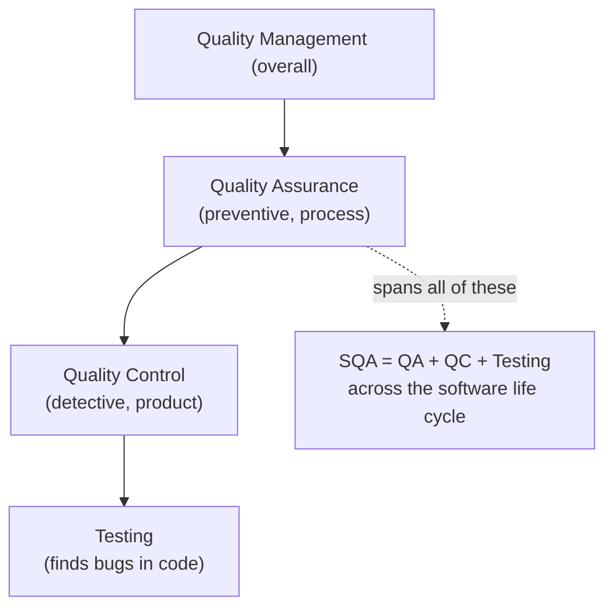

### 1.3 SQA Basics

- **Goal:** ensure software meets requirements, standards, and user expectations at **lowest cost**.
- **Objectives:** early defect detection, conformance to standards, improved reliability & maintainability, reduced rework and cost.
- **Key activities:** standards setting, reviews & audits, testing oversight, defect tracking, metrics collection, documentation control.
- **SQA ≠ Testing** — testing is only *one* activity inside SQA.

### 1.4 Components of the SQA System (Galin's model)

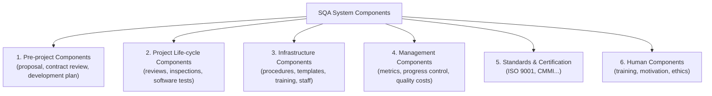

### 1.5 Software Quality in Business Context

- Good quality → **fewer failures → lower cost, better reputation, customer loyalty, market share, legal compliance**.
- Poor quality is expensive: rework, recalls, lost customers — Cost of Poor Quality (CoPQ) may reach **20–40% of revenue**.
- Quality is a **business strategy**, not just a technical activity (competitive edge, brand image).

### 1.6 Planning for Software Quality Assurance

- Output = **SQA Plan** (IEEE Std 730). Typical contents:
  1. Purpose & scope of the plan
  2. Management (organization, tasks, responsibilities)
  3. Documentation to be produced
  4. Standards, practices, conventions, metrics
  5. **Reviews and audits** (schedule)
  6. Test (plan & methodology)
  7. Problem reporting & corrective action
  8. Tools, techniques, methodologies
  9. Code / configuration control
  10. Supplier (subcontractor) control
  11. Records collection & retention, training, risk management

### 1.7 Product Quality vs Process Quality

| Aspect | Process Quality | Product Quality |
|---|---|---|
| Focus | *How* software is built | *What* is delivered |
| Measured by | Process capability, maturity (CMMI), adherence to standards | Defect density, reliability, usability, maintainability |
| Improves | By maturity models, standards, training | By reviews, testing, metrics |
| Relation | A better process **produces** a better product | Product quality is the *outcome* |

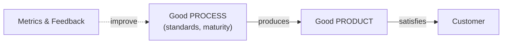

### 1.8 Software Process Models

| Model | Idea | Quality aspect |
|---|---|---|
| **Waterfall** | Sequential phases: Requirements → Design → Code → Test → Maintain | Reviews after each phase |
| **V-Model** | Each dev phase paired with a test level | Testing planned from the start |
| **Incremental** | Product built and delivered in pieces | Early feedback, lower risk |
| **Spiral** | Risk-driven iterative cycles | Risk analysis every cycle |
| **Agile** | Short sprints, continuous customer feedback | Continuous testing & integration |

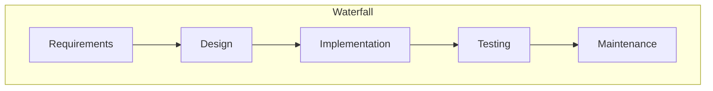

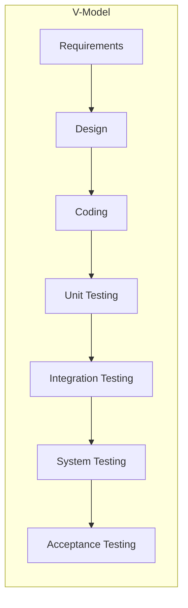

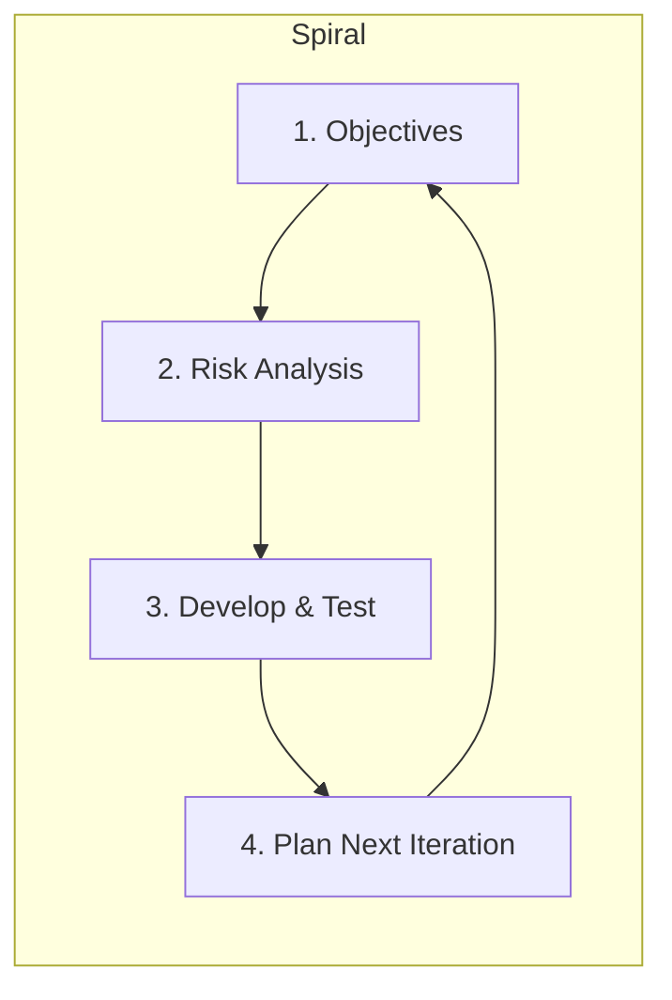

### 1.9 Seven QC Tools (Ishikawa's classic tools)

| # | Tool | Purpose |
|---|---|---|
| 1 | **Check Sheet** | Systematically record/collect defect data |
| 2 | **Histogram** | Show frequency distribution of data |
| 3 | **Pareto Chart** | Rank causes — *"vital few, trivial many"* (80/20 rule) |
| 4 | **Cause-and-Effect (Fishbone/Ishikawa)** | Find root causes of a problem |
| 5 | **Scatter Diagram** | Show correlation between two variables |
| 6 | **Control Chart** | Monitor process stability (UCL/LCL limits) |
| 7 | **Stratification / Flowchart** | Split data into groups / map process flow |

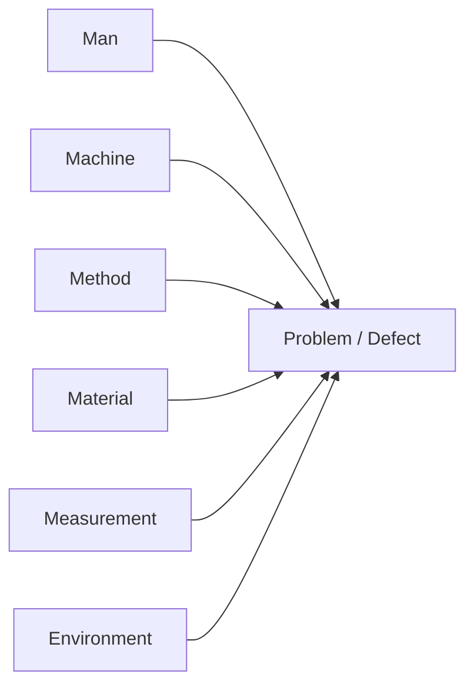
*(Simplified Fishbone diagram — causes point to the problem.)*

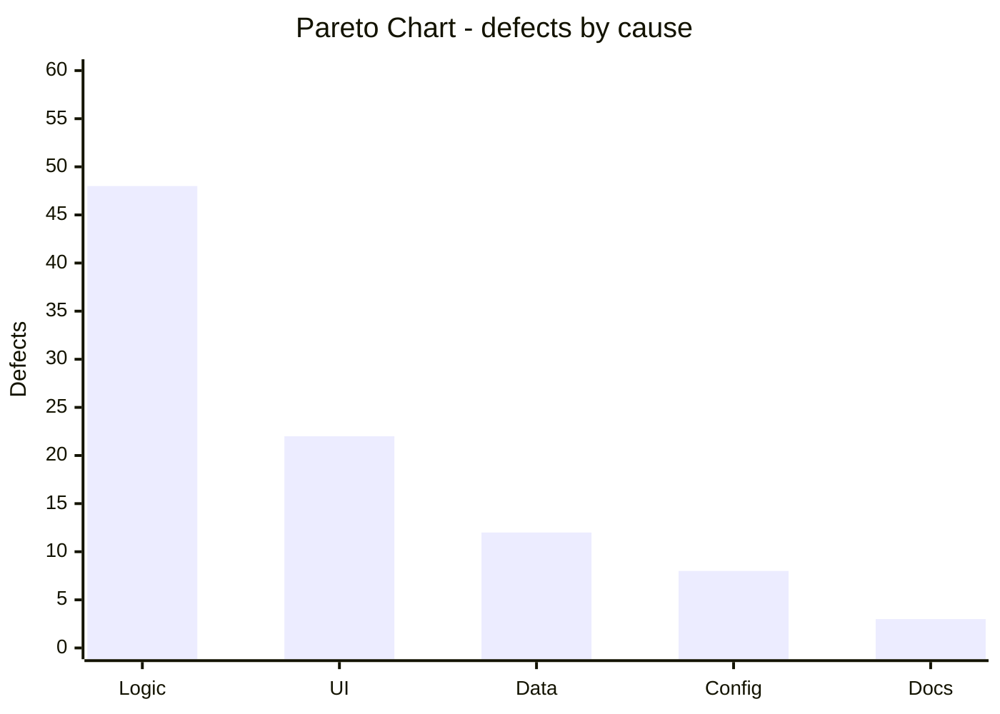

**Modern tools:** static analysis (SonarQube), issue/bug trackers (Jira), test automation (Selenium), CI/CD pipelines (Jenkins/GitHub Actions), code-review tools, coverage & monitoring tools — they automate defect detection, traceability, and continuous feedback.

---

## 2. Quality Assurance Models

### 2.1 ISO-9000 Series

- International standard for **quality management systems** (QMS) — *"Say what you do, do what you say, prove it."*
- **ISO 9000:** fundamentals & vocabulary · **ISO 9001:** requirements (**only certifiable one**) · **ISO 9004:** performance improvement guidance · **ISO 19011:** auditing guidelines · **ISO 9000-3:** guidance for applying ISO 9001 to *software*.
- Based on the **PDCA cycle** (Plan–Do–Check–Act) and 7 quality-management principles (customer focus, leadership, process approach, improvement, evidence-based decisions, relationship management).
- **Pros:** worldwide recognition, disciplined documentation. **Cons:** heavy documentation, doesn't guarantee product quality by itself.

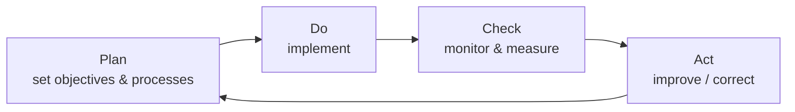

### 2.2 CMM (Capability Maturity Model) — SEI

Five maturity levels — a "staircase" of process maturity:

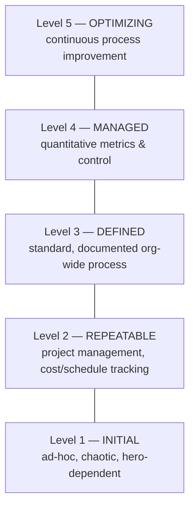

| Level | Character | Key KPAs |
|---|---|---|
| 1 Initial | Ad-hoc, unpredictable | — |
| 2 Repeatable | Basic project management | Requirements mgmt, project planning, tracking, configuration mgmt |
| 3 Defined | Standard organizational process | Process definition, training, reviews, peer reviews |
| 4 Managed | Quantitatively controlled | Quantitative process mgmt, quality mgmt |
| 5 Optimizing | Continuous improvement | Defect prevention, technology change mgmt, process change mgmt |

### 2.3 CMMI (Capability Maturity Model Integration)

- Successor to CMM — **integrates** multiple models (software, systems, people) into one framework.
- Two representations:
  - **Staged:** 5 levels — Initial → Managed → Defined → **Quantitatively Managed** → Optimizing.
  - **Continuous:** capability levels CL0 (Incomplete) → CL1 (Performed) → CL2 (Managed) → CL3 (Defined), applied per process area.

| CMM | CMMI |
|---|---|
| Software only | Software + systems + hardware + people |
| 5 stages only | Staged **and** continuous |
| Reactive improvement | More emphasis on measurement & integrated improvement |

### 2.4 Test Maturity Models (TMM / TMMi)

- **TMM** (developed at Illinois Tech) assesses an organization's **testing process** in 5 levels:
  1. **Initial** — testing = debugging, ad-hoc
  2. **Definition** — testing = planned, defined phase
  3. **Integration** — testing tied into life cycle (V-model), mastered
  4. **Management & Measurement** — testing measured, quality checked at every level
  5. **Optimization** — defect prevention, continuous test improvement, automation
- **TMMi** and **TPI (Test Process Improvement)** are modern variants with the same idea: move testing from ad-hoc → managed → optimizing.

### 2.5 SPICE (ISO/IEC 15504)

- **S**oftware **P**rocess **I**mprovement and **C**apability d**E**termination — international standard for **process assessment**.
- Assesses processes on **6 capability levels**: 0 Incomplete, 1 Performed, 2 Managed, 3 Established, 4 Predictable, 5 Optimizing.
- Process categories: **Customer-Supplier, Engineering, Support, Management, Organization.**
- Output: process profile used for improvement or supplier capability determination.

### 2.6 Malcolm Baldrige Model

- US national quality award criteria — **business excellence framework** with **7 categories**:

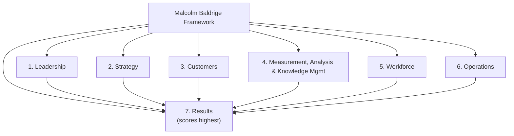

### 2.7 P-CMM (People CMM)

- Adapts CMM's 5-level structure to **manage and develop the workforce**:
  1. **Initial** — inconsistent workforce practices
  2. **Managed** — repeatable people practices (work environment, communication)
  3. **Defined** — competency-based practices, training, career development
  4. **Predictable** — quantitatively manage teams & performance
  5. **Optimizing** — continuous workforce capability improvement
- Logic: *capable, motivated people → quality software.*

---

## 3. Software Quality Assurance Trends

### 3.1 Software Process: PSP and TSP (Humphrey / SEI)

- **PSP (Personal Software Process):** framework for an **individual engineer** — personal planning, time & defect logs, estimates, personal design & code reviews.
  - Levels: PSP0 (baseline) → PSP0.1 → PSP1 (estimating) → PSP1.1 → PSP2 (personal reviews) → PSP2.1 → PSP3 (cyclic development).
- **TSP (Team Software Process):** builds PSP up to **self-directed teams** — team launch, shared goals, defined roles, measured team performance; enables predictable, high-quality delivery.

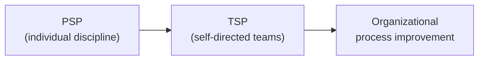

### 3.2 OO Methodology

- **Encapsulation, inheritance, polymorphism, modularity** → reusable, easier-to-change code → **fewer defects, better maintainability**.
- Objects map naturally to real-world requirements → clearer designs, easier testing at class level.
- **OO metrics (CK metric suite):** WMC (Weighted Methods per Class), DIT (Depth of Inheritance Tree), NOC (Number of Children), CBO (Coupling Between Objects), RFC (Response For a Class), LCOM (Lack of Cohesion of Methods).

### 3.3 Cleanroom Software Engineering (IBM — Mills, Dyer, Linger)

- Aims to develop software with **near-zero defects** — "clean" like a cleanroom chip fab.
- Principles:
  1. **Formal specification** (box structures) instead of informal requirements.
  2. **Incremental development** under statistical process control.
  3. **Correctness verification** (math-based team reviews) — *no unit debugging*.
  4. **Statistical usage testing** based on an operational profile → measures reliability in "expected use".

### 3.4 Defect Injection and Prevention

- **Defects are injected** during: requirements, design, coding, testing fixes, maintenance (accidentally) — or deliberately (**bebugging/mutation testing**) to measure test effectiveness.
- **Defect Prevention approach (Jones/Humphrey):** find *root causes* → analyze → change the process so the same defect never occurs again.
- Techniques: causal-analysis meetings, checklists, standards & templates, peer reviews, automated analysis, **poka-yoke** (mistake-proofing devices).

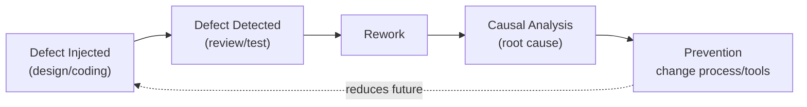

### 3.5 Internal Auditing and Assessments

- **Audit:** planned, independent, documented examination to check whether activities **comply with planned arrangements** (ISO 19011).
- Steps: *Plan → Prepare checklist → Conduct audit → Report findings (non-conformities) → Corrective Action → Follow-up.*
- **Assessment:** evaluates process *capability/maturity* (e.g., CMMI appraisal) — broader than a compliance audit.
- Benefits: objective visibility, early risk detection, continuous improvement, certification readiness.

### 3.6 Inspections & Walkthroughs

**Fagan Inspection** (formal, defect *finding*) — roles: moderator, author, reader, recorder, reviewers. Steps:

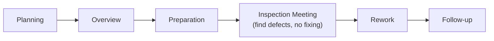

| Feature | Inspection | Walkthrough |
|---|---|---|
| Formality | High (checklists, metrics, roles) | Informal |
| Leader | Trained moderator | Author |
| Goal | Find defects + collect data | Understand code, share knowledge, light review |
| Preparation | Mandatory, before meeting | Optional, often during meeting |
| Output | Defect list, rework & follow-up | Comments/suggestions |

### 3.7 CASE Tools and their Effect on Software Quality

- **Upper CASE:** analysis & design support (diagramming, prototyping).
- **Lower CASE:** coding, testing, debugging support (IDEs, debuggers, test tools).
- **Integrated (I-CASE):** shared repository linking all phases.
- **Quality effects:** consistency & standards enforcement, **early error detection**, traceability from requirements → tests, automated regression testing, better documentation, higher productivity, fewer human errors.

---

## 4. Testing Software System Security & Quality Techniques

*(Security testing verifies that the system protects data and maintains function as intended — then these quality management techniques/metrics quantify quality.)*

### 4.1 Six Sigma

- **Motorola, 1986** — data-driven method to make processes **99.99966% defect-free = 3.4 defects per million opportunities (DPMO)**.
- **DMAIC** (improve existing process): Define → Measure → Analyze → Improve → Control.
- **DMADV** (design new process/product): Define → Measure → Analyze → Design → Verify.
- Practitioners: Green Belt → Black Belt → Master Black Belt.

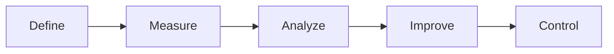

### 4.2 TQM (Total Quality Management)

- Organization-wide philosophy: **everyone** participates in continuously improving quality to satisfy the customer.
- Principles: customer focus, total employee involvement, process-centered thinking, integrated system, strategic approach, **continuous improvement (Kaizen)**, fact-based decisions, communication.
- Tool inside TQM: **PDCA cycle** (same diagram as §2.1).

### 4.3 Complexity Metrics and Models

| Metric | Formula / Meaning |
|---|---|
| **LOC** | Size in lines of code (crude but common) |
| **Halstead** | Volume `V = N log₂ n` (n = distinct operators/operands, N = total) — measures information content |
| **Cyclomatic (McCabe)** | `V(G) = E − N + 2P` = (edges − nodes + 2·components) = **number of independent paths** = decision points + 1. `V(G) ≤ 10` recommended |

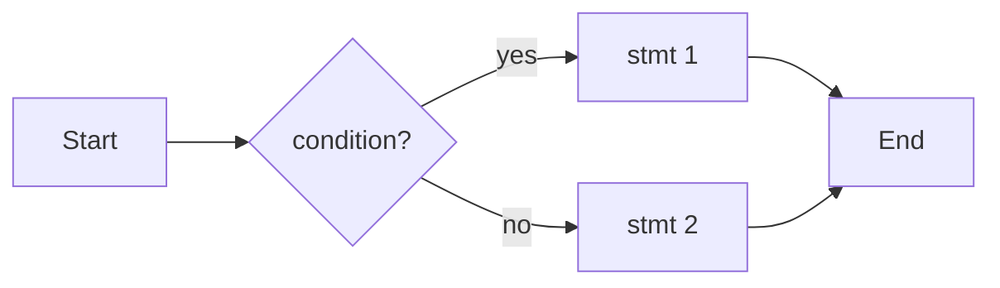
*Example: E = 5 edges, N = 5 nodes → V(G) = 5 − 5 + 2 = **2** independent paths (1 decision + 1).*

### 4.4 Quality Management Metrics

- **Defect Density** = Total defects / Size (KLOC) — compare modules/releases.
- **Defect Removal Efficiency (DRE)** — see §4.6.
- **Mean Time To Failure (MTTF)**, **Mean Time Between Failures (MTBF = MTTF + MTTR)**, defect leakage, test coverage %, customer-found defects.

### 4.5 Availability Metrics

- **Availability % = MTTF / (MTTF + MTTR) × 100**
- MTTF = Mean Time To Failure, MTTR = Mean Time To Repair. Reliability = probability of failure-free operation for a given time; availability adds *repairability*.

### 4.6 Defect Removal Effectiveness (DRE)

- **DRE = E / (E + D) × 100** — E = defects found **before** release, D = defects found **after** release (by customers).
- Higher DRE (≥ 95% is excellent) ⇒ fewer escaped defects ⇒ lower cost & better reputation.

### 4.7 FMEA (Failure Mode and Effects Analysis)

- **Preventive analysis** of *what can fail, why, and how bad* — used in design & safety/security reviews.
- Steps: list failure modes → identify effects & causes → rate **Severity (S), Occurrence (O), Detection (D)** (1–10 each).
- **Risk Priority Number: RPN = S × O × D** (max 1000). Fix highest-RPN items first, then re-evaluate.

| Failure Mode | S | O | D | RPN |
|---|---|---|---|---|
| Login bypass | 9 | 3 | 4 | **108** |
| Slow query | 4 | 6 | 3 | 72 |

### 4.8 Quality Function Deployment (QFD)

- Translates **customer needs (WHATs)** into **technical requirements (HOWs)** at every stage — a *customer-driven* quality approach.
- Main tool: **House of Quality** — customer requirements, technical requirements, relationship matrix, roof (correlations between HOWs), priorities & targets.

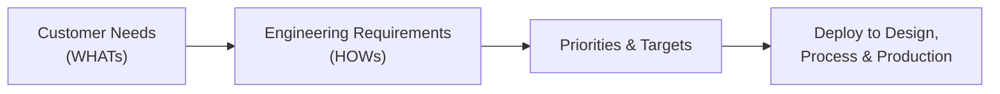

### 4.9 Taguchi Quality Loss Function

- **Genichi Taguchi:** any **deviation from the target value** causes loss — quality is *conformance to target*, not just within tolerance limits.
- **L(x) = k (x − T)²**, where x = measured value, T = target, k = cost constant (k = C/Δ²).
- Loss is **zero at target** and grows quadratically as you move away — so aim for the *target*, not the tolerance edge.

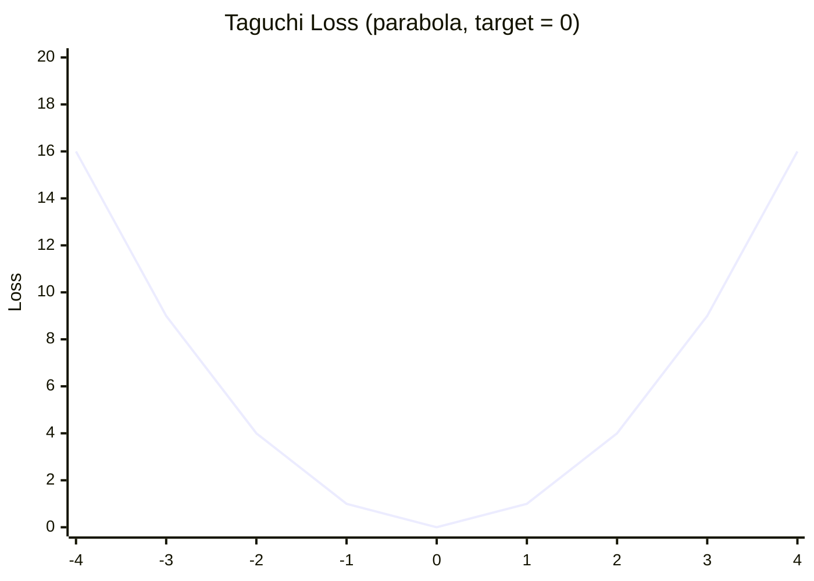

### 4.10 Cost of Quality (CoQ)

- Total cost of achieving quality + cost of failing:

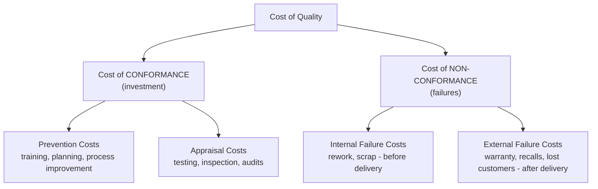

- **1–10–100 rule:** ₹1 spent on prevention saves ₹10 in correction and ₹100 in failure costs. Prevention investment *reduces* total CoQ.

---

## 5. Quick Revision — Formulas & Facts

| Item | Formula / Fact |
|---|---|
| Cyclomatic complexity | `V(G) = E − N + 2P` (keep ≤ 10) |
| Availability | `MTTF / (MTTF + MTTR) × 100` |
| DRE | `E / (E + D) × 100` |
| Defect density | `Defects / KLOC` |
| DPMO (Six Sigma) | 3.4 defects per million opportunities |
| Taguchi loss | `L(x) = k(x − T)²` |
| FMEA | `RPN = Severity × Occurrence × Detection` |
| 7 QC tools | Check sheet, Histogram, Pareto, Fishbone, Scatter, Control chart, Stratification |
| CMM 5 levels | Initial → Repeatable → Defined → Managed → Optimizing |
| CMMI 5 levels | Initial → Managed → Defined → Quantitatively Managed → Optimizing |
| TMM 5 levels | Initial → Definition → Integration → Management & Measurement → Optimization |
| ISO 9000 | QMS standard; 9001 = certifiable; PDCA-based |
| QA vs QC | QA = preventive/process; QC = detective/product |
| CoQ | Prevention + Appraisal + Internal + External failure |
| 1-10-100 rule | Prevention ≪ Correction ≪ Failure cost |

**Good luck with the exam! 🎯**
