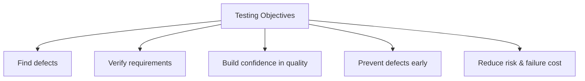
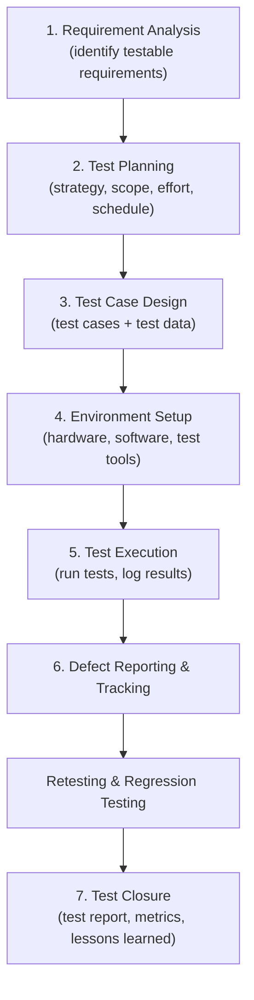
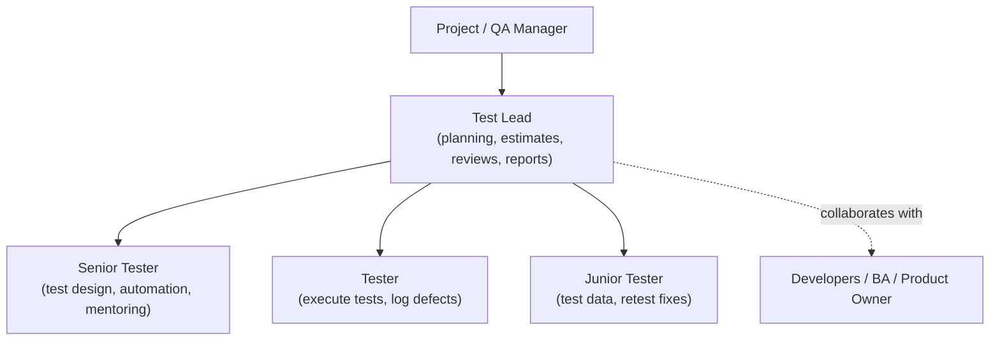
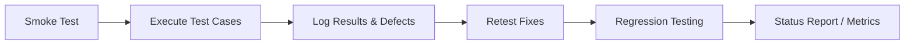
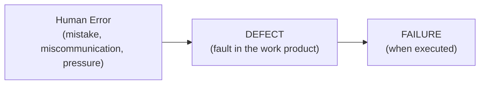
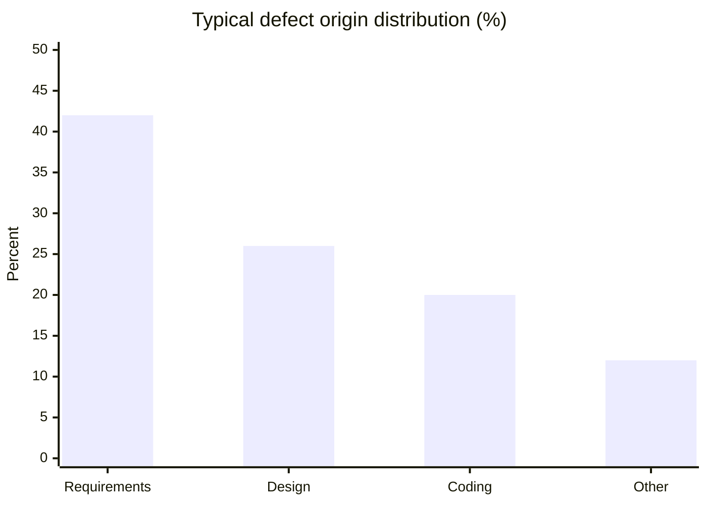
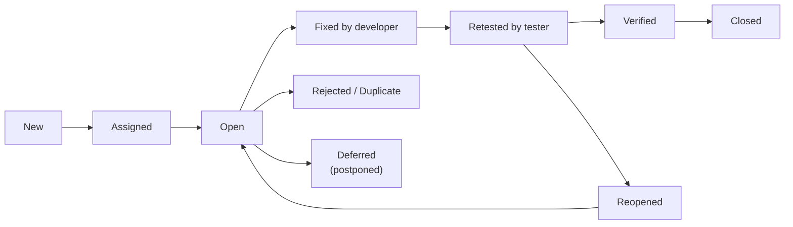

# STQA — Unit 2 (Essentials of Software Testing)

> Exam-prep notes: short definitions, key points, and diagrams.

**Contents**
1. [Software Testing Basics](#1-software-testing-basics)
2. [Test Plan and Test Cases](#2-test-plan-and-test-cases)
3. [Defect Management](#3-defect-management)
4. [Quick Revision](#4-quick-revision)

---

## 1. Software Testing Basics

### 1.1 Definition of Testing

- **IEEE:** *"Testing is the process of exercising or evaluating a system or component by manual or automated means to verify that it satisfies specified requirements."*
- **Myers:** *"Testing is the process of executing a program with the intent of finding errors."*
- Testing = executing software to **find defects** before the customer does. It shows defects *exist*, not that none remain.

### 1.2 Objectives of Testing

1. **Find defects / bugs** before release
2. **Verify** the product meets requirements (verification) and user needs (validation)
3. **Gain confidence** in and provide information about quality level
4. **Prevent defects** through early reviews and test design
5. Ensure **coverage** of functionality (all features, boundaries, flows)
6. Reduce **risk** of failure and cost of poor quality

### 1.3 Software Testing Life Cycle (STLC)

**Exit criteria:** all planned tests executed, critical defects fixed & closed, test summary report delivered.

### 1.4 Software Testing Principles (7)

| # | Principle | Meaning |
|---|---|---|
| 1 | Testing shows **presence** of defects, not their absence | You can prove bugs exist, never that zero bugs remain |
| 2 | **Exhaustive testing is impossible** | Test smartly using risk, priorities, and techniques |
| 3 | **Early testing** saves time & money | Defects found in requirements cost least (shift-left) |
| 4 | **Defect clustering** | ~80% of defects are found in ~20% of modules — test hotspots more |
| 5 | **Pesticide paradox** | Same tests stop finding new bugs — keep reviewing/updating tests |
| 6 | Testing is **context dependent** | E-commerce, medical, and game software need different testing |
| 7 | **Absence-of-errors fallacy** | A bug-free app that nobody needs is still a failure — test for user needs |

### 1.5 The Tester's Role in a Software Development Organization

| SDLC Phase | Tester's Role |
|---|---|
| Requirements | Find ambiguities, write acceptance criteria, prepare RTM |
| Design | Review design docs, identify test conditions, plan environment |
| Coding | Build test cases/data, automate, review code with developers |
| Testing | Execute tests, log & track defects, retest fixes |
| Release | Smoke tests, regression, test summary report |
| Maintenance | Regression packs, support defect triage |

- Tester acts as the **customer's advocate** — independent eye, but collaborates (not fights) with developers.

---

## 2. Test Plan and Test Cases

### 2.1 Test Plan — Definition

- A document (IEEE 829 standard) describing the **scope, approach, resources, schedule** of intended test activities, and responsibilities.
- *"Who tests what, when, how, and with what?"*

### 2.2 Test Plan — Preparation (Contents, IEEE 829)

1. Test plan identifier
2. **Introduction / objectives** & scope (in-scope / out-of-scope)
3. Test items & **features to be tested / not tested**
4. **Approach** (levels, types, techniques, tools)
5. **Pass / fail criteria** and entry / exit criteria
6. **Suspension criteria & resumption** requirements
7. Test **deliverables** (cases, scripts, reports)
8. **Environment** needs & test data
9. **Responsibilities** & staffing/training
10. **Schedule** & effort estimates
11. **Risks & contingencies**
12. Approvals

### 2.3 Test Plan — Management & Execution

- **Management:** keep plan under version control, track progress vs schedule (tests executed/passed/failed), handle risks, re-plan when requirements change, status meetings & daily reports.
- **Execution:** smoke test first → execute test cases → log actual results → report defects → **retest** fixed defects → run **regression** → mark case status (*Pass / Fail / Blocked / Skipped*).

### 2.4 Test Case — Definition

- A set of **inputs, execution preconditions, and expected results** developed to exercise a particular test condition and verify a requirement.

### 2.5 Designing Test Cases

**Standard fields:** Test Case ID · Title · Module · Requirement ID (traceability) · Precondition · Test Steps · Test Data · **Expected Result** · Actual Result · Status (Pass/Fail) · Priority · Author/Reviewer.

**Design tips:** one objective per case · clear steps anyone can execute · trace each case to a requirement · cover positive **and** negative scenarios · design before coding (early defect prevention).

**Example — Login Test Case:**

| Field | Value |
|---|---|
| TC ID | TC_LOGIN_01 |
| Title | Verify login with valid credentials |
| Precondition | User is registered; login page open |
| Steps | 1. Enter valid username 2. Enter valid password 3. Click Login |
| Test Data | user01 / Pass@123 |
| Expected Result | User is redirected to dashboard; welcome message shown |
| Status | Pass |

### 2.6 Test Report (Test Summary Report)

Prepared **after execution** — a formal record for stakeholders:
- Summary of what was tested (features, builds)
- **Metrics:** tests planned/executed/passed/failed/blocked, defect counts by severity
- Defect summary & known remaining defects
- Environment & deviations from plan
- **Conclusion:** quality assessment + release recommendation (*Go / No-Go*)

---

## 3. Defect Management

### 3.1 Origins of Defects

- A defect is born from a **human error** at some stage:

- **Main origins:** misunderstood / changing **requirements (~40–45%)**, **design** mistakes (~25%), **coding** errors (~20%), environment/config, documentation, late fixes & time pressure.

### 3.2 Defect Classes

| Class | Examples |
|---|---|
| **Requirements defects** | Wrong / missing / ambiguous / extra requirements |
| **Design defects** | Wrong algorithm, interface mismatch, missing module |
| **Coding defects** | Logic errors, off-by-one, null handling, syntax-level bugs |
| **Data / Database defects** | Wrong datatype, integrity violations, corrupt data |
| **UI defects** | Misaligned layout, wrong labels, broken navigation |
| **Documentation defects** | Manual doesn't match actual behaviour |
| **Environment / Config defects** | Works on Chrome not Firefox; wrong server settings |

### 3.3 The Defect Repository and Test Design

- A **defect repository** is a central database of all defect records (tools: Jira, Bugzilla, Mantis) with standard fields:

  `ID | Description | Module | Origin (phase) | Detected In | Severity | Priority | Status | Reported By | Fix Version`

- **How it supports test design:**
  - **Defect clustering** → identify error-prone modules → *risk-based testing*
  - Historical patterns → build **checklists** & targeted negative tests
  - Metrics (defect density, leakage) → decide **regression scope** and release readiness
  - Same defect seen repeatedly → new test case to prevent repeat escapes

### 3.4 Defect Examples

| ID | Description | Class | Severity |
|---|---|---|---|
| D-101 | Bill computes 18% GST on already-discounted price | Coding | High |
| D-102 | App crashes when phone number field is left blank | Coding/UI | Critical |
| D-103 | Manual says "Reset password via email" but SMS is sent | Documentation | Medium |
| D-104 | Page layout breaks at 1024×768 resolution | UI | Low |

### 3.5 Defect Life Cycle (Bug Life Cycle)

### 3.6 Developer / Tester Support for Building a Defect Repository

1. **Standard template & taxonomy** — agreed defect classes, severities, priorities
2. **Good defect reports:** reproduce it → isolate it → generalize it → *What happened vs. what was expected* (one defect per report, screenshots/logs)
3. **Training** testers & developers in classification; joint **causal analysis meetings** (root causes feed defect prevention)
4. **Tool support** (Jira/Bugzilla) — workflow automation, dashboards, metrics
5. **No-blame culture** — defects are process feedback, not personal faults; review repository regularly for trends

---

## 4. Quick Revision

| Item | One-liner |
|---|---|
| Testing | Executing a program with intent to find errors |
| 7 principles | Presence-not-absence · No exhaustive testing · Early testing · Defect clustering · Pesticide paradox · Context-dependent · Absence-of-errors fallacy |
| STLC | Requirement analysis → Planning → Case design → Setup → Execution → Defect tracking → Closure |
| Test plan | IEEE 829: scope, approach, criteria, environment, schedule, risks |
| Test case | Input + precondition + expected result, traced to a requirement |
| Test report | Execution metrics + defect summary + Go/No-Go |
| Defect chain | Human error → Defect → Failure |
| Top defect origin | Requirements (~40%+) — test early! |
| Severity vs Priority | Severity = impact on system; Priority = urgency to fix |
| Good bug report | Reproducible, specific, minimal, expected-vs-actual |
