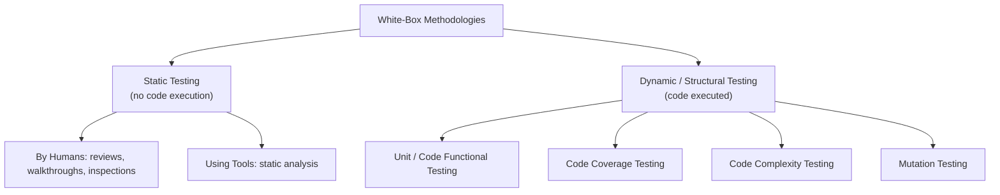
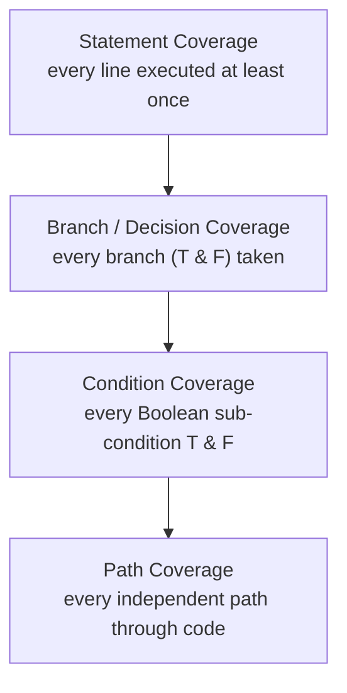
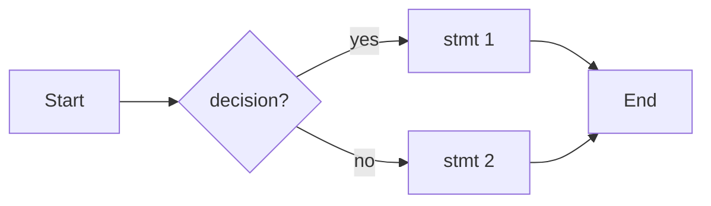
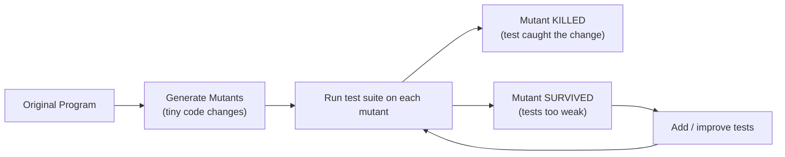
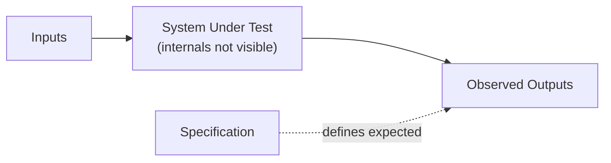
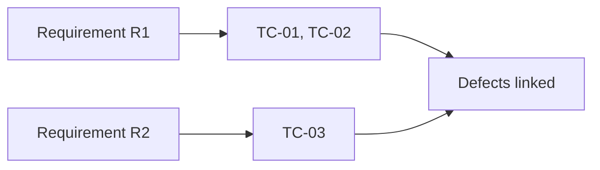
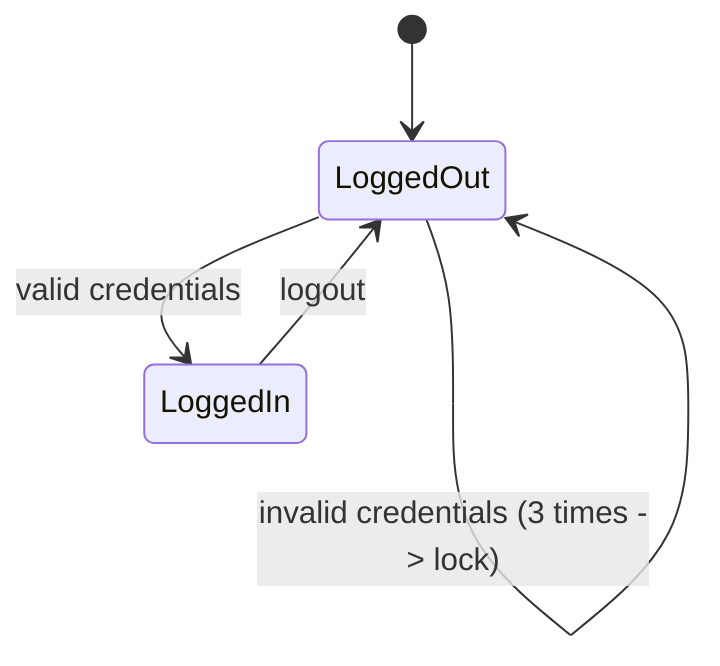

# STQA — Unit 3 (Software Testing Techniques)

> Exam-prep notes: short definitions, key points, and diagrams.

**Contents**
1. [White-Box Testing Methodologies](#1-white-box-testing-methodologies)
2. [Black-Box Testing Methodologies](#2-black-box-testing-methodologies)
3. [Quick Revision](#3-quick-revision)

---

## 1. White-Box Testing Methodologies

- **White-box (glass-box / structural) testing:** tester can **see the internal code/logic** and designs tests to exercise it. Done mostly by developers.

### 1.1 Static Testing — By Humans

- Testing **without executing** the code — examining documents, design and code by reading.
- Techniques: **Walkthrough** (author-guided, informal), **Inspection** (formal, moderator + checklist, Fagan), **Peer review / code review**, **Desk checking**.
- Finds: logic errors, standard violations, missing requirements — **early and cheap**.

### 1.2 Static Testing — Using Static Analysis Tools

- Tools parse code **without running it** and flag problems automatically.
- Detect: unused variables, unreachable code, null-pointer risks, coding-standard violations, duplicated code, **security vulnerabilities** (SQL injection patterns), memory leaks.
- Examples: **Lint / ESLint**, **SonarQube**, Checkmarx, Pylint, FindBugs/SpotBugs.
- Benefit: 100% of code checked quickly, enforces standards, fits CI pipeline.

### 1.3 Structural Testing: Unit / Code Functional Testing

- Testing **individual units (functions/methods/classes)** in isolation with the code visible.
- Developer writes tests calling each function with normal, boundary and exceptional inputs; uses **drivers/stubs** for dependencies.
- Usually automated with frameworks like **JUnit / NUnit / pytest** — the foundation of the test pyramid.

### 1.4 Code Coverage Testing

- Coverage = *how much of the code the tests actually execute*. Strength increases top-down:

- **Statement coverage** = (statements executed / total statements) × 100
- **Branch coverage** = (branches taken / total branches) × 100 — stronger than statement coverage
- **Path coverage** = all independent paths (practical only for small units)
- Coverage **< 100% means untested code exists**; 100% statement coverage does **not** guarantee zero defects (missing-path code is never executed by definition).

### 1.5 Code Complexity Testing

- Based on **Cyclomatic Complexity** (McCabe): `V(G) = E − N + 2P` = number of **independent paths** = number of decisions + 1. Keep `V(G) ≤ 10`.
- **Basis Path Testing steps:**
  1. Draw the **flow graph** of the code
  2. Compute **V(G)**
  3. Identify that many **independent paths**
  4. Write **one test case per path**
- High complexity ⇒ hard to test & maintain ⇒ refactor into smaller functions.

*V(G) = E(5) − N(5) + 2 = 2 → two independent paths: (A-B-C-E) and (A-B-D-E) → 2 test cases minimum.*

### 1.6 Mutation Testing

- Deliberately **inject small code changes (mutants)** — e.g. change `>` to `>=`, `+` to `-` — and check whether the test suite **detects (kills)** each mutant.

- **Mutation Score = (killed mutants / total non-equivalent mutants) × 100** — measures the **quality (adequacy) of the test suite**, not of the product.
- Costly (many runs) → usually applied to critical units; equivalent mutants (no behaviour change) are ignored.

---

## 2. Black-Box Testing Methodologies

- **Black-box (functional/behavioural) testing:** tests **what the system does** (from requirements/specification) **without looking at internal code**. Done by independent testers.

### 2.1 Requirements-Based Testing

- Derive test conditions **directly from each requirement** and prove each one works.
- Use a **Requirements Traceability Matrix (RTM)**: Requirement ↔ Test Cases ↔ Defects — ensures every requirement is tested and no extra untested behaviour ships.
- Also validates the requirements themselves (clear, complete, testable).

### 2.2 Positive and Negative Testing

| | Positive testing | Negative testing |
|---|---|---|
| Purpose | System works with **valid** input ("happy path") | System **handles invalid** input gracefully |
| Example | Login with correct password | Login with wrong/blank password; SQL in username |
| Mindset | "Does it work as intended?" | "How can it be broken?" |
| Result expected | Success | Error message, no crash |

### 2.3 Boundary Value Analysis (BVA)

- Defects cluster at **boundaries** of input ranges (unit 2's "defect clustering" applied to values).
- For range **[min, max]** test: `min−1, min, min+1, mid, max−1, max, max+1`.
- **Example — field accepts age 18–60:**

| Input | 17 | 18 | 19 | 40 | 59 | 60 | 61 |
|---|---|---|---|---|---|---|---|
| Expected | Reject | Accept | Accept | Accept | Accept | Accept | Reject |

### 2.4 Equivalence Partitioning (EP)

- Divide the input domain into **classes treated the same way**; test **one value per class** (huge effort reduction).
- **Example — age 18–60:**

| Partition | Class | Test value |
|---|---|---|
| Invalid (below) | < 18 | 10 |
| **Valid** | 18–60 | 35 |
| Invalid (above) | > 60 | 75 |

- EP + BVA together = classic specification-based combo.

### 2.5 State-Based (State Transition) Testing

- Model the system as **states + transitions + events**; test every valid transition and **invalid transitions** too.
- Example — Login state machine:

- Coverage ideas: all states visited, all transitions executed, invalid transition rejected.

### 2.6 Graph-Based Testing

- Convert requirements into a **graph** — nodes = objects/states, edges = relationships/flows — then derive test cases to cover nodes & links.
- Useful when behaviour depends on **sequences and links** (menus, workflows, navigation).

### 2.7 Compatibility Testing

- Verifies the app works across **different environments**:
  - **Browsers** (Chrome, Firefox, Safari, Edge) & versions
  - **OS** (Windows, Linux, macOS, Android, iOS)
  - **Devices** / resolutions (mobile vs desktop)
  - **Networks**, third-party integrations
- **Backward compatibility** (works with older versions) and **forward compatibility** (with newer ones).

### 2.8 User Documentation Testing

- Verify **manuals, help files, installation guides, FAQs, tutorials** are **accurate, complete, and easy to follow**.
- Method: perform tasks *only* using the documentation; every documented step must match real behaviour; check screenshots, version consistency, terminology.

### 2.9 Domain Testing

- The umbrella strategy: treat inputs as a **domain of values**, then pick **strategic values** — boundaries, mid-points, special/invalid values inside and outside the domain.
- Combines EP + BVA with risk-based sampling to maximize defect-finding with few tests.

---

## 3. Quick Revision

| Technique | Core idea | Type |
|---|---|---|
| Reviews / inspections | Humans read code/docs — no execution | Static (white-box) |
| Static analysis | Tools flag code smells without running | Static (white-box) |
| Unit testing | Test functions/classes in isolation | Structural |
| Statement / branch / path coverage | % of code exercised by tests | Coverage |
| Cyclomatic complexity | `V(G) = E − N + 2P` ≤ 10 → basis path tests | Complexity |
| Mutation testing | Kill mutants → measure test suite quality | White-box |
| Requirements-based + RTM | Every requirement traced to tests | Black-box |
| Positive / negative | Valid vs invalid input handling | Black-box |
| BVA | Test min−1…max+1 (edges break) | Black-box |
| EP | One value per equivalence class | Black-box |
| State / graph-based | Cover states, transitions, links | Black-box |
| Compatibility | Browsers, OS, devices, versions | Black-box |
| Documentation testing | Manuals match real behaviour | Black-box |
| Domain testing | Strategic values across input domain | Black-box |
