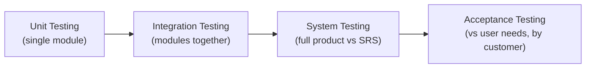
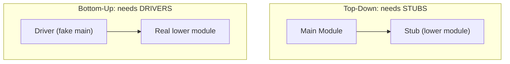
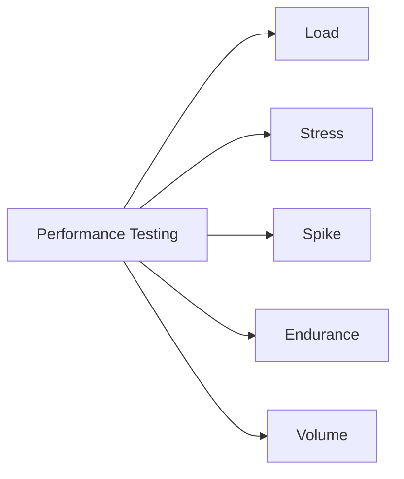
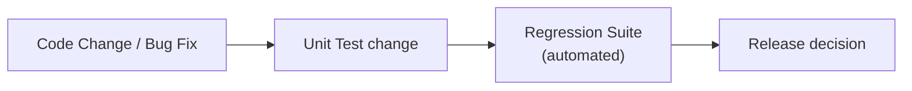
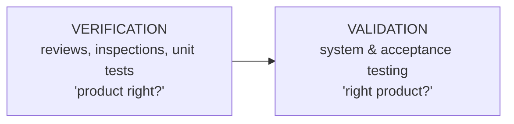
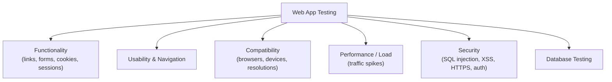

# STQA — Unit 4 (Testing Strategies)

> Exam-prep notes: short definitions, key points, and diagrams.

**Contents**
1. [Testing Levels](#1-testing-levels)
2. [Testing Approaches](#2-testing-approaches)
3. [Specialized Testing](#3-specialized-testing)
4. [Quick Revision](#4-quick-revision)

---

## 1. Testing Levels

### 1.1 Integration Testing

- Tests the **interfaces & interaction between combined modules** (data flow, API calls, sequencing).
- **Approaches:**

| Approach | How | Needs | Pros / Cons |
|---|---|---|---|
| **Big Bang** | Combine everything, test at once | Nothing extra | Cheap but fault localization is hard |
| **Top-Down** | Test from main module downward | **Stubs** (dummy lower modules) | Major interfaces tested early; stubs cost effort |
| **Bottom-Up** | Test lowest modules upward | **Drivers** (dummy callers) | Utility modules tested early; main flow last |
| **Sandwich / Hybrid** | Top-down + bottom-up together | Stubs + drivers | Best of both; complex to manage |
| **Continuous** | Integrate & test with every commit (CI) | Automation | Fast feedback; modern default |

### 1.2 System Testing

- Tests the **complete, integrated system** against the **SRS** in a production-like environment — the last test by the dev organization.
- Includes:
  - **Functional** system tests (end-to-end features)
  - **Non-functional:** performance, load, security, recovery, usability, compatibility, installation, documentation testing
- Performed by an **independent test team** (not the developers).

### 1.3 Acceptance Testing

- Formal testing to decide whether the system **satisfies acceptance criteria** and the customer **accepts** it. Usually by/for the customer.

| Type | Who / Where | Meaning |
|---|---|---|
| **UAT** | Users, customer site | Verify real business scenarios work |
| **Alpha** | Internal / dev-site, controlled | Early customer-style testing by test team |
| **Beta** | Real users, their site | Field trial before release; feedback drives fixes |
| **Contract / Regulation** | Per contract / law | Prove compliance (e.g., gov standards) |

---

## 2. Testing Approaches

### 2.1 Scenario Testing

- Test **real-world user stories end-to-end** ("student registers → enrolls → pays → downloads certificate").
- Uses the software **the way a customer would** — connects features across modules.
- Benefits: finds gaps unit tests miss, validates business flow, high stakeholder value.

### 2.2 Performance Testing

| Type | Question answered |
|---|---|
| **Load** | Behaviour at expected concurrent users (e.g., 5,000 users) |
| **Stress** | Beyond limits — does it degrade gracefully or crash? |
| **Spike** | Sudden user surge (flash sale) |
| **Endurance / Soak** | Stability over long duration (memory leaks) |
| **Volume** | Large amounts of data in the DB |
| **Scalability** | Does adding hardware/resources help handle more load? |

- Key metrics: **response time, throughput, resource utilization (CPU/RAM), error rate**. Tools: JMeter, LoadRunner, Gatling, k6.

### 2.3 Regression Testing

- Re-running tests **after a change** (bug fix, enhancement, config) to confirm **existing functionality still works**.
- Strategy: **selective regression** (only impacted areas), risk-based prioritization, **automation** of the regression pack, run in **CI on every build**.

### 2.4 Ad Hoc Testing

- **Random, unplanned testing without documentation** — relies on tester intuition/experience.
- Variants: **error guessing** (guess where developers fail), **exploratory testing** (learn-design-execute simultaneously, documented via session notes), **monkey testing** (random inputs/ clicks).
- Finds surprising defects fast, but **can't be repeated/audited** — best as a supplement, not a strategy.

---

## 3. Specialized Testing

### 3.1 Usability Testing

- Measures **how easy, efficient and satisfying** the product is for real users.
- Checks: navigation, learnability, error prevention/recovery, consistency, help.
- Methods: user observation, think-aloud sessions, surveys, heuristic evaluation (Nielsen's 10 usability heuristics).

### 3.2 Accessibility Testing

- Ensures the app is usable by **people with disabilities** (visual, auditory, motor, cognitive) per **WCAG** guidelines.
- **POUR principles:** Perceivable, Operable, Understandable, Robust.
- Checks: **screen-reader** support, keyboard-only navigation, **colour contrast**, alt text for images, captions, font scaling, focus order. Tools: axe, WAVE, NVDA/JAWS.

### 3.3 GUI Testing

- Validates the **graphical front-end**: buttons, menus, forms, icons, layout, fonts, colours, error messages, on different resolutions/browsers.
- Levels: check single **elements** → their **behaviour** → complete **screen/workflow**. Automated via Selenium / Cypress / TestCafe.

### 3.4 Validation Testing

- **"Are we building the RIGHT product?"** — final checks that the built product matches **user needs/expectations** (vs *verification* = "are we building the product right?" against specs).
- Happens through system/acceptance testing, demos, UAT.

### 3.5 Specification-Based Testing

- Black-box tests derived **from the specification** (not code). Techniques:
  - **Equivalence Partitioning** & **BVA**
  - **Decision Table testing** (business rule combinations)
  - **State Transition** testing
  - **Use-case / scenario** testing
- Coverage measure = % of specified requirements / rules exercised.

### 3.6 Testing Object-Oriented Software

- **Class (unit) testing:** each class's methods & state changes; inherited methods re-tested in subclasses.
- **Interaction (integration) testing:** collaborations between objects, message passing, **polymorphic calls** (test all subclass behaviours).
- **System testing:** scenarios across object interactions.
- **Challenges:** inheritance re-tests, encapsulation hides state (need state-access hooks), dynamic binding changes behaviour at runtime, no single "main flow".
- OO design supports testing: small cohesive classes → easier unit tests.

### 3.7 Testing Web-Based Applications

- Extra web concerns: broken links, browser back-button behaviour, session timeout, responsive layout, third-party integrations, CDN/caching.

### 3.8 Database Testing

| Area | What is checked |
|---|---|
| **Schema / metadata** | Tables, columns, datatypes, keys match design |
| **Data integrity** | Constraints (PK, FK, unique, not-null) enforced |
| **CRUD operations** | Create / Read / Update / Delete work correctly |
| **ACID properties** | Atomicity, Consistency, Isolation, Durability of transactions |
| **Stored procedures / triggers** | Logic, return values, exceptions |
| **Migration testing** | Old data maps correctly to new schema |
| **Performance** | Query response time, indexes |

- Method: run UI/API action → **verify DB state with SQL** → verify data flows back to UI correctly.

---

## 4. Quick Revision

| Item | One-liner |
|---|---|
| Levels order | Unit → Integration → System → Acceptance |
| Top-down needs | **Stubs** (dummy lower modules) |
| Bottom-up needs | **Drivers** (dummy callers) |
| System testing | Full product vs SRS, independent team |
| Acceptance | UAT, Alpha (dev site), Beta (user site) |
| Scenario testing | Real user stories end-to-end |
| Performance types | Load, Stress, Spike, Endurance, Volume |
| Regression | Re-test after every change; automate it |
| Ad hoc / exploratory | Unplanned, experience-driven; not repeatable |
| Usability | Easy, efficient, satisfying to use |
| Accessibility | WCAG + POUR; screen readers, contrast, keyboard |
| Validation vs Verification | Right product vs product built right |
| Spec-based techniques | EP, BVA, decision tables, state transition, use cases |
| OO testing | Class → interactions (polymorphism!) → system |
| Web testing | Functionality, usability, compatibility, performance, security, DB |
| DB testing | Schema, integrity, CRUD, ACID, procedures, migration |
