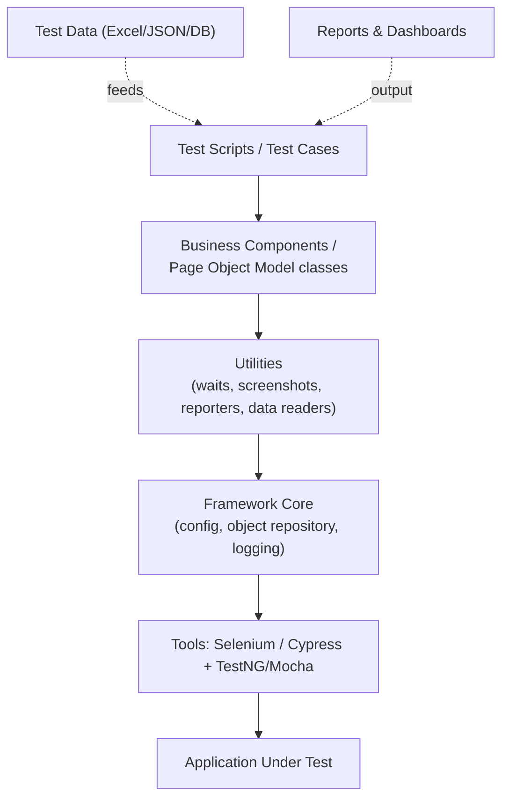
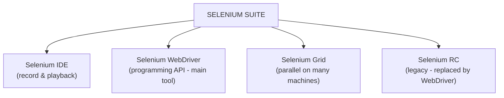
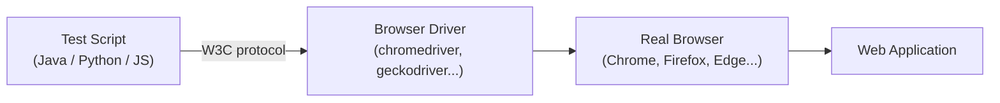
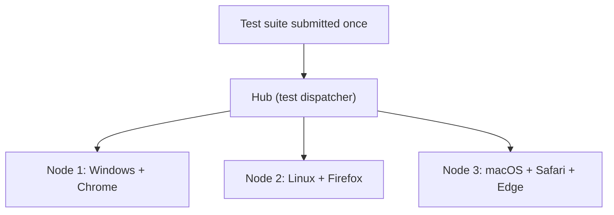

# STQA — Unit 5 (Software Test Automation)

> Exam-prep notes: short definitions, key points, and diagrams.

**Contents**
1. [Introduction to Automation Testing](#1-introduction-to-automation-testing)
2. [Selenium](#2-selenium)
3. [Quick Revision](#3-quick-revision)

---

## 1. Introduction to Automation Testing

### 1.1 What is Software Test Automation?

- Using **tools and scripts** to execute pre-recorded/pre-written tests, **compare actual vs expected results**, and report outcomes — with **minimal human intervention**.
- Best for: repetitive, stable, high-risk, data-driven tests (regression, smoke, API). Worst for: exploratory, usability, one-time checks.

### 1.2 Skills Needed for Automation

1. **Programming** (Java, JavaScript, Python, C#) — OOP, loops, exception handling
2. Knowledge of **SDLC/STLC & Agile** processes
3. **Tool expertise** — Selenium/Cypress, REST API tools (Postman), build tools (Maven/npm)
4. **Framework design** — Page Object Model, data-driven, keyword-driven, hybrid
5. **Version control (Git)** + **CI/CD** (Jenkins, GitHub Actions)
6. **Locators/XPath/CSS selectors**, HTML/DOM basics
7. Analytical skills, reporting & debugging

### 1.3 Scope of Automation (What to Automate)

| Automate ✔ | Don't automate ✘ |
|---|---|
| Regression & smoke suites | Exploratory / ad hoc testing |
| Repeated data-driven tests | Usability & look-and-feel judgement |
| Stable, frequently-used flows | Very frequently *changing* UI |
| API/backend tests | One-time execution tests |
| Cross-browser matrix runs | Captcha / OTP / human-judgement checks |

### 1.4 Design & Architecture for Automation

- **Popular framework patterns:** Page Object Model (each page = a class), **Data-driven** (tests read external data), **Keyword-driven** (actions from keyword tables), **Hybrid**, BDD (Cucumber: Given-When-Then).

### 1.5 Requirements for a Good Test Tool

- Supports your **technology stack** (web, mobile, API) & browsers
- Easy **object/element identification** and script creation
- **Reusability**, data-driven support, maintainability
- Good **reporting/logging**, screenshots on failure
- Integrates with **CI/CD & version control**
- Reasonable **cost/license**, community support, scripting language flexibility

### 1.6 Challenges in Automation

1. High **initial cost & setup time** (tool + skills)
2. **Script maintenance** burden when UI changes frequently
3. **Flaky tests** (timing/AJAX/dynamic elements) → false failures
4. Tool **limitations** (browser popups, captchas, OTP)
5. Needs **programming skill** — not all manual testers have it
6. Can't replace human **judgement** (usability, UX)

### 1.7 Tracking the Bug (in automation)

- Failures auto-captured: screenshot + logs + environment details → auto-**log defect** into tracker (Jira/Bugzilla) via API
- Defect lifecycle: New → Assigned → Fixed → **Retested (often re-run automation)** → Verified → Closed (see Unit 2)
- Dashboards show defect trends per build; flaky failures separated from real defects before logging.

### 1.8 Debugging (vs Testing)

- **Testing:** finding that a defect *exists* (tester). **Debugging:** locating the exact cause and **fixing** it (developer) — breakpoints, step-through, logs, heap dumps.
- Automation helps: failing test + screenshot + console log = a great starting clue for debugging.

### 1.9 Manual Testing vs Automated Testing

| Aspect | Manual | Automated |
|---|---|---|
| Executed by | Human tester | Tool/script |
| Speed & consistency | Slow, human error | Fast, repeatable, exact |
| Cost | Low setup, high long-term | High setup, low repeat cost |
| Best for | Exploratory, usability, ad hoc | Regression, data-driven, smoke |
| Coverage | Limited by time | Large data/browser matrices |
| Reports | Written by tester | Auto-generated with screenshots |
| Verdict | Needed always | Complements manual |

### 1.10 UI Automation Tools: Cypress, TestCafe, Protractor

| Feature | **Cypress** | **TestCafe** | **Protractor** |
|---|---|---|---|
| Language | JavaScript/TypeScript | JavaScript/TypeScript | JavaScript/TypeScript |
| Architecture | Runs **inside** browser (same event loop) | **Proxy-based**, no browser plugin | WebDriver (Selenium protocol) |
| Special | Time-travel debugging, auto-waiting, great DX | Cross-browser incl. mobile, no webdriver | Built for **Angular** (selectors, waiting) |
| Parallelism | Dashboard/CI | Built-in | Via Selenium Grid |
| Status | Very popular | Popular | **Deprecated** (retired 2022-23) |

### 1.11 Case Studies of Automation Testing

1. **E-commerce regression (Selenium + POM + TestNG):** 600+ test cases automated for login, cart, checkout, payments; nightly Jenkins runs cut a 3-day manual regression to **~4 hours**; escaped defects dropped ~30%.
2. **Banking app cross-browser (Selenium Grid):** 40 critical flows × 5 browser/OS combos in **parallel**, certifying every release candidate in one night instead of a week.
3. **SPA dashboard (Cypress):** auto-waiting eliminated flaky waits; time-travel debugging cut diagnosis time of UI failures by ~50%; wired into CI so every merge gets UI feedback in minutes.
4. **Angular app (Protractor):** e2e tests synchronized with Angular's async activity for stable releases — later migrated to Cypress/TestCafe when Protractor was retired.

---

## 2. Selenium

### 2.1 Introduction

- **Selenium** = open-source suite of tools for **automating web browsers** — the de-facto standard for web UI test automation. Cross-browser, cross-platform, multi-language (Java, Python, C#, JS, Ruby...). Free & actively community-developed.

### 2.2 Brief History of the Selenium Project

| Year | Event |
|---|---|
| **2004** | **Jason Huggins** (ThoughtWorks) builds "JavaScriptTestRunner" — becomes **Selenium Core/RC** (name = joke on Mercury Interactive's rival "Selenium detoxes Mercury") |
| **2006** | **Shinya Kasatani** (Japan) creates **Selenium IDE** (Firefox record-playback) |
| **2007** | **Simon Stewart** creates **WebDriver** (direct browser control, no JS-sandbox limits) |
| **2009** | Selenium + WebDriver merged → **Selenium 2 (WebDriver)** |
| **2016** | **Selenium 3** — WebDriver as the core; RC moved to legacy |
| **2021** | **Selenium 4** — **W3C WebDriver protocol** native, new IDE, Grid revamp, relative locators |

### 2.3 Selenium's Tool Suite

### 2.4 Selenium IDE

- **Browser extension** (Firefox/Chrome) — **record & playback** of user actions; no programming needed.
- Generates scripts in multiple languages, has command completion (Selenese), can export to WebDriver code.
- **Use:** quick prototyping, learning, simple regression of stable flows. **Limits:** no looping/logic originally, fragile for dynamic apps, single browser at a time.

### 2.5 Selenium RC (Remote Control) — Legacy

- First full-featured Selenium: a **server** received commands and **injected JavaScript** into the browser to run them (worked around browser sandbox with a proxy).
- Drawbacks: slow, complex setup, JS-injection limitations, own API.
- **Replaced by WebDriver** (kept only as "legacy" in Selenium 3).

### 2.6 Selenium WebDriver

- **The core tool.** Language bindings send commands over the **W3C WebDriver protocol** to a **browser-specific driver** (chromedriver, geckodriver) which controls the **real browser natively** (no JS injection) — faster & more realistic.

- Key capabilities: find elements (id, name, XPath, CSS), actions (click, type, select), waits, frames/windows/alerts handling, screenshots, headless runs. **Cannot** test desktop apps or read captchas.

### 2.7 Selenium Grid

- Runs tests **in parallel on multiple machines/browsers/OS** — one **Hub** receives tests, **Nodes** execute them.

- Benefits: massive time saving, **cross-browser matrix** coverage in one run; (Selenium 4 Grid: fully re-architected, docker-friendly, observability).

### 2.8 Test Design Considerations (Selenium best practices)

1. **Waits over sleeps:** implicit wait + **explicit (WebDriverWait) conditions** (visibility/clickability) for dynamic/AJAX content — never fixed `Thread.sleep`.
2. **Reliable locators:** prefer stable `id`/`data-*` attributes > CSS > absolute XPath; keep a central **object repository** (POM).
3. **Page Object Model:** one class per page; pages expose actions; tests contain assertions only → UI change = edit one class.
4. **Independence:** each test self-contained, cleans its data, no order dependency; reset state between tests.
5. **Test data:** external files (Excel/JSON/DB) for data-driven tests; unique data per run.
6. **Failure evidence:** screenshots + page source + logs on failure; mark & isolate flaky tests.
7. **Maximize coverage per run:** headless mode, parallel via Grid, run suite in **CI on every commit**; verify results with assertions, not just script completion.

---

## 3. Quick Revision

| Item | One-liner |
|---|---|
| Automation | Tools+scripts execute tests & compare results |
| Automate / not | Regression, data-driven ✔ / usability, exploratory ✘ |
| Frameworks | POM, Data-driven, Keyword-driven, Hybrid, BDD |
| Big challenges | Cost, maintenance, flaky tests, skill need |
| Debugging vs Testing | Fix cause (dev) vs find defect (tester) |
| Manual vs Automated | Judgement vs speed & repeatability |
| Cypress | Runs in browser, auto-waits, time-travel debugging |
| TestCafe | Proxy-based, cross-browser, no plugins |
| Protractor | Angular e2e — **deprecated** |
| Selenium history | 2004 RC (Huggins) → 2006 IDE → 2007 WebDriver → 2009 merge → 2021 Selenium 4 |
| Suite | IDE (record) · WebDriver (API) · Grid (parallel) · RC (legacy) |
| WebDriver flow | Script → W3C → Browser driver → Real browser |
| Grid | Hub distributes to nodes for parallel cross-browser runs |
| Best practices | Explicit waits, stable locators, POM, independent tests, CI |
