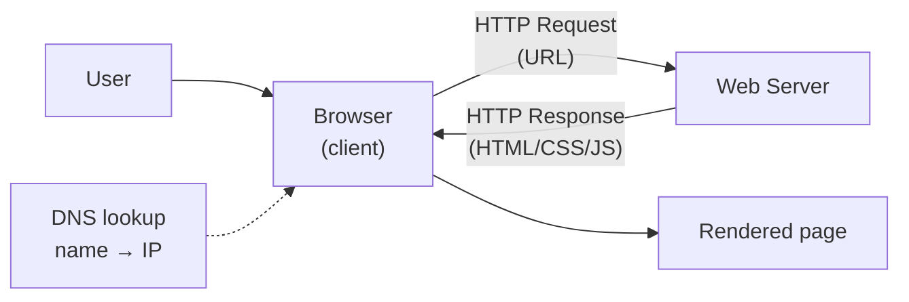
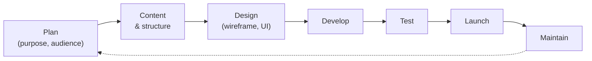
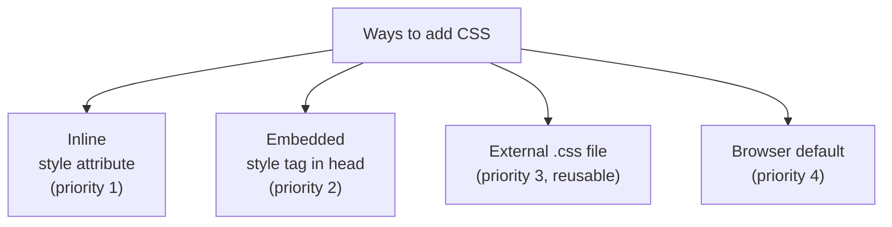

# WT — Unit 1 (HTML and XML)

> Exam-prep notes: short definitions, key points, and diagrams.

**Contents**
1. [Web Technology Basics](#1-web-technology-basics)
2. [HTML](#2-html)
3. [CSS](#3-css)
4. [XML](#4-xml)
5. [Quick Revision](#5-quick-revision)

---

## 1. Web Technology Basics

### 1.1 Internet and WWW

- **Internet:** global network of interconnected computers (hardware infrastructure) using TCP/IP.
- **WWW (Web):** an **information service on the Internet** — collection of interlinked **hypertext documents** accessed via HTTP through browsers.
- Key parts: **Web client (browser)** sends a request → **Web server** responds with a page → browser **renders** it.



- **URL:** `protocol://domain:port/path` e.g. `https://www.example.com:443/courses/index.html`
- Common protocols: **HTTP/HTTPS** (web), **SMTP/POP3** (mail), **FTP** (files), **DNS** (names).

### 1.2 Web Servers

- Software that **accepts HTTP requests and serves responses** (static files, or dynamic output with app frameworks).
- Examples: **Apache**, **Nginx**, **IIS**, Tomcat.
- Features: virtual hosting, logging, caching, security (SSL/TLS), load handling.
- **Static page** = same HTML every time; **Dynamic page** = generated by code (PHP/ASP/JSP) per request.

### 1.3 Website Planning & Design Issues

- Planning steps: define **purpose/audience → content requirements → sitemap/navigation → wireframe/design → technology choice → testing → launch → maintenance**.
- Design issues: **usability** (simple nav, 3-click rule), **consistency** (layout, colours), **accessibility** (alt text, contrast), **responsiveness** (mobile-first), **browser compatibility**, **performance** (image size, caching), **SEO**, **security**.



---

## 2. HTML

### 2.1 Structure of an HTML Document

- **HTML (HyperText Markup Language)** — standard language to **structure web pages** using tags.

```html
<!DOCTYPE html>
<html>
  <head>
    <title>Page Title</title>  <!-- metadata, links CSS/JS -->
  </head>
  <body>
    <h1>Visible content here</h1>
    <p>Paragraph of text.</p>
  </body>
</html>
```

### 2.2 HTML Elements

| Element | Tag(s) | Example / Use |
|---|---|---|
| **Headings** | `<h1>`–`<h6>` | `<h1>Main title</h1>` (h1 largest) |
| **Paragraph** | `<p>` | `<p>Some text.</p>` |
| **Line break** | `<br>` (void) | new line inside text |
| **Colors & fonts** | `<font>` (old) / **CSS** | `<p style="color:blue;font-family:Arial">` |
| **Links** | `<a href>` | `<a href="page.html">Go</a>`; targets: `_blank`, mailto: |
| **Lists** | `<ul><li>`, `<ol><li>`, `<dl><dt><dd>` | bulleted / numbered / definition |
| **Tables** | `<table><tr><th><td>` (+`caption, thead, tbody`) | rows & cells, `colspan`, `rowspan` |
| **Images** | `` | `` |
| **Forms** | `<form action method>` | inputs: text, password, radio, checkbox, submit |
| **Frames** | `<frameset><frame>` (old) / **`<iframe>`** | embed another page (frames obsolete in HTML5) |

```html
<form action="login.php" method="post">
  Name: <input type="text" name="user"><br>
  Password: <input type="password" name="pass"><br>
  Gender: <input type="radio" name="g" value="M">M
          <input type="radio" name="g" value="F">F<br>
  <input type="submit" value="Login">
</form>
```

- **method get vs post:** GET appends data to URL (visible, limited, bookmarkable); POST sends in body (secure-ish, unlimited, for passwords/updates).

### 2.3 HTML vs HTML5

| HTML 4.01 | HTML5 |
|---|---|
| Only `<div>` for layout | **Semantic tags:** `<header> <nav> <section> <article> <footer>` |
| Needs plugins (Flash) for media | Native `<audio>`, `<video>`, `<canvas>`, SVG |
| No local storage (cookies only) | **localStorage, sessionStorage**, IndexedDB |
| Doctype long & versioned | Simple `<!DOCTYPE html>` |
| No forms validation | New inputs (email, date, range) + required/pattern |
| No offline/geolocation | **Geolocation, Web Workers, drag & drop** APIs |
| Frames `<frameset>` allowed | Frames removed; `<iframe>` remains |

---

## 3. CSS

### 3.1 Introduction to Style Sheets

- **CSS (Cascading Style Sheets)** = language describing the **presentation** (colours, fonts, layout) of HTML — separates **content (HTML)** from **style (CSS)**.
- "Cascading" = rules apply in priority order: **Inline → Embedded/Internal → External → browser default** (later/more-specific wins).

### 3.2 Inserting CSS in an HTML Page

```html
<!-- 1. INLINE (inside tag - highest priority) -->
<p style="color:red;">Inline CSS</p>

<!-- 2. EMBEDDED / INTERNAL (in <head>) -->
<head>
  <style> p { color: blue; } </style>

  <!-- 3. EXTERNAL (separate .css file - best practice) -->
  <link rel="stylesheet" href="style.css">
</head>
```

```css
/* style.css */
body { background: #f0f0f0; font-family: Arial; }
h1   { color: navy; }
```

### 3.3 CSS Selectors

| Selector | Syntax | Selects |
|---|---|---|
| **Element** | `p { }` | all `<p>` tags |
| **Class** | `.warning { }` | elements with `class="warning"` (reusable) |
| **ID** | `#top { }` | the one element with `id="top"` |
| **Universal** | `* { }` | every element |
| **Grouping** | `h1, h2 { }` | several selectors together |
| **Descendant** | `div p { }` | `<p>` inside `<div>` |
| **Attribute** | `input[type="text"]` | inputs with that attribute |
| **Pseudo-class** | `a:hover`, `li:first-child` | states/positions |



---

## 4. XML

### 4.1 Introduction to XML

- **XML (eXtensible Markup Language)** = markup language for **storing & transporting structured data**; tags are **user-defined**, focus on *what data is* (HTML = how it looks).
- Sample:

```xml
<?xml version="1.0" encoding="UTF-8"?>
<student id="101">
  <name>Amit</name>
  <branch>IT</branch>
  <marks>85</marks>
</student>
```

- Rules: single root element, tags case-sensitive & properly nested, all attributes quoted, **well-formed** = follows these rules.

### 4.2 Features & Applications of XML

- **Features:** platform/language independent · extensible (own tags) · self-descriptive · separates data from presentation · supports validation (DTD/Schema) & Unicode.
- **Applications:** data exchange between systems (**web services/SOAP**), config files (Android layouts, Maven, web.config), RSS feeds, office document formats (docx), sitemaps.

### 4.3 XML Key Components

```mermaid
flowchart TD
    X["XML Document"] --> PD["Prolog / Declaration<br/>(<?xml version...?>)"]
    X --> RO["ROOT element<br/>(exactly one)"]
    X --> EL["ELEMENTS<br/>(<name>...</name>)"]
    X --> AT["ATTRIBUTES<br/>(inside start tag: id="101")"]
    X --> TX["Text / CDATA content"]
    X --> CO["Comments <!-- -->"]
```

- **Element vs Attribute:** element = data container (can nest); attribute = metadata about an element (no nesting). Rule of thumb: data → elements, metadata → attributes.

### 4.4 XML DTD (Document Type Definition)

- Defines the **grammar/structure** of an XML document — which elements/attributes are allowed → used for **validation**.

```xml
<!DOCTYPE note [
  <!ELEMENT note (to, from, body)>
  <!ELEMENT to    (#PCDATA)>
  <!ELEMENT from  (#PCDATA)>
  <!ELEMENT body  (#PCDATA)>
]>
```

- Declares: `!ELEMENT` (children/`#PCDATA`), `!ATTLIST` (attributes), cardinality `?` optional, `*` zero+, `+` one+.
- Limitations: no data types, not XML itself, limited validation power → replaced by XSD.

### 4.5 XML Schema (XSD)

- XML-based alternative to DTD with **data types** (string, int, date), min/max occurs, namespaces support.

```xml
<xs:element name="marks" type="xs:integer"/>
```

| DTD | XML Schema |
|---|---|
| Non-XML syntax | Written in XML |
| No data types | Rich data types |
| Weak validation | Strong validation & restrictions |
| No namespaces | Supports namespaces |

### 4.6 XML Namespaces

- Solve **name collisions** when mixing vocabularies — qualify elements with a prefix bound to a URI.

```xml
<root xmlns:h="http://www.w3.org/TR/html4/" xmlns:t="http://www.w3.org/Students/">
  <h:table>...</h:table>
  <t:table>...</t:table>   <!-- same name, different meaning -->
</root>
```

### 4.7 XSLT (Transforming XML)

- **XSL = eXtensible Stylesheet Language**; **XSLT** = its transformation language that converts **XML → HTML / another XML / text** using templates & XPath.

```xml
<xsl:stylesheet xmlns:xsl="http://www.w3.org/1999/XSL/Transform" version="1.0">
  <xsl:template match="/">
    <html><body>
      <h2>Students</h2>
      <xsl:for-each select="students/student">
        <p><xsl:value-of select="name"/></p>
      </xsl:for-each>
    </body></html>
  </xsl:template>
</xsl:stylesheet>
```

```mermaid
flowchart LR
    X["XML document"] + S["XSLT stylesheet"] --> P["XSLT Processor"] --> H["HTML / XML / Text output"]
```

---

## 5. Quick Revision

| Item | One-liner |
|---|---|
| Internet vs WWW | Network infrastructure vs hypertext service on it |
| Web server | Accepts HTTP requests, serves pages (Apache, Nginx, IIS) |
| HTML structure | doctype, html → head (metadata) + body (content) |
| GET vs POST | URL/visible/limited vs body/hidden/unlimited |
| HTML5 new | Semantic tags, audio/video/canvas, localStorage, geolocation |
| CSS priority | Inline > Embedded > External > default |
| CSS selectors | element, .class, #id, *, grouping, descendant, attribute, pseudo |
| XML purpose | Store/transport data, user-defined tags |
| Well-formed | One root, nested properly, case-sensitive, quoted attributes |
| DTD vs XSD | No types vs typed XML-schema validation |
| Namespaces | Avoid name clashes via prefix + URI |
| XSLT | Transforms XML → HTML/XML using templates + XPath |
