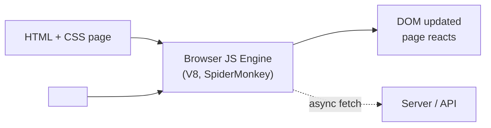
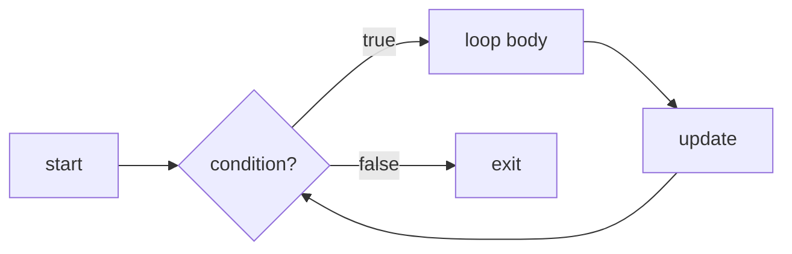
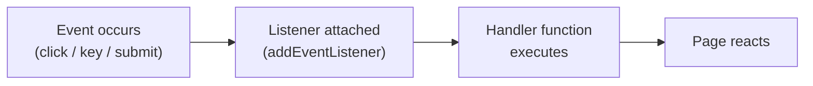
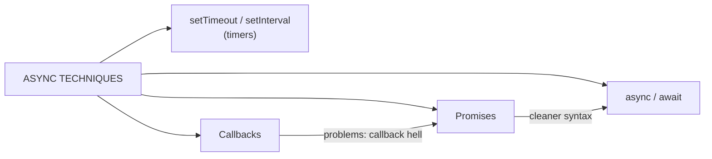

# WT — Unit 2 (JavaScript)

> Exam-prep notes: short definitions, key points, and diagrams.

**Contents**
1. [JavaScript Overview](#1-javascript-overview)
2. [Using JS in HTML, Variables & Data Types](#2-using-js-in-html-variables--data-types)
3. [Control Structures, Functions & Dialog Boxes](#3-control-structures-functions--dialog-boxes)
4. [Page Redirect & Cookies & Events](#4-page-redirect-cookies--events)
5. [JS Built-in Objects](#5-js-built-in-objects)
6. [Asynchronous JavaScript](#6-asynchronous-javascript)
7. [Bootstrap](#7-bootstrap)
8. [Quick Revision](#8-quick-revision)

---

## 1. JavaScript Overview

### 1.1 Need / Why JavaScript?

- **JavaScript (JS)** = lightweight, interpreted (JIT) **client-side scripting language** that makes web pages **interactive and dynamic** — runs inside the browser without recompiling.
- Why: HTML = structure, CSS = style, **JS = behaviour** — validate forms, react to clicks, update content without reload (DOM manipulation), talk to servers (AJAX).

### 1.2 Applications

- Form validation · interactive UI (menus, sliders, modals) · **SPA frameworks** (React, Angular, Vue) · server-side (**Node.js**) · mobile apps (React Native) · desktop (Electron) · games & animations · browser extensions.

### 1.3 Advantages & Limitations

| Advantages | Limitations |
|---|---|
| Fast (no server round-trip for UI work) | **Client-side security** — code visible to users |
| Simple to learn, no setup | Can be **disabled** in browser → app must degrade gracefully |
| Rich interfaces, instant feedback | Rendering differs across browsers (older ones) |
| Event-driven & asynchronous | No file/DB access directly (sandboxed) |
| Huge ecosystem (libraries) | Stops working on errors — one script error can break page |

### 1.4 Where JS Runs



---

## 2. Using JS in HTML, Variables & Data Types

### 2.1 Embedding JS (3 ways)

```html
<!-- 1. EMBEDDED / INTERNAL -->
<script>
  alert("Hello from embedded JS");
</script>

<!-- 2. EXTERNAL file (best practice, cacheable, reusable) -->
<script src="app.js"></script>

<!-- 3. INLINE in an element (avoid) -->
<button onclick="alert('Clicked!')">Click</button>
```

### 2.2 Variables & Data Types

- Declare with `var` (function scope, old) · `let` (block scope, re-assignable) · `const` (block scope, fixed).
- **Loosely typed** — type comes from the value.

| Type | Example |
|---|---|
| String | `"Amit"` |
| Number | `21, 3.14` |
| Boolean | `true / false` |
| Undefined | declared, no value |
| Null | intentional empty |
| Object / Array | `{name:"Amit"}`, `[1,2,3]` |
| Function | `function(){}` |

```js
let name = "Amit";      // string
const age = 21;          // number
let isEnrolled = true;   // boolean
let marks;               // undefined
typeof age;              // "number"
```

---

## 3. Control Structures, Functions & Dialog Boxes

### 3.1 if…else and switch

```js
if (marks >= 40)  console.log("Pass");
else              console.log("Fail");

switch (day) {
  case 1:  console.log("Mon"); break;
  case 2:  console.log("Tue"); break;
  default: console.log("Other");
}
```

### 3.2 Loops

```js
for (let i = 1; i <= 5; i++)  console.log(i);     // known count

let i = 1;
while (i <= 5) { console.log(i); i++; }            // test first

let j = 1;
do { console.log(j); j++; } while (j <= 5);        // runs at least once

for (let x of [10, 20, 30]) console.log(x);        // values of array
```

- `break` exits the loop; `continue` skips to next iteration.



### 3.3 Functions

```js
function add(a, b) {        // declaration + parameters
  return a + b;             // returns value
}
let sum = add(2, 3);        // call + arguments

const mul = (a, b) => a*b;  // arrow function (ES6)
```

### 3.4 Dialog Boxes

| Box | Use | Code |
|---|---|---|
| **alert()** | Show message (OK only) | `alert("Saved!");` |
| **confirm()** | Yes/No → returns true/false | `if (confirm("Delete?")) {...}` |
| **prompt()** | Take text input | `let n = prompt("Your name?");` |

---

## 4. Page Redirect, Cookies & Events

### 4.1 Page Redirect

```js
window.location.href = "https://example.com";   // redirect (history kept)
window.location.replace("home.html");           // redirect (no history)
setTimeout(() => location.href = "next.html", 3000); // after 3 seconds
```

### 4.2 Cookies

- Small **text data stored in the browser** (per domain), sent with every request → remember users, preferences, sessions.

```js
document.cookie = "user=Amit; expires=Fri, 31 Dec 2027 12:00:00 UTC; path=/";
let c = document.cookie;      // read all cookies
// delete: set expires in the past
```

- Limits: ~4 KB, ~20 per domain, can expire (`expires`/`max-age`), `path`/`domain` scope; **not secure** for sensitive data.

### 4.3 Events

- **Events** = user/browser actions (click, load, keypress, submit) that trigger handler code.

```html
<button id="btn">Go</button>
<script>
  document.getElementById("btn").addEventListener("click", function () {
    alert("Button clicked!");
  });
</script>
```

| Category | Events |
|---|---|
| Mouse | click, dblclick, mouseover, mouseout |
| Keyboard | keydown, keypress, keyup |
| Form | submit, change, focus, blur |
| Window | load, unload, resize, scroll |



---

## 5. JS Built-in Objects

### 5.1 Object Properties & Methods (general idea)

- **Property** = value attached to an object (`car.color`); **Method** = function attached to it (`car.start()`).

```js
let student = { name: "Amit", roll: 12, show: function(){ return this.name; } };
student.name;      // property
student.show();    // method
```

### 5.2 Number

- **Properties:** `MAX_SAFE_INTEGER`, `MIN_SAFE_INTEGER`, `MAX_VALUE`, `MIN_VALUE`, `NaN`, `EPSILON`.
- **Methods:** `toFixed(2)` (decimal places), `toPrecision()`, `toString()`, `parseInt()`, `parseFloat()`, `isInteger()`, `isNaN()`.

```js
let n = 3.14159;
n.toFixed(2);          // "3.14"
Number.parseInt("42"); // 42
Number.isInteger(5);   // true
```

### 5.3 String

- **Properties:** `length`.
- **Methods:** `toUpperCase()`, `toLowerCase()`, `charAt(i)`, `indexOf("x")`, `slice(start,end)`, `substring()`, `replace("a","b")`, `split(",")`, `trim()`, `concat()`, `includes()`.

```js
let s = "  Hello World  ";
s.trim().toUpperCase();               // "HELLO WORLD"
"MIT,WIT,VIT".split(",");             // ["MIT","WIT","VIT"]
"banana".indexOf("na");               // 2
```

### 5.4 Array

- **Property:** `length`.
- **Methods:** `push()`/`pop()` (end), `shift()`/`unshift()` (start), `indexOf()`, `join(",")`, `slice()`, `splice()`, `concat()`, `sort()`, `reverse()`, `map()`, `filter()`, `reduce()`.

```js
let a = [3, 1, 2];
a.push(4);            // [3,1,2,4]
a.sort();             // [1,2,3,4]
a.map(x => x * 2);    // [2,4,6,8]
a.filter(x => x > 2); // [3,4]
```

### 5.5 Math

- **Properties:** `PI`, `E`, `LN2`, `SQRT2`.
- **Methods:** `round()`, `floor()`, `ceil()`, `trunc()`, `abs()`, `sqrt()`, `pow(x,y)`, `min()`, `max()`, `random()` (0–1).

```js
Math.round(4.6);          // 5
Math.floor(4.9);          // 4   |  Math.ceil(4.1) → 5
Math.random();            // 0.371...
Math.floor(Math.random()*6)+1;  // dice: 1-6
```

### 5.6 Date & Temporal

- **Date object** handles dates/times (legacy but standard):

```js
let d = new Date();          // now
d.getFullYear(); d.getMonth();      // 0-11!
d.getDate(); d.getDay();            // day-of-month, 0=Sun
d.getHours(); d.getMinutes();
d.getTime();                        // ms since 1 Jan 1970
let d2 = new Date("2026-09-28");
```

- **Temporal** = the modern successor API (ES proposal) fixing Date's quirks — immutable, timezone-aware: `Temporal.Now`, `Temporal.PlainDate`, `Temporal.ZonedDateTime`, `Temporal.Duration`.

---

## 6. Asynchronous JavaScript

- JS is **single-threaded** — async techniques run slow work (timers, network) **without freezing the page**.



### 6.1 Timeout

```js
setTimeout(() => console.log("after 2 s"), 2000);   // once
setInterval(() => console.log("every 1 s"), 1000);  // repeatedly
```

### 6.2 Callback

- Function **passed to another function** to run later.

```js
function getData(callback) {
  setTimeout(() => callback("data"), 1000);
}
getData(d => console.log(d));
```
- Problem: nesting many → **"callback hell"** (unreadable pyramid).

### 6.3 Promises

- Object representing a **future value**: states → **pending → fulfilled (resolve) / rejected**.

```js
let p = new Promise((resolve, reject) => {
  setTimeout(() => resolve("done!"), 1000);
});
p.then(r => console.log(r))        // on success
 .catch(e => console.log(e));      // on failure
```

### 6.4 async / await

- **Sugar over promises** — async code that *looks* synchronous; `await` pauses inside an `async` function until the promise settles.

```js
async function load() {
  try {
    let res = await fetch("api/data.json");
    let json = await res.json();
    console.log(json);
  } catch (e) { console.log("error", e); }
}
```

| Technique | Readability | Error handling |
|---|---|---|
| Callback | Poor (nesting) | Manual |
| Promise `.then()` | Good | `.catch()` |
| async/await | **Best** | `try/catch` |

---

## 7. Bootstrap

### 7.1 Need / Why Bootstrap?

- **Bootstrap** = free, open-source **CSS/JS front-end framework** (Twitter, 2011) of ready-made **responsive** components (grid, navbars, cards, modals, buttons).
- Why: write mobile-friendly UI **without deep CSS knowledge**, consistent design, cross-browser tested, faster development.

### 7.2 Advantages

1. **Responsive grid system** (12-column, mobile-first)
2. **Ready components** — buttons, forms, navbars, carousels, modals
3. Cross-browser consistency
4. Easy to learn/use (classes like `btn btn-primary`)
5. Customizable (Sass variables) + huge community
6. Saves development time massively

### 7.3 How to Use Bootstrap

```html
<!-- via CDN -->
<link href="https://cdn.jsdelivr.net/npm/bootstrap@5.3.0/dist/css/bootstrap.min.css" rel="stylesheet">
<script src="https://cdn.jsdelivr.net/npm/bootstrap@5.3.0/dist/js/bootstrap.bundle.min.js"></script>

<div class="container">          <!-- layout -->
  <div class="row">
    <div class="col-md-6">Left half</div>
    <div class="col-md-6">Right half</div>
  </div>
  <button class="btn btn-primary">Styled button</button>
</div>
```

- Add classes to HTML (no custom CSS needed) — or download files locally / install via npm. Include **jQuery-free bundle JS** (v5) for dropdowns/modals.

---

## 8. Quick Revision

| Item | One-liner |
|---|---|
| JavaScript | Client-side scripting for interactivity (HTML=structure, CSS=style, JS=behaviour) |
| Embedding | Embedded `<script>` · external `.js` (best) · inline attribute |
| var vs let/const | function-scope vs block-scope & fixed |
| Loops | for (count), while (pre-test), do-while (post-test), for-of (values) |
| Dialogs | alert, confirm, prompt |
| Cookies | `document.cookie`, ~4 KB, remember user across visits |
| Redirect | `window.location.href` / `replace()` |
| Events | click/submit/load handled via addEventListener |
| Number/String/Array/Math | toFixed, split-push-map-sort, random-PI — know 5 methods each |
| Date | `new Date()`, getTime() ms epoch; Temporal = modern replacement |
| Async evolution | setTimeout → callback → **Promise** → **async/await** |
| Promise states | pending → resolved / rejected |
| Bootstrap | Responsive 12-col grid + ready components via CSS classes |
