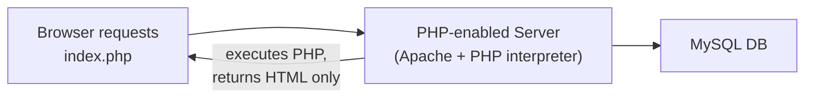
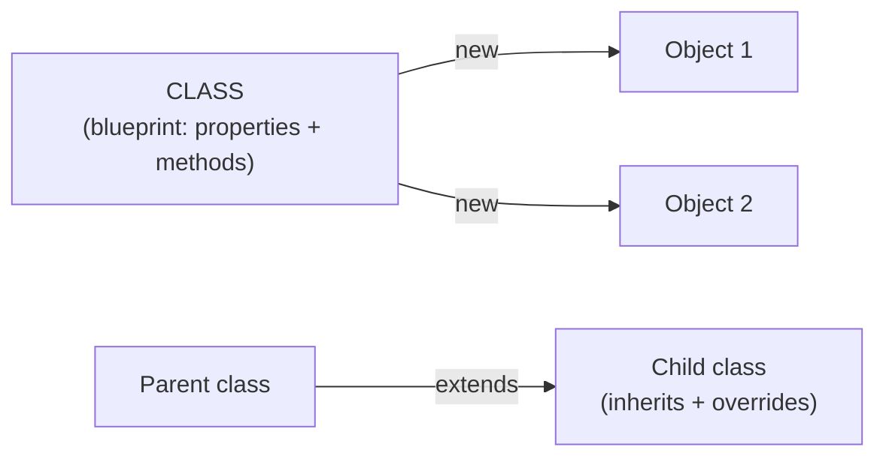
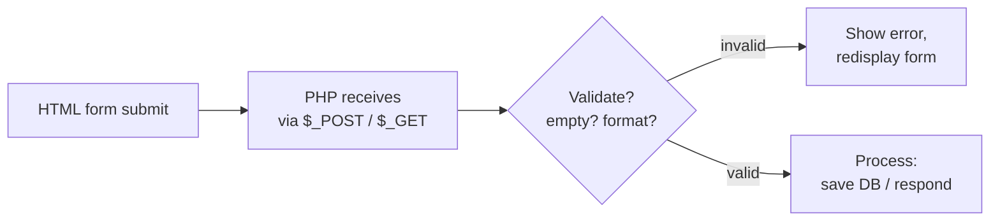
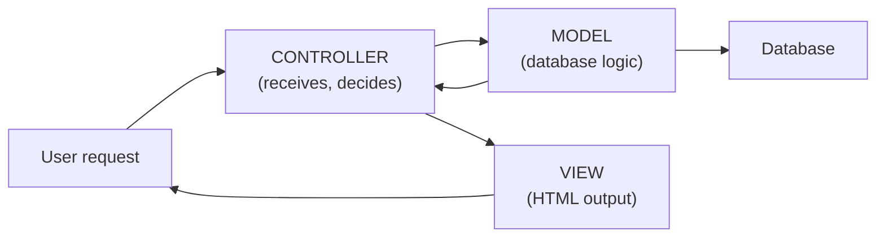

# WT — Unit 3 (PHP)

> Exam-prep notes: short definitions, key points, and diagrams.

**Contents**
1. [PHP Basics: Variables & Operators](#1-php-basics-variables--operators)
2. [Input, Output & String Formatting](#2-input-output--string-formatting)
3. [Arrays](#3-arrays)
4. [Dates & User-Defined Functions](#4-dates--user-defined-functions)
5. [OOP in PHP](#5-oop-in-php)
6. [File Handling, Cookies & Sessions](#6-file-handling-cookies--sessions)
7. [PHP Forms: Handling & Validation](#7-php-forms-handling--validation)
8. [CodeIgniter](#8-codeigniter)
9. [Quick Revision](#9-quick-revision)

---

## 1. PHP Basics: Variables & Operators

### 1.1 What is PHP?

- **PHP (Hypertext Preprocessor)** = open-source **server-side scripting language** for web development; code runs **on the server**, and plain **HTML is sent to the browser**.
- Features: embedded in HTML, cross-platform, works with MySQL, huge library support, dynamic page generation.



### 1.2 Variables & Operators

- Variables start with **`$`**, no type declaration (loosely typed), case-sensitive; scope: **local, global, static**.

```php
<?php
  $name = "Amit";      // string
  $age  = 21;          // integer
  $fees = 2500.50;     // float
  $pass = true;        // boolean
?>
```

| Operator group | Symbols |
|---|---|
| Arithmetic | `+ - * / % **` |
| Assignment | `= += -= *= /=` |
| Comparison | `== === != !== < > <= >=` (`===` compares value **and type**) |
| Logical | `&& \|\| !` |
| Increment/Decrement | `++ --` |
| String | `. ` (concatenation) |

---

## 2. Input, Output & String Formatting

### 2.1 User Input & Output

- Output: **`echo`** (fast, multiple args) and **`print`** (returns 1, one arg); `print_r()` / `var_dump()` for debugging arrays/objects.
- Input arrives from forms/URL via superglobals:

```php
echo "Hello $name <br>";            // output
print_r($_POST);                    // inspect array
$user = $_POST["username"];         // form POST
$id   = $_GET["id"];                // URL query string
```

### 2.2 Formatting Strings & Library Functions

```php
printf("Name: %s, Age: %05d", $name, $age);  // formatted output
sprintf("%.2f", 3.14159);                    // returns formatted string → "3.14"
```

| Function | Use |
|---|---|
| `strlen($s)` | length of string |
| `strrev($s)` | reverse |
| `strtoupper() / strtolower()` | case change |
| `ucfirst() / ucwords()` | capitalize |
| `trim($s)` | strip spaces |
| `substr($s, start, len)` | part of string |
| `str_replace("a","b",$s)` | replace |
| `strpos($s, "x")` | find position |
| `explode(",", $s)` / `implode()` | string ↔ array |
| `strcmp($a,$b)` | compare |

---

## 3. Arrays

### 3.1 Fundamentals

- **Array** = variable holding **multiple values** under one name; 3 kinds:

```php
// 1. SINGLE-DIMENSIONAL (indexed, starts at 0)
$cars = array("BMW", "Tesla", "Audi");
echo $cars[1];               // Tesla

// 2. MULTIDIMENSIONAL (array of arrays)
$marks = array(
  "Amit"  => array("PHP" => 85, "DBMS" => 78),
  "Riya"  => array("PHP" => 90, "DBMS" => 88)
);
echo $marks["Riya"]["PHP"];  // 90

// 3. ASSOCIATIVE (key => value pairs)
$salary = array("Amit" => 50000, "Riya" => 60000);
echo $salary["Amit"];        // 50000
foreach ($salary as $k => $v) echo "$k earns $v <br>";
```

### 3.2 Array Library Functions

| Function | Use |
|---|---|
| `count($a)` / `sizeof()` | number of elements |
| `array_push($a, x)` / `array_pop($a)` | add/remove at end |
| `array_shift()` / `array_unshift()` | remove/add at start |
| `in_array(x, $a)` | search value |
| `array_search(x, $a)` | key of a value |
| `array_keys($a)` / `array_values($a)` | keys / values only |
| `sort() rsort()` | order by value |
| `ksort() krsort()` | order by key |
| `array_merge($a,$b)` | combine |
| `array_reverse($a)` | flip order |
| `array_sum($a)` | sum of values |

---

## 4. Dates & User-Defined Functions

### 4.1 Date & Time Functions

```php
echo date("d-m-Y");            // 28-09-2026
echo date("D, d M Y h:i:s A"); // Mon, 28 Sep 2026 10:30:45 AM
echo time();                   // Unix timestamp (seconds since 1970)
echo mktime(10, 30, 0, 9, 28, 2026);   // timestamp for a given time
echo strtotime("next Monday");          // text → timestamp
echo date("Y", strtotime("+1 year"));   // calculations
```

- Format letters: **d** day, **m** month, **Y** 4-digit year, **h:i:s** time, **A** AM/PM.

### 4.2 User-Defined Functions

```php
function greet($name = "Guest") {     // default parameter
  return "Hello, $name!";
}
echo greet("Amit");                   // Hello, Amit!

function addFive(&$n) { $n += 5; }    // pass by reference (&)
$val = 10; addFive($val);             // $val = 15
```

- Can have default values, return values, pass by value/reference; variables inside are local (use `global $x;` to access globals).

---

## 5. OOP in PHP

```php
<?php
class Student {                       // class = blueprint
  public $name;                       // property
  private $marks;

  public function __construct($name, $marks) {   // constructor
    $this->name  = $name;
    $this->marks = $marks;
  }
  public function show() {
    return "$this->name scored $this->marks";
  }
}
$s1 = new Student("Amit", 85);        // object
echo $s1->show();
?>
```

| Concept | In PHP |
|---|---|
| **Encapsulation** | visibility: `public`, `protected`, `private` |
| **Inheritance** | `class GradStudent extends Student {}` |
| **Polymorphism** | method overriding in child; interfaces/abstract classes |
| **Constructor** | `__construct()` auto-called on `new` |
| **Static** | `static::$x`, `self::method()` — class-level |
| **Interface** | `interface Shape { public function area(); }` |



---

## 6. File Handling, Cookies & Sessions

### 6.1 File Handling

```php
$f = fopen("notes.txt", "r");      // modes: r, w, a, x, r+, w+
while (!feof($f)) echo fgets($f) . "<br>";   // read line by line
fwrite($f2, "new text");           // write (file opened w/a)
fclose($f);
echo file_get_contents("notes.txt");   // whole file at once
file_put_contents("log.txt", "line\n", FILE_APPEND);
unlink("old.txt");                 // delete file
```

- Steps always: **open → read/write → close**.

### 6.2 Cookie vs Session

| | **Cookie** | **Session** |
|---|---|---|
| Stored on | **Browser (client)** | **Server** (only ID in browser) |
| Size / limit | ~4 KB | Unlimited (server) |
| Security | Low (user can read/edit) | **Higher** |
| Lifetime | Set expiry (can persist) | Until browser closes / `session_destroy()` |
| Start / use | `setcookie("user","Amit", time()+3600, "/")` then `$_COOKIE["user"]` | `session_start();` then `$_SESSION["user"]="Amit";` |

```php
// SESSION
session_start();                  // must be first line
$_SESSION["user"] = "Amit";       // store
echo $_SESSION["user"];           // read (any page)
session_unset(); session_destroy();   // logout

// COOKIE
setcookie("theme", "dark", time() + (86400*7), "/");
echo $_COOKIE["theme"];           // after reload
```

---

## 7. PHP Forms: Handling & Validation

```php
<!-- form.html -->
<form action="welcome.php" method="post">
  Name:  <input type="text" name="name">
  Email: <input type="text" name="email">
  <input type="submit">
</form>
```

```php
// welcome.php — handling + validation
if ($_SERVER["REQUEST_METHOD"] == "POST") {
  $name = trim($_POST["name"]);
  if (empty($name))              die("Name is required");
  if (!preg_match("/^[a-zA-Z ]*$/", $name)) die("Only letters allowed");
  if (!filter_var($_POST["email"], FILTER_VALIDATE_EMAIL)) die("Invalid email");
  echo "Welcome, " . htmlspecialchars($name);
}
```

- **Superglobals:** `$_GET` (URL, bookmarkable), `$_POST` (body, secure-ish), `$_REQUEST` (both).
- **Validation layers:** client-side (JS/HTML5 `required`) for UX + **server-side (PHP)** for security; sanitize with `trim/stripslashes/htmlspecialchars`.



---

## 8. CodeIgniter

- **CodeIgniter** = lightweight, fast **PHP MVC framework** — organizes code into **Model** (data/DB), **View** (presentation), **Controller** (logic) with ready libraries (session, form validation, email) and clean URLs.



- Flow: request → `Controller` (e.g., `site.php` method `index`) loads `Model` for data → passes data to `View` → HTML out.
- **Benefits:** MVC separation, small footprint, no template language forced, built-in security (XSS/CSRF filters), quick learning curve.

---

## 9. Quick Revision

| Item | One-liner |
|---|---|
| PHP | Server-side scripting; outputs HTML to browser |
| Variable | `$x`, loosely typed; `===` value + type check |
| Output | `echo` / `print`; `printf` for formats |
| String fns | strlen, strrev, strtoupper, substr, explode, implode |
| Arrays | Indexed, **associative** (key=>value), multidimensional |
| Array fns | count, push/pop, in_array, sort, array_merge, array_sum |
| Dates | `date("d-m-Y")`, time(), strtotime() |
| Function | `function f($a){ return ...; }`; `&` = by reference |
| OOP | class/object, `extends`, `__construct`, public/private |
| File modes | r read, w write, a append; always fclose() |
| Cookie | client-side, 4 KB, `setcookie()` + `$_COOKIE` |
| Session | server-side, `session_start()` + `$_SESSION`, more secure |
| Form validation | trim + empty check + regex + `filter_var(FILTER_VALIDATE_EMAIL)` |
| CodeIgniter | PHP **MVC** framework: Controller → Model → View |
