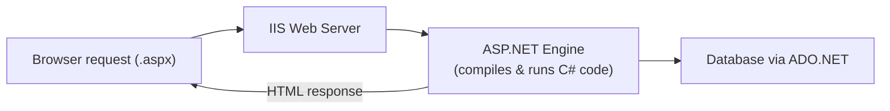
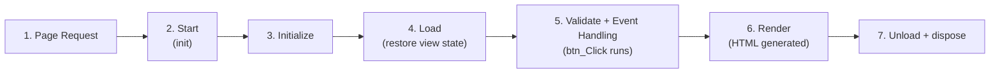
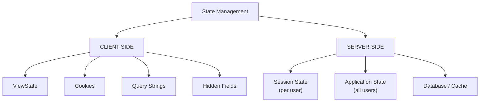
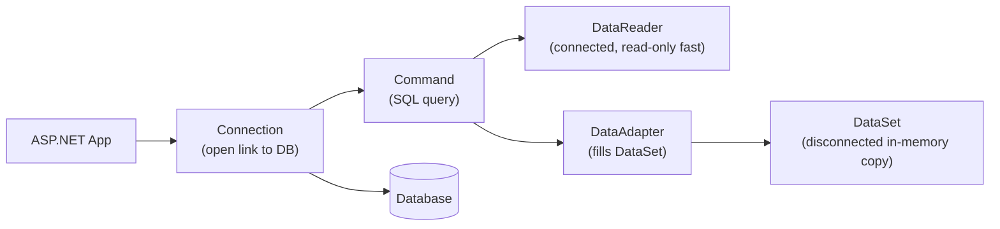
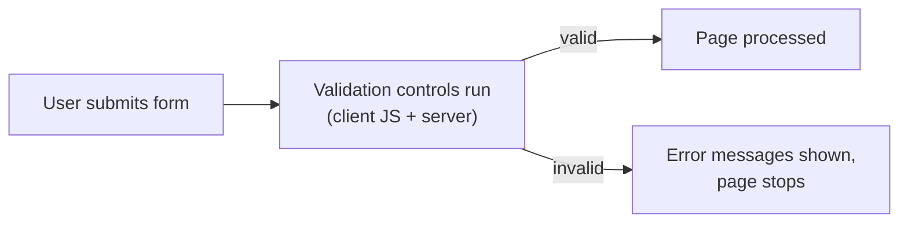

# WT — Unit 4 (ASP.NET)

> Exam-prep notes: short definitions, key points, and diagrams.

**Contents**
1. [Introduction to ASP.NET](#1-introduction-to-aspnet)
2. [Environment Setup](#2-environment-setup)
3. [Web Forms & Types of Controls](#3-web-forms--types-of-controls)
4. [State Management](#4-state-management)
5. [Server.Transfer vs Response.Redirect](#5-servertransfer-vs-responseredirect)
6. [Data Access: ADO.NET](#6-data-access-adonet)
7. [Validation Controls & Security](#7-validation-controls--security)
8. [Quick Revision](#8-quick-revision)

---

## 1. Introduction to ASP.NET

- **ASP.NET** = Microsoft's **server-side web application framework** (part of **.NET Framework**) for building **dynamic websites, web applications & web services** using C#/VB.NET.
- Code runs on the **server** → generates HTML sent to browser; supports compiled code (fast), rich **server controls**, automatic state management, and language independence (CLR).

| Feature | Meaning |
|---|---|
| Language support | C#, VB.NET (compiled to IL by CLR) |
| Rich server controls | Drag-drop controls with events (like desktop apps) |
| State management | ViewState, Session, Application built-in |
| Data access | ADO.NET + data-bound controls (GridView) |
| Security | Built-in authentication/authorization, validators |
| Models | **Web Forms** (event-driven) · **ASP.NET MVC** · Web API · Core |



---

## 2. ASP.NET Environment Setup

- Requirements: **Visual Studio** (free Community edition) + **.NET Framework/SDK** + optional **IIS Express** (bundled for local testing).
- Steps: Install Visual Studio → New Project → **ASP.NET Web Application** → choose template (Web Forms/MVC) → run with **F5** (built-in dev server starts, browser opens `localhost:port`).
- File types: **.aspx** (page markup) · **.aspx.cs** (code-behind C#) · **web.config** (settings, connection strings) · **Global.asax** (app events).

---

## 3. ASP.NET Web Forms & Types of Controls

### 3.1 Web Forms

- **Web Form** = an `.aspx` page with **server controls + code-behind**, following an **event-driven model** (like Windows forms): control events (button click, page load) trigger C# handlers.
- Page runs through a **life cycle**:



### 3.2 Types of ASP.NET Controls

| Type | Examples | Notes |
|---|---|---|
| **HTML server controls** | `<input runat="server">` | ordinary HTML + `runat="server"` → programmable |
| **Web/Standard server controls** | `<asp:TextBox>`, `<asp:Button>`, `<asp:Label>`, `<asp:DropDownList>`, `<asp:CheckBox>`, `<asp:RadioButton>` | richer API, auto state |
| **Data controls** | GridView, DetailsView, DataList, Repeater | bind to data sources |
| **Validation controls** | RequiredFieldValidator, RangeValidator, … | see §7 |
| **Navigation** | Menu, TreeView, SiteMapPath | site navigation |
| **Login controls** | Login, LoginView, PasswordRecovery | membership/security |

```aspx
<asp:TextBox ID="txtName" runat="server" />
<asp:Button ID="btnGo" runat="server" Text="Go" OnClick="btnGo_Click" />
<asp:Label ID="lblMsg" runat="server" />
```

```csharp
protected void btnGo_Click(object sender, EventArgs e) {
    lblMsg.Text = "Hello " + txtName.Text;
}
```

---

## 4. ASP.NET State Management

- **Problem:** HTTP is **stateless** — each request is independent; state management keeps data (user, cart, counters) **between requests**.



### 4.1 View State

- Hidden field `__VIEWSTATE` holding page & control values → values survive postbacks of the **same page only**; enabled by default (`EnableViewState`).

```csharp
ViewState["count"] = 5;
int c = (int)ViewState["count"];
```

### 4.2 Session State

- Data for a **single user** across **multiple pages**, stored server-side, identified by session cookie; dies on timeout/logout.

```csharp
Session["user"] = "Amit";              // store
string u = (string)Session["user"];    // read on any page
Session.Remove("user"); Session.Abandon();   // clear / end
```

### 4.3 Application State

- **Shared by all users** of the application (e.g., visitor counter), stored in server memory for app lifetime.

```csharp
Application["hits"] = (int)Application["hits"] + 1;
Application.Lock();   // thread-safe writes
Application.UnLock();
```

### 4.4 Cookies and Query Strings

```csharp
// COOKIE (client machine, small text)
Response.Cookies["theme"].Value = "dark";
Response.Cookies["theme"].Expires = DateTime.Now.AddDays(7);
string t = Request.Cookies["theme"].Value;

// QUERY STRING (URL parameters)
Response.Redirect("page2.aspx?name=Amit&id=9");
string n = Request.QueryString["name"];
```

### 4.5 Comparison

| Mechanism | Where | Scope | Lifetime | Best for |
|---|---|---|---|---|
| ViewState | Client (hidden field) | One page | Page postbacks | Control values |
| Cookies | Client | All pages (per user) | Set expiry | Preferences |
| Query string | URL | Next request | Until navigation | Small IDs/filters |
| Hidden field | Client | One page | Postback | Small page data |
| **Session** | Server | All pages, one user | 20-min default timeout | Login, cart |
| **Application** | Server | All users | App lifetime | Counters, global config |

---

## 5. Server.Transfer vs Response.Redirect

| | **Response.Redirect** | **Server.Transfer** |
|---|---|---|
| Mechanism | Tells **browser** to request new URL | Server switches page internally |
| Round trips | **2** (extra network trip) | **1** (no browser involvement) |
| Browser URL | **Changes** to new page | **Stays same** |
| Cross-server/domain | Yes | Same server only |
| Speed | Slower | Faster |

---

## 6. ASP.NET Data Access: ADO.NET

- **ADO.NET** = .NET library for **database access** — connected (read fast) & disconnected (cache in memory) models.



- **Core classes:** `Connection` (link), `Command` (SQL/stored proc), `DataReader` (forward-only read), `DataAdapter` (bridge), `DataSet` (in-memory tables + relations).

```csharp
string cs = ConfigurationManager.ConnectionStrings["db"].ConnectionString;
using (SqlConnection con = new SqlConnection(cs)) {
    con.Open();
    // connected read
    SqlCommand cmd = new SqlCommand("SELECT * FROM Students", con);
    SqlDataReader r = cmd.ExecuteReader();
    while (r.Read()) Response.Write(r["name"] + "<br>");

    // disconnected
    SqlDataAdapter da = new SqlDataAdapter("SELECT * FROM Students", con);
    DataSet ds = new DataSet();
    da.Fill(ds);
    GridView1.DataSource = ds.Tables[0];
    GridView1.DataBind();
}
```

- **Providers:** SqlClient (SQL Server), OleDb (Access/Oracle), ODBC.

---

## 7. Validation Controls & Security

### 7.1 Validation Controls

Server + client-side validation without custom code — set `ControlToValidate`, error text, and trigger (`CausesValidation`).

| Control | Checks | Key properties |
|---|---|---|
| **RequiredFieldValidator** | Field is not empty | `InitialValue` |
| **RangeValidator** | Value within min–max | `MinimumValue`, `MaximumValue`, `Type` |
| **CompareValidator** | Equals/compares another control or value | `ControlToCompare`, `Operator` |
| **RegularExpressionValidator** | Pattern (email, phone) | `ValidationExpression` |
| **CustomValidator** | Your own logic | `ServerValidate` event |
| **ValidationSummary** | Lists all errors in one place | `ShowSummary` |

```aspx
<asp:TextBox ID="txtAge" runat="server" />
<asp:RequiredFieldValidator runat="server" ControlToValidate="txtAge"
     ErrorMessage="Age required" />
<asp:RangeValidator runat="server" ControlToValidate="txtAge"
     MinimumValue="18" MaximumValue="60" Type="Integer"
     ErrorMessage="Age must be 18-60" />
```



### 7.2 Basic Security Concepts

- **Authentication vs Authorization:** *who you are* (login) vs *what you may do* (permissions).
- Types: **Windows** (intranet), **Forms** (login page + cookie), **Passport** (Microsoft ID).
- Practices: **validate all input** (SQL injection, XSS → use parameters & `HtmlEncode`), HTTPS/SSL for transport, hashed passwords (salt), role-based authorization, keep secrets in `web.config` (encrypted).

```xml
<authentication mode="Forms">
  <forms loginUrl="Login.aspx" timeout="20"/>
</authentication>
<authorization>
  <deny users="?"/>   <!-- block anonymous -->
</authorization>
```

---

## 8. Quick Revision

| Item | One-liner |
|---|---|
| ASP.NET | Microsoft server-side framework (C#), event-driven web pages |
| Files | .aspx markup + .aspx.cs code-behind + web.config |
| Page life cycle | Request → Start/Init → Load → Validate/Events → Render → Unload |
| Control types | HTML server, Web server, Data, Validation, Navigation, Login |
| Stateless HTTP | why state management is needed |
| ViewState | hidden field, same page only |
| Session vs Application | one user vs all users (both server-side) |
| Cookie / QueryString | client text file / URL parameters |
| Transfer vs Redirect | server-side 1 trip, URL same vs browser 2 trips, URL changes |
| ADO.NET core | Connection, Command, DataReader (connected), DataSet (disconnected) |
| Validators | RequiredField, Range, Compare, RegularExpression, Custom, Summary |
| Security | Authentication (who) + Authorization (what); forms auth, SQL-injection & XSS defence |
