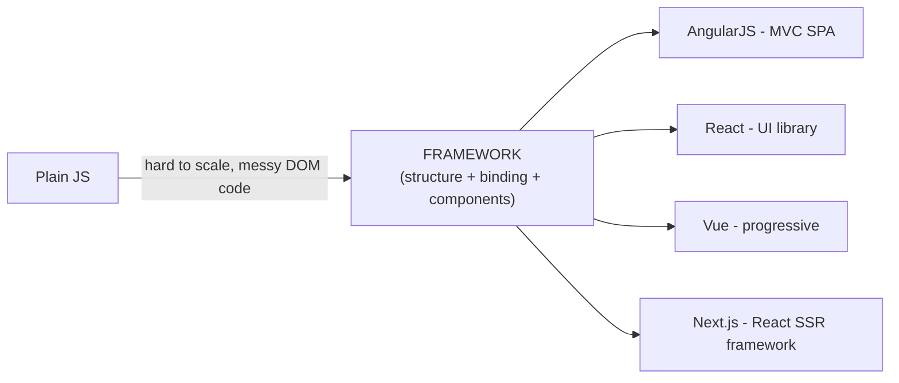
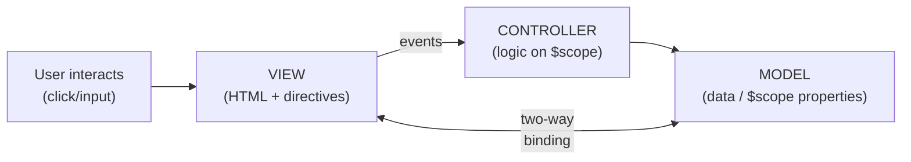
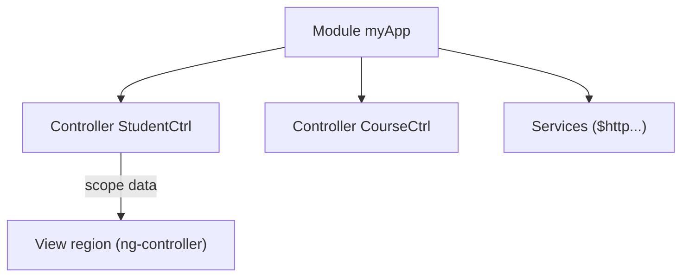
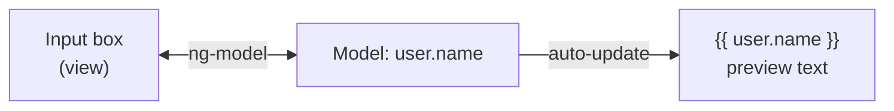
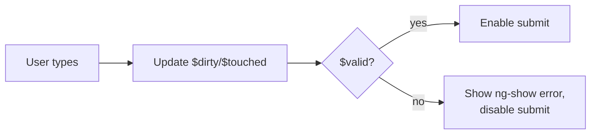
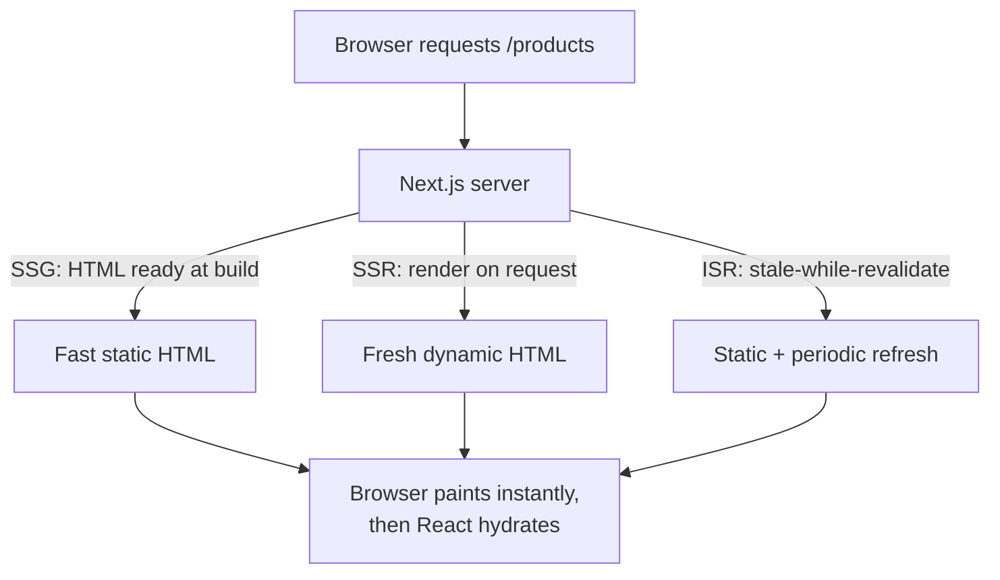

# WT — Unit 5 (AngularJS)

> Exam-prep notes: short definitions, key points, and diagrams.

**Contents**
1. [JavaScript Frameworks](#1-javascript-frameworks)
2. [AngularJS Overview](#2-angularjs-overview)
3. [MVC Architecture in AngularJS](#3-mvc-architecture-in-angularjs)
4. [Expressions & Directives](#4-expressions--directives)
5. [Modules & Controllers](#5-modules--controllers)
6. [Forms, Two-way Binding & Validation](#6-forms-two-way-binding--validation)
7. [Next.js](#7-nextjs)
8. [Quick Revision](#8-quick-revision)

---

## 1. Introduction to JavaScript Frameworks

- **JS framework** = pre-built structure of JS code (rules + reusable components) that speeds up building complex, maintainable web apps — you "fill in the blanks" instead of writing everything from scratch.
- Why: DOM manipulation is tedious in plain JS; frameworks give **structure, data binding, routing, reusability, testability**.
- Examples: **AngularJS/Angular, React, Vue, Next.js**, Ember, Svelte.



---

## 2. AngularJS Overview

### 2.1 What is AngularJS?

- **AngularJS** = Google's open-source **JavaScript framework (v1.x, 2010)** for building **single-page applications (SPAs)** by **extending HTML** with directives and **two-way data binding** (note: modern "Angular 2+" is a full rewrite; AngularJS = the MVC, HTML-extended original).

### 2.2 Features of AngularJS

| Feature | Meaning |
|---|---|
| **Two-way data binding** | Model ↔ View auto-sync both ways |
| **MVC architecture** | separates data, logic, presentation |
| **Directives** | extend HTML: `ng-app, ng-model, ng-repeat…` |
| **Expressions** | `{{ expression }}` inside HTML |
| **Modules & Controllers** | organize code |
| **Services/DI** | reusable logic injected ($http, $scope) |
| **Filters** | format display: `currency, date, uppercase, orderBy` |
| **Routing (ngRoute)** | SPA navigation without reload |
| **Form validation** | built-in states & directives |
| **Testing** | designed to be unit-testable |

### 2.3 Advantages & Applications

- **Advantages:** no manual DOM syncing (binding), less code, SPA without page reloads, HTML is cleaner & declarative, Google support + big community, easy testing.
- **Limitations (brief):** steep learning, performance for very large DOMs, deprecated (2022) — superseded by Angular 2+.
- **Applications:** SPAs, dashboards & admin panels, e-commerce front-ends, form-heavy enterprise apps, real-time collaboration tools (Gmail-style interactivity).

---

## 3. MVC Architecture in AngularJS



- **Model** = application data (JS objects on `$scope` or services) · **View** = HTML template with directives & expressions · **Controller** = JS function that initializes/updates the model and handles view logic.
- AngularJS auto-wires them: change the **model** → **view** updates; user edits the **view** → **model** updates (that's the two-way arrow).

---

## 4. Expressions & Directives

### 4.1 Expressions

- `{{ expression }}` — JS-like snippets **evaluated and printed inside HTML** (safe, scoped to `$scope`).

```html
<p>5 + 5 = {{ 5 + 5 }}</p>
<p>Hello {{ firstName }}</p>
<p>Total: {{ qty * price | currency }}</p>   <!-- with filter -->
```
- vs JS expressions: evaluated against `$scope`, forgiving (`undefined` → blank, no errors), cannot use loops/conditions/`eval`.

### 4.2 Directives

| Directive | Purpose |
|---|---|
| `ng-app` | defines the root of an Angular application |
| `ng-model` | binds input → model property (two-way) |
| `ng-bind` | binds element text to model (alt. to `{{}}`) |
| `ng-init` | set initial variable (for demos) |
| `ng-repeat` | loop over array (render lists) |
| `ng-if / ng-show / ng-hide` | conditional visibility |
| `ng-click` | attach click handler |
| `ng-src / ng-href` | safe dynamic image/link URLs |
| `ng-class / ng-style` | dynamic styling |

```html
<div ng-app="" ng-init="students=['Amit','Riya','John']">
  <ul>
    <li ng-repeat="s in students">{{ s }}</li>
  </ul>
</div>
```

---

## 5. Modules & Controllers

```html
<!DOCTYPE html>
<html ng-app="myApp">
<body ng-controller="StudentCtrl">
  <p>Name: <input ng-model="name"></p>
  <p>Welcome {{ name }}, roll: {{ roll }}</p>

  <script src="angular.min.js"></script>
  <script>
    // MODULE = container for app parts
    var app = angular.module("myApp", []);

    // CONTROLLER = logic + model via $scope
    app.controller("StudentCtrl", function($scope) {
      $scope.name = "Amit";
      $scope.roll = 101;
    });
  </script>
</body>
</html>
```

- **Module** = application "box" (`angular.module("name", [dependencies])`) holding controllers, services, directives — keeps globals away, testable.
- **Controller** = constructor function attached to a view region; **`$scope`** is the shared object bridging controller ↔ view.



---

## 6. Forms, Two-way Binding & Validation

### 6.1 Form Handling + Two-way Data Binding

- **Two-way binding:** `ng-model` keeps input box and scope variable **always in sync** — type in the box → model changes instantly → every `{{}}` using it updates, and vice versa.

```html
<form ng-controller="RegCtrl">
  <input type="text" ng-model="user.name" required>
  <input type="email" ng-model="user.email" required>
  <button ng-click="submit(user)">Register</button>
  <p>Live preview: {{ user.name }} — {{ user.email }}</p>
</form>
```



### 6.2 Validation (directives & form states)

- Angular tracks validity automatically; form/inputs get **states**:

| Property | Meaning |
|---|---|
| `$valid / $invalid` | passes validation rules? |
| `$dirty / $pristine` | user changed it / untouched |
| `$touched / $untouched` | visited / not visited |
| `$error` | object of failed rules |

- Validation directives: `required`, `ng-minlength/ng-maxlength`, `ng-pattern` (regex), `type="email"/"number"`, `min/max`.

```html
<form name="regForm" novalidate>          <!-- novalidate: use Angular validation -->
  <input name="pwd" ng-model="pwd" ng-minlength="6" required>
  <span ng-show="regForm.pwd.$invalid && regForm.pwd.$dirty">
    Password must be at least 6 characters
  </span>
  <button ng-disabled="regForm.$invalid">Submit</button>  <!-- block invalid submit -->
</form>
```



---

## 7. Next.js

### 7.1 Overview

- **Next.js** = open-source **React framework (Vercel, 2016)** that adds **server-side rendering (SSR), static site generation (SSG), routing and full-stack features** on top of React (React itself = only client-side UI library; you assemble routing/rendering yourself).

### 7.2 Why Next.js?

- Plain React SPAs have problems: **slow first load** (everything renders in browser), poor **SEO** (empty HTML until JS runs), no backend. Next.js solves these: pages are **pre-rendered on the server/build**, SEO-friendly HTML, automatic code splitting, built-in routing & API endpoints.

### 7.3 Key Features

| Feature | Meaning |
|---|---|
| **File-based routing** | `pages/about.js` → `/about` automatically |
| **Rendering modes** | SSG (pre-built), SSR (per request), ISR (regenerate), CSR |
| **API routes** | backend endpoints inside the same project (`pages/api/`) |
| **Automatic code splitting** | only load JS each page needs → faster |
| **Image/font optimization** | `next/image` lazy loading & sizing |
| **Fast Refresh** | instant edit feedback in dev |
| **SEO & meta handling** | head control per page |
| **Full-stack** | front-end + backend in one codebase |



- Choose **SSG** for blogs/docs, **SSR** for user-specific/live data, **ISR** for large catalogs that update periodically.

---

## 8. Quick Revision

| Item | One-liner |
|---|---|
| JS framework | Pre-built structure for scalable web apps (Angular, React, Vue) |
| AngularJS | Google's MVC framework (v1) for SPAs; extends HTML |
| Killer feature | **Two-way data binding** (model ↔ view auto-sync) |
| MVC roles | Model = data · View = HTML · Controller = `$scope` logic |
| Expression | `{{ 5+5 }}` — safe, scope-aware output in HTML |
| Key directives | ng-app, ng-model, ng-repeat, ng-show, ng-click |
| Module | `angular.module("app", [])` — container of parts |
| Controller | function managing `$scope` for a view region |
| Form states | $valid, $dirty, $touched, $error |
| Validation directives | required, ng-minlength, ng-pattern; ng-disabled on $invalid |
| Next.js | React framework with SSR/SSG/ISR + file routing + API routes |
| Why Next.js | Speed + SEO + full-stack vs plain React SPA |
